# Simple To-Do Fullstack Architecture Document

This document outlines the complete fullstack architecture for Simple To-Do, including backend systems, frontend implementation, and their integration. It serves as the single source of truth for AI-driven development, ensuring consistency across the entire technology stack.

This unified approach combines what would traditionally be separate backend and frontend architecture documents, streamlining the development process for modern fullstack applications where these concerns are increasingly intertwined.

## Starter Template or Existing Project

Based on the PRD analysis and current project structure, this appears to be a **greenfield project** with specific requirements for Astro v5, TypeScript, and Tailwind CSS v4. The project prioritizes:

- Static-first approach with selective hydration
- Zero server-side infrastructure requirements  
- Educational transparency for BMAD methodology demonstration
- Performance optimization (<1 second load times, >95 Lighthouse scores)

**Decision:** N/A - Greenfield project with clear technology constraints specified in PRD

## Change Log

| Date | Version | Description | Author |
|------|---------|-------------|---------|
| 2025-09-08 | v1.0 | Initial architecture document creation from PRD requirements | Winston (Architect) |

---

## High Level Architecture

### Technical Summary

Simple To-Do employs a **Pure Static Architecture** using Astro v5 with TypeScript strict mode and vanilla JavaScript for interactivity. This approach eliminates all framework overhead while maintaining type safety and modern development practices. Tailwind CSS provides utility-first styling with zero runtime JavaScript, supporting responsive design and theme switching through CSS custom properties.

The architecture prioritizes radical simplicity - no React, no complex state management, no build-time dependencies beyond Astro's core functionality. Interactive features use vanilla JavaScript with strict TypeScript interfaces, localStorage for persistence, and CSS-only animations where possible. This approach directly demonstrates BMAD principles of choosing appropriate technology complexity for the problem domain.

### Platform and Infrastructure Choice (Following Elio Struyf's Best Practices)

**Platform:** Azure Static Web Apps (Free Tier) with GitHub Actions  
**Key Services:** Static hosting with global CDN, automated deployment, future Azure Functions expansion capability  
**Deployment Host and Regions:** Azure global edge network with automatic region selection  
**Node Version:** Node 20+ (required for latest Astro v5 compatibility)

**Azure Static Web Apps Benefits:**
- **Free Tier:** Perfect for MVP with generous limits (100GB bandwidth, 0.5GB storage)
- **Global CDN:** Automatic content distribution with low latency worldwide
- **Native GitHub Integration:** Clean workflow automation following Elio Struyf patterns
- **Future Expandability:** Can add Azure Functions for API endpoints without migration
- **Pull Request Previews:** Automatic staging deployments for testing

**Following Elio Struyf's SWA CLI Methodology:**
```json
// swa-cli.config.json (Clean configuration over verbose boilerplate)
{
  "$schema": "https://aka.ms/azure/static-web-apps-cli/schema",
  "configurations": {
    "simple-todo": {
      "appLocation": "/app",
      "outputLocation": "dist",
      "appDevserverUrl": "http://localhost:4321",
      "apiLocation": "/api",
      "apiLanguage": "node", 
      "apiVersion": "20",
      "apiDevserverUrl": "http://localhost:7071"
    }
  }
}
```

**GitHub Actions Configuration (Optimized for Node 20+):**
```yaml
# .github/workflows/azure-static-web-apps-ci-cd.yml
name: Azure Static Web Apps CI/CD

on:
  push:
    branches: [main]
  pull_request:
    types: [opened, synchronize, reopened, closed]
    branches: [main]

jobs:
  build_and_deploy_job:
    if: github.event_name == 'push' || (github.event_name == 'pull_request' && github.event.action != 'closed')
    runs-on: ubuntu-latest
    name: Build and Deploy Job
    steps:
      - uses: actions/checkout@v4
        with:
          submodules: true
      - name: Setup Node.js 20+
        uses: actions/setup-node@v4
        with:
          node-version: '20'
          cache: 'npm'
      - name: Install dependencies
        run: |
          npm ci
          cd app && npm ci
      - name: Build And Deploy
        id: builddeploy
        uses: Azure/static-web-apps-deploy@v1
        with:
          azure_static_web_apps_api_token: ${{ secrets.AZURE_STATIC_WEB_APPS_API_TOKEN }}
          repo_token: ${{ secrets.GITHUB_TOKEN }}
          action: "upload"
          app_location: "/app"
          api_location: ""
          output_location: "dist"
        env:
          NODE_VERSION: "20"

  close_pull_request_job:
    if: github.event_name == 'pull_request' && github.event.action == 'closed'
    runs-on: ubuntu-latest
    name: Close Pull Request Job
    steps:
      - name: Close Pull Request
        id: closepullrequest
        uses: Azure/static-web-apps-deploy@v1
        with:
          azure_static_web_apps_api_token: ${{ secrets.AZURE_STATIC_WEB_APPS_API_TOKEN }}
          action: "close"
```

### Repository Structure (Following Elio Struyf's Clean Patterns)

**Structure:** Monorepo with logical separation following Elio's proven methodology  
**Monorepo Tool:** Native npm workspaces (lightweight, no additional tooling complexity)  
**Package Organization:** Clean separation between frontend and API

```
simple-todo/
├── .bmad-core/              # BMAD methodology files
├── docs/                    # Architecture and documentation
├── app/                     # Astro frontend application
│   ├── src/
│   │   ├── components/      # Astro components (.astro files)
│   │   ├── pages/           # Astro pages (routing)
│   │   ├── scripts/         # Vanilla JavaScript modules
│   │   ├── types/           # TypeScript type definitions
│   │   └── styles/          # Tailwind config and custom CSS
│   ├── public/              # Static assets
│   ├── package.json
│   └── astro.config.mjs
├── api/                     # Azure Functions (future expansion)
│   ├── package.json
│   └── [future API functions]
├── swa-cli.config.json      # Clean SWA configuration
├── package.json             # Root orchestration
└── .github/workflows/       # GitHub Actions deployment
```

**npm Scripts Architecture (Elio Struyf Pattern):**
```json
{
  "scripts": {
    "dev": "npm run dev:swa",
    "dev:app": "cd app && npm run dev",
    "dev:api": "echo 'No API yet - localStorage only'",
    "dev:swa": "swa start",
    "build": "npm run build:app",
    "build:app": "cd app && npm run build",
    "deploy": "swa deploy --print-config",
    "install:all": "npm ci && cd app && npm ci"
  }
}
```

### High Level Architecture Diagram (Following Elio Struyf's SWA CLI Proxy Pattern)

```mermaid
graph TB
    subgraph "Development Environment"
        Developer[👨‍💻 Developer] --> SWA_CLI[🔧 SWA CLI :4280]
        SWA_CLI --> Astro[📄 Astro App :4321]
        SWA_CLI --> Future_API[⚡ Future API :7071]
    end
    
    subgraph "User Experience"
        User[👤 User] --> Browser[🌐 Browser]
        Browser --> AzureCDN[🌍 Azure Global CDN]
    end
    
    subgraph "Production (Azure Static Web Apps)"
        AzureCDN --> StaticApp[📱 Simple Todo App]
        StaticApp --> AstroComponents[🧩 Astro Components]
        StaticApp --> VanillaJS[⚡ Vanilla JS Modules]
        StaticApp --> TailwindCSS[🎨 Tailwind CSS]
        
        VanillaJS --> TaskLogic[📝 Task Logic]
        VanillaJS --> LocalStorage[💾 localStorage API]
        VanillaJS --> DOMManipulation[🔄 DOM Updates]
        
        TailwindCSS --> ThemeCSS[🌗 CSS Theme Variables]
        TailwindCSS --> ResponsiveCSS[📱 Responsive Design]
        
        StaticApp --> Future_Functions[🔮 Future: Azure Functions]
    end
    
    subgraph "Development Workflow"
        GitHub[📚 GitHub Repository] --> GitHubActions[⚡ GitHub Actions]
        GitHubActions --> AzureSWA[☁️ Azure Static Web Apps]
    end
    
    style StaticApp fill:#e1f5fe
    style AzureSWA fill:#0078d4,color:#ffffff
    style SWA_CLI fill:#f0f8ff
    style Future_Functions fill:#f0f0f0,stroke-dasharray: 5 5
    style Future_API fill:#f0f0f0,stroke-dasharray: 5 5
```



### Architectural Patterns (Aligned with BMAD and Elio Struyf Methodologies)

- **Pure Static Generation with SWA CLI Development Proxy:** Astro-only rendering with zero client-side frameworks in production, SWA CLI proxy for unified development experience - _Rationale:_ Maximum simplicity and performance for a basic todo app, following Elio's proven development workflow patterns

- **Vanilla JavaScript Modules with Strict TypeScript:** ES6+ modules with strict TypeScript interfaces, no framework dependencies - _Rationale:_ Modern JavaScript without framework overhead, full type safety, educational clarity for BMAD demonstration

- **CSS-First Theming with System Preference Detection:** Tailwind utilities with CSS custom properties and prefers-color-scheme - _Rationale:_ No JavaScript needed for theme switching, pure CSS performance, accessibility through system integration

- **Progressive Enhancement with localStorage Persistence:** HTML-first with JavaScript enhancement, client-side data persistence - _Rationale:_ Works without JavaScript, enhanced with vanilla JS interactivity, privacy-first local storage approach

- **Component-Based Astro Architecture:** .astro components with zero client-side hydration unless specifically needed - _Rationale:_ Component organization benefits without React complexity, selective hydration for performance

- **Elio Struyf's Clean Configuration Pattern:** Minimal SWA configuration focusing on essentials, avoiding boilerplate - _Rationale:_ Readable, maintainable configuration that developers can understand and modify, following proven industry patterns

---

## Tech Stack

This is the **DEFINITIVE** technology selection for the entire Simple To-Do project. All development must use these exact versions and tools. This selection balances simplicity, performance, educational value, and future expandability.

### Technology Stack Table

| Category | Technology | Version | Purpose | Rationale |
|----------|------------|---------|---------|-----------|
| **Frontend Language** | TypeScript | 5.3+ | Type-safe development with strict mode | Eliminates runtime errors, improves developer experience, educational clarity for BMAD demonstration |
| **Frontend Framework** | Astro | 5.0+ | Static site generation with selective hydration | Zero-JS by default, optimal performance, component-based architecture without framework complexity |
| **UI Component Library** | Native Astro Components | 5.0+ | .astro file components with TypeScript | No external dependencies, maximum performance, educational transparency |
| **State Management** | Vanilla JavaScript + localStorage | ES2022+ | Client-side persistence and DOM manipulation | Simplicity, privacy-first, no framework overhead, demonstrates fundamental concepts |
| **Backend Language** | N/A (MVP) | - | localStorage-only for MVP phase | Zero infrastructure complexity, privacy-first design, rapid development |
| **Backend Framework** | N/A (MVP) | - | Future: Node.js 20+ Azure Functions | Prepared for API expansion without architecture changes |
| **API Style** | N/A (MVP) | - | Future: RESTful JSON APIs | Standard approach for future Azure Functions integration |
| **Database** | Browser localStorage | Native | Client-side JSON data persistence | Zero infrastructure, privacy compliance, offline functionality |
| **Cache** | Browser Cache | Native | Static asset and localStorage caching | Built-in browser performance optimization |
| **File Storage** | N/A (MVP) | - | Future: Azure Blob Storage | Prepared for cloud expansion when needed |
| **Authentication** | N/A (MVP) | - | Future: Azure Static Web Apps Auth | Simple integration path for user management |
| **Frontend Testing** | Vitest | 2.0+ | Unit testing for utilities and logic | Fast, modern testing framework aligned with Vite ecosystem |
| **Backend Testing** | N/A (MVP) | - | Future: Vitest for Azure Functions | Consistent testing approach across stack |
| **E2E Testing** | Playwright | 1.40+ | Complete user workflow validation | Cross-browser testing, accessibility validation integration |
| **Build Tool** | Astro CLI | 5.0+ | Static site generation and optimization | Built-in optimization, zero configuration complexity |
| **Bundler** | Vite | 5.0+ | Fast development and production builds | Integrated with Astro, excellent TypeScript support |
| **IaC Tool** | N/A | - | Manual Azure Static Web Apps setup | Simplicity over infrastructure complexity for MVP |
| **CI/CD** | GitHub Actions | Latest | Automated deployment to Azure Static Web Apps | Native GitHub integration, zero additional costs |
| **Monitoring** | Azure Static Web Apps Analytics | Built-in | Basic usage analytics and performance monitoring | Integrated solution, privacy-conscious |
| **Logging** | Browser DevTools | Native | Client-side debugging and error tracking | Development-focused approach for MVP |
| **CSS Framework** | Tailwind CSS | 4.0+ | Utility-first styling with design system | Rapid development, consistent design, excellent performance |

### Key Technology Decisions

**Why Astro v5?**
- Zero-JavaScript by default aligns with performance requirements (<1 second load times)
- Component-based architecture provides educational clarity for BMAD methodology
- Built-in TypeScript support with strict mode
- Excellent developer experience with hot reload and debugging

**Why Vanilla JavaScript over React/Vue?**
- Eliminates framework complexity for a simple todo app
- Demonstrates fundamental web development concepts clearly
- Zero runtime dependencies = maximum performance
- Educational value for developers learning core technologies

**Why Tailwind CSS v4?**
- Utility-first approach speeds development
- Built-in design system ensures consistency
- Excellent dark/light theme support
- Zero runtime JavaScript for styling

**Why localStorage over Database?**
- Privacy-first design (no data collection)
- Zero infrastructure costs and complexity
- Offline functionality by default
- Perfect for MVP scope

**Why Node 20+?**
- Latest LTS version with optimal performance
- Required for Astro v5 compatibility
- Future-proof for Azure Functions expansion
- Enhanced TypeScript support

---

## Data Models

Based on the PRD requirements, I'll define the core data entities for Simple To-Do. These TypeScript interfaces will be shared across components and provide the foundation for data validation and localStorage persistence.

### Task

**Purpose:** Core entity representing a user's task with completion state and metadata for persistence and user experience.

**Key Attributes:**
- id: string - Unique identifier using crypto.randomUUID() for client-side generation
- text: string - Task description with 280 character limit (Twitter-like constraint)
- completed: boolean - Completion status for visual distinction and filtering
- createdAt: Date - Creation timestamp for chronological sorting (newest first)
- updatedAt: Date - Last modification timestamp for data integrity tracking
- deletedAt?: Date - Soft deletion timestamp for undo functionality within session

#### TypeScript Interface
```typescript
interface Task {
  id: string;
  text: string;
  completed: boolean;
  createdAt: Date;
  updatedAt: Date;
  deletedAt?: Date; // For soft deletion and undo functionality
}
```

#### Relationships
- Tasks are independent entities (no parent-child relationships in MVP)
- Tasks belong to a single user session (localStorage scoped)

### UserPreferences

**Purpose:** Stores user customization settings with persistence across browser sessions for personalized experience.

**Key Attributes:**
- theme: 'light' | 'dark' | 'system' - Theme preference with system detection fallback
- motionReduced: boolean - Accessibility preference for users with motion sensitivity
- quotesEnabled: boolean - Toggle for motivational quotes display
- lastActiveQuote?: string - Current quote ID for persistence across sessions
- favoriteQuotes: string[] - User-favorited quote IDs for future personalization

#### TypeScript Interface
```typescript
interface UserPreferences {
  theme: 'light' | 'dark' | 'system';
  motionReduced: boolean;
  quotesEnabled: boolean;
  lastActiveQuote?: string;
  favoriteQuotes: string[];
}
```

#### Relationships
- One UserPreferences per browser/device
- Independent of tasks (separate localStorage keys)

### Quote

**Purpose:** Motivational quotes data structure for inspiration system with rotation and favoriting capabilities.

**Key Attributes:**
- id: string - Unique identifier for quote referencing and favoriting
- text: string - Quote content with length validation (max 200 characters)
- author?: string - Quote attribution (optional for anonymous quotes)
- category: string - Theme categorization ('productivity', 'motivation', 'focus')
- dateAdded: Date - When quote was added to system for rotation algorithms

#### TypeScript Interface
```typescript
interface Quote {
  id: string;
  text: string;
  author?: string;
  category: 'productivity' | 'motivation' | 'focus' | 'general';
  dateAdded: Date;
}
```

#### Relationships
- Referenced by UserPreferences.lastActiveQuote and favoriteQuotes
- Stored as static collection with local caching

### AppState

**Purpose:** Runtime application state management for UI coordination and data persistence orchestration.

**Key Attributes:**
- tasks: Task[] - Current task collection with real-time updates
- preferences: UserPreferences - User settings with immediate UI reflection
- currentQuote: Quote | null - Active quote for display with rotation logic
- isLoading: boolean - Global loading state for user feedback
- lastSyncTime: Date - Last localStorage sync for data integrity

#### TypeScript Interface
```typescript
interface AppState {
  tasks: Task[];
  preferences: UserPreferences;
  currentQuote: Quote | null;
  isLoading: boolean;
  lastSyncTime: Date;
}
```

#### Relationships
- Aggregates all other data models
- Managed by TaskService and PreferenceService utilities
- Synced to localStorage on every state change

---

## API Specification

Since Simple To-Do MVP uses localStorage for data persistence, this section defines the **client-side service layer APIs** that abstract data operations. This approach provides a clean interface that can later be replaced with server-side APIs without changing component code.

### Client-Side Service APIs

The application uses service classes that provide Promise-based APIs mimicking server-side patterns. This design choice enables seamless transition to Azure Functions APIs in future phases.

### TaskService API

**Purpose:** Manages all task-related operations with localStorage persistence and error handling.

```typescript
class TaskService {
  private static readonly STORAGE_KEY = 'simple-todo-tasks';
  private static readonly VERSION = 'v1';

  // GET /api/tasks equivalent
  static async getAllTasks(): Promise<Task[]> {
    try {
      const stored = localStorage.getItem(this.STORAGE_KEY);
      if (!stored) return [];
      
      const data = JSON.parse(stored);
      return data.tasks.map(this.deserializeTask);
    } catch (error) {
      console.error('Failed to load tasks:', error);
      return [];
    }
  }

  // POST /api/tasks equivalent  
  static async createTask(text: string): Promise<Task> {
    if (!text.trim() || text.length > 280) {
      throw new Error('Invalid task text: must be 1-280 characters');
    }

    const task: Task = {
      id: crypto.randomUUID(),
      text: text.trim(),
      completed: false,
      createdAt: new Date(),
      updatedAt: new Date()
    };

    const tasks = await this.getAllTasks();
    tasks.unshift(task); // Add to beginning (newest first)
    await this.saveTasks(tasks);
    
    return task;
  }

  // PATCH /api/tasks/{id} equivalent
  static async updateTask(id: string, updates: Partial<Task>): Promise<Task> {
    const tasks = await this.getAllTasks();
    const taskIndex = tasks.findIndex(t => t.id === id && !t.deletedAt);
    
    if (taskIndex === -1) {
      throw new Error(`Task not found: ${id}`);
    }

    const updatedTask = {
      ...tasks[taskIndex],
      ...updates,
      updatedAt: new Date()
    };

    tasks[taskIndex] = updatedTask;
    await this.saveTasks(tasks);
    
    return updatedTask;
  }

  // DELETE /api/tasks/{id} equivalent (soft delete)
  static async deleteTask(id: string): Promise<void> {
    await this.updateTask(id, { deletedAt: new Date() });
  }

  // POST /api/tasks/{id}/restore equivalent
  static async restoreTask(id: string): Promise<Task> {
    const tasks = await this.getAllTasks();
    const task = tasks.find(t => t.id === id);
    
    if (!task?.deletedAt) {
      throw new Error(`Task not found or not deleted: ${id}`);
    }

    return await this.updateTask(id, { deletedAt: undefined });
  }

  // Utility methods
  private static async saveTasks(tasks: Task[]): Promise<void> {
    const data = {
      version: this.VERSION,
      tasks: tasks.map(this.serializeTask),
      lastModified: new Date().toISOString()
    };
    
    localStorage.setItem(this.STORAGE_KEY, JSON.stringify(data));
  }

  private static serializeTask(task: Task): any {
    return {
      ...task,
      createdAt: task.createdAt.toISOString(),
      updatedAt: task.updatedAt.toISOString(),
      deletedAt: task.deletedAt?.toISOString()
    };
  }

  private static deserializeTask(data: any): Task {
    return {
      ...data,
      createdAt: new Date(data.createdAt),
      updatedAt: new Date(data.updatedAt),
      deletedAt: data.deletedAt ? new Date(data.deletedAt) : undefined
    };
  }
}
```

### PreferenceService API

**Purpose:** Manages user preferences with validation and system preference detection.

```typescript
class PreferenceService {
  private static readonly STORAGE_KEY = 'simple-todo-preferences';
  private static readonly DEFAULT_PREFERENCES: UserPreferences = {
    theme: 'system',
    motionReduced: false,
    quotesEnabled: true,
    favoriteQuotes: []
  };

  // GET /api/preferences equivalent
  static async getPreferences(): Promise<UserPreferences> {
    try {
      const stored = localStorage.getItem(this.STORAGE_KEY);
      if (!stored) {
        return await this.initializePreferences();
      }
      
      const preferences = JSON.parse(stored);
      return { ...this.DEFAULT_PREFERENCES, ...preferences };
    } catch (error) {
      console.error('Failed to load preferences:', error);
      return await this.initializePreferences();
    }
  }

  // PATCH /api/preferences equivalent
  static async updatePreferences(updates: Partial<UserPreferences>): Promise<UserPreferences> {
    const current = await this.getPreferences();
    const updated = { ...current, ...updates };
    
    // Validation
    if (updates.theme && !['light', 'dark', 'system'].includes(updates.theme)) {
      throw new Error('Invalid theme preference');
    }

    localStorage.setItem(this.STORAGE_KEY, JSON.stringify(updated));
    return updated;
  }

  // GET /api/preferences/theme/resolved equivalent
  static getResolvedTheme(preferences: UserPreferences): 'light' | 'dark' {
    if (preferences.theme !== 'system') {
      return preferences.theme;
    }
    
    // System preference detection
    return window.matchMedia('(prefers-color-scheme: dark)').matches 
      ? 'dark' 
      : 'light';
  }

  private static async initializePreferences(): Promise<UserPreferences> {
    const preferences = {
      ...this.DEFAULT_PREFERENCES,
      motionReduced: window.matchMedia('(prefers-reduced-motion: reduce)').matches
    };
    
    localStorage.setItem(this.STORAGE_KEY, JSON.stringify(preferences));
    return preferences;
  }
}
```

### QuoteService API

**Purpose:** Manages motivational quotes with rotation logic and favoriting.

```typescript
class QuoteService {
  private static readonly STORAGE_KEY = 'simple-todo-quote-cache';
  private static quotes: Quote[] = [
    {
      id: 'q1',
      text: 'The way to get started is to quit talking and begin doing.',
      author: 'Walt Disney',
      category: 'productivity',
      dateAdded: new Date('2024-01-01')
    },
    {
      id: 'q2', 
      text: 'Focus on being productive instead of busy.',
      author: 'Tim Ferriss',
      category: 'focus',
      dateAdded: new Date('2024-01-01')
    }
    // ... more quotes would be defined here
  ];

  // GET /api/quotes/daily equivalent
  static async getDailyQuote(): Promise<Quote> {
    const today = new Date().toDateString();
    const cached = this.getCachedQuote(today);
    
    if (cached) return cached;
    
    // Simple rotation based on date
    const dayIndex = new Date().getDate() % this.quotes.length;
    const quote = this.quotes[dayIndex];
    
    this.setCachedQuote(today, quote);
    return quote;
  }

  // GET /api/quotes/random equivalent
  static async getRandomQuote(): Promise<Quote> {
    const randomIndex = Math.floor(Math.random() * this.quotes.length);
    return this.quotes[randomIndex];
  }

  // POST /api/quotes/{id}/favorite equivalent
  static async toggleFavoriteQuote(quoteId: string, preferences: UserPreferences): Promise<UserPreferences> {
    const favoriteQuotes = [...preferences.favoriteQuotes];
    const index = favoriteQuotes.indexOf(quoteId);
    
    if (index === -1) {
      favoriteQuotes.push(quoteId);
    } else {
      favoriteQuotes.splice(index, 1);
    }
    
    return await PreferenceService.updatePreferences({ favoriteQuotes });
  }

  private static getCachedQuote(date: string): Quote | null {
    try {
      const cached = localStorage.getItem(this.STORAGE_KEY);
      if (!cached) return null;
      
      const data = JSON.parse(cached);
      return data[date] || null;
    } catch {
      return null;
    }
  }

  private static setCachedQuote(date: string, quote: Quote): void {
    try {
      const cached = JSON.parse(localStorage.getItem(this.STORAGE_KEY) || '{}');
      cached[date] = quote;
      localStorage.setItem(this.STORAGE_KEY, JSON.stringify(cached));
    } catch (error) {
      console.error('Failed to cache quote:', error);
    }
  }
}
```

### Future API Migration Path

When transitioning to Azure Functions, these service classes can be updated to call actual HTTP endpoints while maintaining the same Promise-based interface:

```typescript
// Future server-side API calls
static async createTask(text: string): Promise<Task> {
  const response = await fetch('/api/tasks', {
    method: 'POST',
    headers: { 'Content-Type': 'application/json' },
    body: JSON.stringify({ text })
  });
  
  if (!response.ok) {
    throw new Error(`Failed to create task: ${response.status}`);
  }
  
  return await response.json();
}
```

This architecture provides clean separation between data operations and UI components while preparing for seamless cloud expansion.

---

## Components

Based on the architectural patterns, tech stack, and data models defined above, I'll identify the major logical components that make up the Simple To-Do application. Each component has clear responsibilities and well-defined interfaces following BMAD principles.

### TaskManager

**Responsibility:** Core component orchestrating all task-related functionality including creation, display, completion, deletion, and undo operations. Serves as the primary interface between UI components and TaskService.

**Key Interfaces:**
- `onTaskCreate(text: string): Promise<void>` - Handles new task creation with validation
- `onTaskToggle(id: string): Promise<void>` - Manages task completion state changes
- `onTaskDelete(id: string): Promise<void>` - Processes task deletion with undo support
- `onTaskRestore(id: string): Promise<void>` - Handles undo functionality within session
- `getActiveTasks(): Task[]` - Provides filtered list of non-deleted tasks
- `getRecentlyDeleted(): Task[]` - Supports undo functionality with time limits

**Dependencies:** TaskService, TaskInput, TaskList, TaskItem components

**Technology Stack:** Astro component (.astro) with TypeScript, vanilla JavaScript for interactivity, Tailwind CSS for styling

### TaskInput

**Responsibility:** Handles task creation interface with validation, character counting, and accessibility features. Provides immediate feedback and maintains focus for rapid task entry.

**Key Interfaces:**
- `onSubmit(text: string): void` - Emits task creation events with validated input
- `onInputChange(text: string): void` - Provides real-time character count and validation
- `reset(): void` - Clears input after successful submission
- `focus(): void` - Programmatic focus management for UX flow

**Dependencies:** TaskManager (parent component)

**Technology Stack:** Astro component with vanilla JavaScript event handling, Tailwind CSS for responsive form styling

### TaskList

**Responsibility:** Renders collection of tasks with proper ordering (newest first), empty states, and efficient DOM updates. Manages bulk operations and list-level interactions.

**Key Interfaces:**
- `renderTasks(tasks: Task[]): void` - Displays task collection with proper ordering
- `showEmptyState(): void` - Renders helpful onboarding when no tasks exist
- `onBulkClearCompleted(): void` - Batch operation for clearing completed tasks
- `updateTaskOrder(tasks: Task[]): void` - Handles reordering without full re-render

**Dependencies:** TaskItem components, TaskManager (parent)

**Technology Stack:** Astro component with vanilla JavaScript for DOM manipulation, CSS animations for smooth transitions

### TaskItem

**Responsibility:** Individual task rendering with completion toggle, delete confirmation, and accessibility support. Handles task-level interactions and state visualization.

**Key Interfaces:**
- `render(task: Task): HTMLElement` - Renders individual task with current state
- `onToggleComplete(): void` - Handles completion state changes with animation
- `onDeleteClick(): void` - Shows confirmation dialog before deletion
- `updateVisualState(task: Task): void` - Updates appearance based on completion status

**Dependencies:** TaskManager (for event propagation)

**Technology Stack:** Astro component with CSS-only animations for completion states, ARIA labels for accessibility

### ThemeManager

**Responsibility:** Manages light/dark theme switching with system preference detection, smooth transitions, and persistence. Coordinates theme changes across all components.

**Key Interfaces:**
- `initializeTheme(): Promise<void>` - Sets initial theme based on preferences
- `toggleTheme(): Promise<void>` - Cycles through light/dark/system options
- `onSystemThemeChange(): void` - Responds to OS theme changes
- `applyTheme(theme: 'light' | 'dark'): void` - Updates CSS custom properties

**Dependencies:** PreferenceService, all styled components

**Technology Stack:** Vanilla JavaScript module with CSS custom properties, prefers-color-scheme media queries

### QuoteDisplay

**Responsibility:** Shows daily motivational quotes with refresh capability, favoriting, and responsive typography. Manages quote rotation and user interaction.

**Key Interfaces:**
- `showDailyQuote(): Promise<void>` - Displays current daily quote with caching
- `refreshQuote(): Promise<void>` - Fetches new random quote on demand
- `toggleFavorite(quoteId: string): Promise<void>` - Manages quote favoriting
- `formatQuoteText(quote: Quote): string` - Handles text wrapping and attribution

**Dependencies:** QuoteService, PreferenceService

**Technology Stack:** Astro component with vanilla JavaScript for quote fetching, Tailwind CSS for responsive typography

### AnimationEngine

**Responsibility:** Provides satisfying micro-interactions for task completion, theme transitions, and UI feedback while respecting motion preferences. Centralized animation management.

**Key Interfaces:**
- `celebrateTaskCompletion(element: HTMLElement): Promise<void>` - Confetti or equivalent celebration
- `animateTaskAddition(element: HTMLElement): Promise<void>` - Smooth task appearance
- `animateTaskRemoval(element: HTMLElement): Promise<void>` - Graceful task disappearance
- `animateThemeTransition(): Promise<void>` - Smooth color scheme changes

**Dependencies:** PreferenceService (for motion preferences), DOM elements

**Technology Stack:** Vanilla JavaScript with CSS animations, Web Animations API, CSS custom properties for theme transitions

### LayoutManager

**Responsibility:** Coordinates responsive layout, navigation, and overall page structure. Manages viewport changes and mobile/desktop layout differences.

**Key Interfaces:**
- `initializeLayout(): void` - Sets up responsive breakpoints and layout
- `onViewportChange(): void` - Handles mobile/desktop layout adjustments
- `showErrorState(error: Error): void` - Displays user-friendly error messages
- `showLoadingState(): void` - Manages global loading indicators

**Dependencies:** All other components (coordination layer)

**Technology Stack:** Astro layout component with Tailwind CSS responsive utilities, vanilla JavaScript for viewport detection

### Component Relationships Diagram


This component architecture provides clear separation of concerns while maintaining loose coupling and high cohesion, perfectly supporting the PRD requirements and BMAD methodology principles.

---

## Core Workflows

The following sequence diagrams illustrate critical user journeys from the PRD, showing component interactions and data flow. These workflows demonstrate how the architecture supports key functional requirements while maintaining performance and user experience goals.

### Workflow 1: Task Creation with Validation

This workflow demonstrates FR1 (task creation with immediate feedback) and shows how validation, persistence, and UI updates work together.


### Workflow 2: Task Completion with Celebration

This workflow demonstrates FR3 (single-click completion) and FR4 (satisfying animations) while respecting accessibility preferences.


### Workflow 3: Theme Switching with System Detection

This workflow demonstrates FR8 (theme toggle with system preference detection) and shows how preferences persist across sessions.

```mermaid
sequenceDiagram
    participant User
    participant ThemeManager as ThemeManager
    participant PreferenceService as PreferenceService
    participant Browser
    participant AnimationEngine as AnimationEngine
    participant Components as All UI Components

    User->>ThemeManager: Clicks theme toggle
    ThemeManager->>PreferenceService: getPreferences()
    PreferenceService-->>ThemeManager: Current theme preference
    
    ThemeManager->>ThemeManager: Cycle theme (light→dark→system→light)
    
    alt New theme is 'system'
        ThemeManager->>Browser: Check prefers-color-scheme
        Browser-->>ThemeManager: Return system preference
        ThemeManager->>ThemeManager: Set resolved theme
    else New theme is 'light' or 'dark'
        ThemeManager->>ThemeManager: Use selected theme directly
    end
    
    ThemeManager->>PreferenceService: updatePreferences({theme: newTheme})
    PreferenceService->>PreferenceService: Save to localStorage
    PreferenceService-->>ThemeManager: Confirmation
    
    ThemeManager->>AnimationEngine: animateThemeTransition()
    AnimationEngine->>Components: Update CSS custom properties
    Components->>Components: Smooth color transitions
    AnimationEngine-->>User: Smooth theme change
    
    ThemeManager-->>User: Visual theme update complete
```



### Workflow 4: Daily Quote Display with Caching

This workflow demonstrates FR7 (daily motivational quotes with refresh) and shows efficient caching to avoid repetitive selections.


### Workflow 5: Task Deletion with Undo Support

This workflow demonstrates FR5 (delete confirmation) and FR6 (undo functionality) showing how soft deletion enables recovery.


### Workflow 6: Error Handling and Recovery

This workflow demonstrates NFR5 (localStorage limitations handling) and shows graceful error recovery patterns.


These workflows demonstrate how the architecture supports all PRD requirements while maintaining excellent user experience through proper error handling, accessibility considerations, and performance optimization.

---

## Database Schema

The Simple To-Do application uses localStorage as its primary data persistence layer for the MVP. This section defines the storage structure, validation patterns, and optimization strategies that ensure data integrity and performance.

### localStorage Schema Structure

The application uses a structured approach to localStorage with namespaced keys and versioned schemas to support future migrations:

```typescript
// Root namespace for all application data
const STORAGE_PREFIX = 'simple-todo';
const SCHEMA_VERSION = '1.0';

// Storage keys with consistent namespacing
enum StorageKeys {
  TASKS = `${STORAGE_PREFIX}:tasks:v${SCHEMA_VERSION}`,
  PREFERENCES = `${STORAGE_PREFIX}:preferences:v${SCHEMA_VERSION}`,
  QUOTES_CACHE = `${STORAGE_PREFIX}:quotes:v${SCHEMA_VERSION}`,
  METADATA = `${STORAGE_PREFIX}:metadata:v${SCHEMA_VERSION}`
}

// Application metadata for storage management
interface StorageMetadata {
  version: string;
  createdAt: string; // ISO timestamp
  lastModified: string; // ISO timestamp
  taskCount: number;
  storageSize: number; // Estimated bytes
}
```

### Task Storage Schema

Tasks are stored as an array of Task objects with comprehensive metadata for future expansion:

```typescript
// Primary task storage structure
interface TaskStorage {
  version: string;
  lastModified: string; // ISO timestamp
  tasks: Task[];
}

// Individual task with complete metadata
interface Task {
  id: string; // UUID v4
  text: string; // User-entered task description
  completed: boolean;
  createdAt: string; // ISO timestamp
  updatedAt: string; // ISO timestamp
  completedAt?: string; // ISO timestamp, optional
  deletedAt?: string; // ISO timestamp for soft deletion
  priority?: 'low' | 'medium' | 'high'; // Future expansion
  tags?: string[]; // Future expansion
  dueDate?: string; // ISO timestamp, future expansion
}

// Example localStorage entry
const exampleTaskStorage: TaskStorage = {
  version: "1.0",
  lastModified: "2025-09-08T10:30:00.000Z",
  tasks: [
    {
      id: "550e8400-e29b-41d4-a716-446655440000",
      text: "Complete architecture documentation",
      completed: false,
      createdAt: "2025-09-08T10:15:00.000Z",
      updatedAt: "2025-09-08T10:15:00.000Z"
    },
    {
      id: "550e8400-e29b-41d4-a716-446655440001",
      text: "Review PRD requirements",
      completed: true,
      createdAt: "2025-09-08T09:00:00.000Z",
      updatedAt: "2025-09-08T09:45:00.000Z",
      completedAt: "2025-09-08T09:45:00.000Z"
    }
  ]
};
```

### User Preferences Storage

Preferences are stored as a flat structure for efficient access and updates:

```typescript
// User preferences with default values
interface UserPreferences {
  version: string;
  theme: 'light' | 'dark' | 'system'; // Default: 'system'
  reducedMotion: boolean; // Default: respects prefers-reduced-motion
  showQuotes: boolean; // Default: true
  taskSortOrder: 'created' | 'updated' | 'alphabetical'; // Default: 'created'
  maxTasks: number; // Default: 1000 (performance consideration)
  confirmDelete: boolean; // Default: true
  lastModified: string; // ISO timestamp
}

// Example preferences storage
const examplePreferences: UserPreferences = {
  version: "1.0",
  theme: "system",
  reducedMotion: false,
  showQuotes: true,
  taskSortOrder: "created",
  maxTasks: 1000,
  confirmDelete: true,
  lastModified: "2025-09-08T10:30:00.000Z"
};
```

### Quote Cache Storage

Daily quotes are cached to ensure consistent experience and reduce computation:

```typescript
// Quote cache with rotation tracking
interface QuoteCacheStorage {
  version: string;
  currentDate: string; // YYYY-MM-DD format
  dailyQuoteIndex: number; // Current quote rotation index
  lastRefreshDate: string; // YYYY-MM-DD format
  customQuotes: Quote[]; // User-added quotes (future expansion)
  lastModified: string; // ISO timestamp
}

// Individual quote structure
interface Quote {
  id: string; // UUID for user quotes, index for built-in
  text: string;
  author?: string;
  category?: 'motivation' | 'productivity' | 'mindfulness'; // Future expansion
  isCustom: boolean; // Differentiates user vs. built-in quotes
}

// Example quote cache
const exampleQuoteCache: QuoteCacheStorage = {
  version: "1.0",
  currentDate: "2025-09-08",
  dailyQuoteIndex: 42,
  lastRefreshDate: "2025-09-08",
  customQuotes: [],
  lastModified: "2025-09-08T10:30:00.000Z"
};
```

### Data Validation Patterns

Comprehensive validation ensures data integrity across all storage operations:

```typescript
// Schema validation utilities
class StorageValidator {
  
  // Task validation with comprehensive checks
  static validateTask(task: unknown): task is Task {
    if (typeof task !== 'object' || task === null) return false;
    
    const t = task as any;
    return (
      typeof t.id === 'string' &&
      this.isValidUUID(t.id) &&
      typeof t.text === 'string' &&
      t.text.length > 0 &&
      t.text.length <= 280 && // PRD requirement
      typeof t.completed === 'boolean' &&
      typeof t.createdAt === 'string' &&
      this.isValidISOTimestamp(t.createdAt) &&
      typeof t.updatedAt === 'string' &&
      this.isValidISOTimestamp(t.updatedAt) &&
      (t.completedAt === undefined || this.isValidISOTimestamp(t.completedAt)) &&
      (t.deletedAt === undefined || this.isValidISOTimestamp(t.deletedAt))
    );
  }
  
  // Preferences validation with type safety
  static validatePreferences(prefs: unknown): prefs is UserPreferences {
    if (typeof prefs !== 'object' || prefs === null) return false;
    
    const p = prefs as any;
    return (
      typeof p.version === 'string' &&
      ['light', 'dark', 'system'].includes(p.theme) &&
      typeof p.reducedMotion === 'boolean' &&
      typeof p.showQuotes === 'boolean' &&
      ['created', 'updated', 'alphabetical'].includes(p.taskSortOrder) &&
      typeof p.maxTasks === 'number' &&
      p.maxTasks > 0 &&
      p.maxTasks <= 10000 &&
      typeof p.confirmDelete === 'boolean'
    );
  }
  
  // Utility validation methods
  static isValidUUID(uuid: string): boolean {
    const uuidRegex = /^[0-9a-f]{8}-[0-9a-f]{4}-4[0-9a-f]{3}-[89ab][0-9a-f]{3}-[0-9a-f]{12}$/i;
    return uuidRegex.test(uuid);
  }
  
  static isValidISOTimestamp(timestamp: string): boolean {
    const date = new Date(timestamp);
    return !isNaN(date.getTime()) && date.toISOString() === timestamp;
  }
}
```

### Storage Optimization Strategies

Performance and space optimization patterns for localStorage management:

```typescript
// Storage management utilities
class StorageManager {
  
  // Calculate storage usage for monitoring
  static getStorageStats(): StorageStats {
    let totalSize = 0;
    let appSize = 0;
    
    for (let key in localStorage) {
      const itemSize = localStorage.getItem(key)?.length || 0;
      totalSize += itemSize;
      
      if (key.startsWith(STORAGE_PREFIX)) {
        appSize += itemSize;
      }
    }
    
    return {
      totalSize,
      appSize,
      availableSpace: 5 * 1024 * 1024 - totalSize, // 5MB typical limit
      taskCount: this.getTaskCount(),
      utilizationPercent: (totalSize / (5 * 1024 * 1024)) * 100
    };
  }
  
  // Cleanup strategy for storage optimization
  static performCleanup(): CleanupResult {
    const tasks = this.getTasks();
    const now = new Date();
    const thirtyDaysAgo = new Date(now.getTime() - 30 * 24 * 60 * 60 * 1000);
    
    // Remove tasks soft-deleted more than 30 days ago
    const cleanTasks = tasks.filter(task => {
      if (!task.deletedAt) return true;
      const deletedDate = new Date(task.deletedAt);
      return deletedDate > thirtyDaysAgo;
    });
    
    const removedCount = tasks.length - cleanTasks.length;
    
    if (removedCount > 0) {
      this.saveTasks(cleanTasks);
    }
    
    return {
      removedTasks: removedCount,
      newStorageSize: this.getStorageStats().appSize,
      freedSpace: this.calculateFreedSpace(removedCount)
    };
  }
  
  // Batch operations for performance
  static batchUpdateTasks(updates: TaskUpdate[]): void {
    const tasks = this.getTasks();
    const taskMap = new Map(tasks.map(task => [task.id, task]));
    
    // Apply all updates in memory
    updates.forEach(update => {
      const task = taskMap.get(update.id);
      if (task) {
        Object.assign(task, update.changes, {
          updatedAt: new Date().toISOString()
        });
      }
    });
    
    // Single write operation
    this.saveTasks(Array.from(taskMap.values()));
  }
}

// Supporting interfaces
interface StorageStats {
  totalSize: number;
  appSize: number;
  availableSpace: number;
  taskCount: number;
  utilizationPercent: number;
}

interface CleanupResult {
  removedTasks: number;
  newStorageSize: number;
  freedSpace: number;
}

interface TaskUpdate {
  id: string;
  changes: Partial<Task>;
}
```

### Migration Strategy

Forward-compatible migration system for future schema updates:

```typescript
// Migration system for schema evolution
class SchemaMigrator {
  
  // Detect and migrate legacy data
  static migrateToCurrentVersion(): MigrationResult {
    const currentVersion = SCHEMA_VERSION;
    const metadata = this.getStorageMetadata();
    
    if (!metadata || metadata.version !== currentVersion) {
      return this.performMigration(metadata?.version || '0.0', currentVersion);
    }
    
    return { migrated: false, fromVersion: currentVersion, toVersion: currentVersion };
  }
  
  // Version-specific migration logic
  private static performMigration(fromVersion: string, toVersion: string): MigrationResult {
    let migrationSteps: MigrationStep[] = [];
    
    // Example: Migrating from hypothetical 0.9 to 1.0
    if (fromVersion === '0.9' && toVersion === '1.0') {
      migrationSteps = [
        { step: 'add-uuid-to-tasks', description: 'Convert numeric IDs to UUIDs' },
        { step: 'add-timestamps', description: 'Add createdAt/updatedAt timestamps' },
        { step: 'normalize-preferences', description: 'Update preference structure' }
      ];
    }
    
    // Execute migration steps
    migrationSteps.forEach(step => this.executeMigrationStep(step));
    
    // Update metadata
    this.updateStorageMetadata({ version: toVersion });
    
    return {
      migrated: true,
      fromVersion,
      toVersion,
      steps: migrationSteps
    };
  }
}

interface MigrationResult {
  migrated: boolean;
  fromVersion: string;
  toVersion: string;
  steps?: MigrationStep[];
}

interface MigrationStep {
  step: string;
  description: string;
}
```

This database schema design ensures data integrity, performance optimization, and future expandability while maintaining the simplicity required for the MVP localStorage implementation. The schema supports all PRD requirements while preparing for potential future migrations to server-side storage.

---

## Frontend Architecture

The frontend architecture leverages Astro's island architecture pattern with vanilla JavaScript and Tailwind CSS to create a performant, maintainable, and accessible user interface. This section details component organization, styling patterns, and client-side JavaScript architecture.

### Astro Component Architecture

The application follows Astro's component-first approach with clear separation between static and interactive elements:

```typescript
// src/layouts/BaseLayout.astro - Main application shell
---
interface Props {
  title: string;
  description?: string;
  canonicalURL?: string;
}

const { title, description = "Simple Todo App - Stay organized with ease", canonicalURL } = Astro.props;
---

<!DOCTYPE html>
<html lang="en" class="h-full">
  <head>
    <meta charset="UTF-8" />
    <meta name="viewport" content="width=device-width, initial-scale=1.0" />
    <title>{title}</title>
    <meta name="description" content={description} />
    {canonicalURL && <link rel="canonical" href={canonicalURL} />}
    
    <!-- Theme detection script (blocking to prevent FOUC) -->
    <script is:inline>
      (function() {
        const theme = localStorage.getItem('simple-todo:preferences:v1.0');
        if (theme) {
          const prefs = JSON.parse(theme);
          if (prefs.theme === 'dark' || 
              (prefs.theme === 'system' && window.matchMedia('(prefers-color-scheme: dark)').matches)) {
            document.documentElement.classList.add('dark');
          }
        } else if (window.matchMedia('(prefers-color-scheme: dark)').matches) {
          document.documentElement.classList.add('dark');
        }
      })();
    </script>
  </head>
  
  <body class="h-full bg-gradient-to-br from-blue-50 to-indigo-100 dark:from-gray-900 dark:to-gray-800 transition-colors duration-300">
    <div id="app" class="h-full">
      <slot />
    </div>
    
    <!-- Global error boundary -->
    <div id="error-boundary" class="hidden fixed inset-0 bg-red-50 dark:bg-red-900/20 flex items-center justify-center z-50">
      <div class="bg-white dark:bg-gray-800 p-6 rounded-lg shadow-xl max-w-md mx-4">
        <h2 class="text-lg font-semibold text-red-600 dark:text-red-400 mb-2">Something went wrong</h2>
        <p id="error-message" class="text-gray-600 dark:text-gray-300 mb-4"></p>
        <button id="error-reload" class="bg-red-600 hover:bg-red-700 text-white px-4 py-2 rounded transition-colors">
          Reload Page
        </button>
      </div>
    </div>
  </body>
</html>
```

### Component Organization Strategy

Components are organized by functionality with clear boundaries between static and interactive elements:

```typescript
// src/components/ui/ - Reusable UI primitives
// Button.astro - Static button component
---
interface Props {
  variant?: 'primary' | 'secondary' | 'danger';
  size?: 'sm' | 'md' | 'lg';
  disabled?: boolean;
  type?: 'button' | 'submit' | 'reset';
  class?: string;
}

const { 
  variant = 'primary', 
  size = 'md', 
  disabled = false, 
  type = 'button',
  class: className = ''
} = Astro.props;

const baseClasses = 'inline-flex items-center justify-center font-medium rounded-lg transition-all duration-200 focus:outline-none focus:ring-2 focus:ring-offset-2';

const variantClasses = {
  primary: 'bg-blue-600 hover:bg-blue-700 text-white focus:ring-blue-500 disabled:bg-blue-300',
  secondary: 'bg-gray-200 hover:bg-gray-300 text-gray-900 focus:ring-gray-500 disabled:bg-gray-100',
  danger: 'bg-red-600 hover:bg-red-700 text-white focus:ring-red-500 disabled:bg-red-300'
};

const sizeClasses = {
  sm: 'px-3 py-1.5 text-sm',
  md: 'px-4 py-2 text-base',
  lg: 'px-6 py-3 text-lg'
};

const classes = [baseClasses, variantClasses[variant], sizeClasses[size], className].filter(Boolean).join(' ');
---

<button 
  type={type}
  disabled={disabled}
  class={classes}
>
  <slot />
</button>
```

```typescript
// src/components/features/ - Feature-specific components
// TaskManager.astro - Main task management interface (interactive island)
---
import TaskInput from './TaskInput.astro';
import TaskList from './TaskList.astro';
import TaskStats from './TaskStats.astro';
---

<div class="task-manager" data-component="task-manager">
  <header class="mb-8">
    <h1 class="text-3xl font-bold text-gray-900 dark:text-white mb-2">
      Simple Todo
    </h1>
    <p class="text-gray-600 dark:text-gray-300">
      Stay organized with ease
    </p>
  </header>
  
  <!-- Task input - interactive -->
  <TaskInput />
  
  <!-- Task statistics - reactive -->
  <TaskStats />
  
  <!-- Task list - interactive -->
  <TaskList />
  
  <!-- Load task manager JavaScript -->
  <script>
    import { TaskManager } from '../scripts/components/TaskManager.js';
    
    // Initialize when DOM is ready
    if (document.readyState === 'loading') {
      document.addEventListener('DOMContentLoaded', initializeTaskManager);
    } else {
      initializeTaskManager();
    }
    
    function initializeTaskManager() {
      const container = document.querySelector('[data-component="task-manager"]');
      if (container) {
        new TaskManager(container);
      }
    }
  </script>
</div>
```

### Vanilla JavaScript Architecture

Client-side JavaScript follows a modular component pattern with clear separation of concerns:

```typescript
// src/scripts/services/ - Business logic layer
// TaskService.ts - Core task management
import type { Task, TaskStorage } from '../types/index.js';
import { StorageManager } from './StorageManager.js';
import { ValidationService } from './ValidationService.js';

export class TaskService {
  private static readonly STORAGE_KEY = 'simple-todo:tasks:v1.0';
  
  // Create new task with validation
  static async createTask(text: string): Promise<Task> {
    const trimmedText = text.trim();
    
    if (!ValidationService.isValidTaskText(trimmedText)) {
      throw new Error('Task text must be between 1 and 280 characters');
    }
    
    const task: Task = {
      id: this.generateUUID(),
      text: trimmedText,
      completed: false,
      createdAt: new Date().toISOString(),
      updatedAt: new Date().toISOString()
    };
    
    const storage = await this.getTaskStorage();
    storage.tasks.unshift(task); // Add to beginning for newest-first display
    storage.lastModified = new Date().toISOString();
    
    await this.saveTaskStorage(storage);
    this.dispatchTaskEvent('task-created', { task });
    
    return task;
  }
  
  // Update existing task
  static async updateTask(id: string, updates: Partial<Task>): Promise<Task | null> {
    const storage = await this.getTaskStorage();
    const taskIndex = storage.tasks.findIndex(task => task.id === id && !task.deletedAt);
    
    if (taskIndex === -1) {
      return null;
    }
    
    const task = storage.tasks[taskIndex];
    const updatedTask = {
      ...task,
      ...updates,
      updatedAt: new Date().toISOString()
    };
    
    // Add completion timestamp if marking complete
    if (updates.completed === true && !task.completed) {
      updatedTask.completedAt = new Date().toISOString();
    }
    
    storage.tasks[taskIndex] = updatedTask;
    storage.lastModified = new Date().toISOString();
    
    await this.saveTaskStorage(storage);
    this.dispatchTaskEvent('task-updated', { task: updatedTask, previousTask: task });
    
    return updatedTask;
  }
  
  // Soft delete task (enables undo)
  static async deleteTask(id: string): Promise<boolean> {
    const storage = await this.getTaskStorage();
    const taskIndex = storage.tasks.findIndex(task => task.id === id);
    
    if (taskIndex === -1) {
      return false;
    }
    
    const task = storage.tasks[taskIndex];
    task.deletedAt = new Date().toISOString();
    task.updatedAt = new Date().toISOString();
    
    storage.lastModified = new Date().toISOString();
    await this.saveTaskStorage(storage);
    
    this.dispatchTaskEvent('task-deleted', { task });
    return true;
  }
  
  // Get active tasks (not soft-deleted)
  static async getActiveTasks(): Promise<Task[]> {
    const storage = await this.getTaskStorage();
    return storage.tasks
      .filter(task => !task.deletedAt)
      .sort((a, b) => new Date(b.createdAt).getTime() - new Date(a.createdAt).getTime());
  }
  
  // Custom event system for reactive updates
  private static dispatchTaskEvent(type: string, detail: any): void {
    const event = new CustomEvent(type, { detail, bubbles: true });
    document.dispatchEvent(event);
  }
  
  // Storage operations with error handling
  private static async getTaskStorage(): Promise<TaskStorage> {
    try {
      const stored = localStorage.getItem(this.STORAGE_KEY);
      
      if (!stored) {
        return {
          version: '1.0',
          lastModified: new Date().toISOString(),
          tasks: []
        };
      }
      
      const parsed = JSON.parse(stored);
      return ValidationService.validateTaskStorage(parsed) ? parsed : this.getDefaultStorage();
      
    } catch (error) {
      console.error('Failed to load tasks:', error);
      return this.getDefaultStorage();
    }
  }
  
  private static async saveTaskStorage(storage: TaskStorage): Promise<void> {
    try {
      const serialized = JSON.stringify(storage);
      localStorage.setItem(this.STORAGE_KEY, serialized);
      
      // Update storage metadata
      StorageManager.updateMetadata({
        taskCount: storage.tasks.filter(t => !t.deletedAt).length,
        lastModified: storage.lastModified
      });
      
    } catch (error) {
      if (error.name === 'QuotaExceededError') {
        // Attempt cleanup and retry
        const cleanupResult = await StorageManager.performCleanup();
        if (cleanupResult.removedTasks > 0) {
          localStorage.setItem(this.STORAGE_KEY, JSON.stringify(storage));
        } else {
          throw new Error('Storage quota exceeded - unable to save task');
        }
      } else {
        throw error;
      }
    }
  }
  
  private static generateUUID(): string {
    return 'xxxxxxxx-xxxx-4xxx-yxxx-xxxxxxxxxxxx'.replace(/[xy]/g, function(c) {
      const r = Math.random() * 16 | 0;
      const v = c == 'x' ? r : (r & 0x3 | 0x8);
      return v.toString(16);
    });
  }
}
```

### Component JavaScript Pattern

Individual components use a consistent initialization and lifecycle pattern:

```typescript
// src/scripts/components/TaskInput.ts - Interactive task input component
export class TaskInput {
  private container: HTMLElement;
  private input: HTMLInputElement;
  private charCounter: HTMLElement;
  private submitButton: HTMLButtonElement;
  
  constructor(container: HTMLElement) {
    this.container = container;
    this.initializeElements();
    this.bindEvents();
    this.setupValidation();
  }
  
  private initializeElements(): void {
    this.input = this.container.querySelector('[data-task-input]') as HTMLInputElement;
    this.charCounter = this.container.querySelector('[data-char-counter]') as HTMLElement;
    this.submitButton = this.container.querySelector('[data-submit-button]') as HTMLButtonElement;
    
    if (!this.input || !this.charCounter || !this.submitButton) {
      throw new Error('TaskInput: Required elements not found');
    }
  }
  
  private bindEvents(): void {
    // Real-time validation
    this.input.addEventListener('input', this.handleInput.bind(this));
    this.input.addEventListener('keydown', this.handleKeyDown.bind(this));
    
    // Form submission
    this.container.addEventListener('submit', this.handleSubmit.bind(this));
    
    // Listen for external task events
    document.addEventListener('task-created', this.handleTaskCreated.bind(this));
  }
  
  private setupValidation(): void {
    // Initialize character counter
    this.updateCharacterCount();
    
    // Set initial button state
    this.updateSubmitButton();
  }
  
  private handleInput(event: Event): void {
    this.updateCharacterCount();
    this.updateSubmitButton();
    
    // Accessibility: announce character count for screen readers
    if (this.input.value.length > 250) {
      this.announceToScreenReader(`${280 - this.input.value.length} characters remaining`);
    }
  }
  
  private handleKeyDown(event: KeyboardEvent): void {
    if (event.key === 'Enter' && !event.shiftKey) {
      event.preventDefault();
      this.submitTask();
    }
  }
  
  private async handleSubmit(event: Event): Promise<void> {
    event.preventDefault();
    await this.submitTask();
  }
  
  private async submitTask(): Promise<void> {
    const text = this.input.value.trim();
    
    if (!text || text.length > 280) {
      this.showValidationError('Please enter a task between 1 and 280 characters');
      return;
    }
    
    try {
      this.setLoading(true);
      await TaskService.createTask(text);
      // Task created event will trigger handleTaskCreated
    } catch (error) {
      this.showValidationError(error.message || 'Failed to create task');
    } finally {
      this.setLoading(false);
    }
  }
  
  private handleTaskCreated(event: CustomEvent): void {
    // Reset form after successful task creation
    this.input.value = '';
    this.updateCharacterCount();
    this.updateSubmitButton();
    
    // Maintain focus for rapid task entry
    this.input.focus();
    
    // Accessibility: announce success
    this.announceToScreenReader(`Task "${event.detail.task.text}" created successfully`);
  }
  
  private updateCharacterCount(): void {
    const length = this.input.value.length;
    const remaining = 280 - length;
    
    this.charCounter.textContent = `${remaining} characters remaining`;
    this.charCounter.className = remaining < 20 
      ? 'text-red-600 dark:text-red-400 font-medium'
      : 'text-gray-500 dark:text-gray-400';
  }
  
  private updateSubmitButton(): void {
    const text = this.input.value.trim();
    const isValid = text.length > 0 && text.length <= 280;
    
    this.submitButton.disabled = !isValid;
    this.submitButton.className = isValid
      ? 'bg-blue-600 hover:bg-blue-700 text-white px-4 py-2 rounded-lg transition-colors focus:outline-none focus:ring-2 focus:ring-blue-500'
      : 'bg-gray-300 text-gray-500 px-4 py-2 rounded-lg cursor-not-allowed';
  }
  
  private setLoading(loading: boolean): void {
    this.input.disabled = loading;
    this.submitButton.disabled = loading;
    
    if (loading) {
      this.submitButton.innerHTML = '<span class="animate-spin">⏳</span> Creating...';
    } else {
      this.submitButton.textContent = 'Add Task';
    }
  }
  
  private showValidationError(message: string): void {
    // Show temporary error message
    const errorElement = document.createElement('div');
    errorElement.className = 'text-red-600 dark:text-red-400 text-sm mt-1';
    errorElement.textContent = message;
    
    // Remove any existing error
    const existingError = this.container.querySelector('.validation-error');
    if (existingError) {
      existingError.remove();
    }
    
    errorElement.classList.add('validation-error');
    this.input.parentNode?.insertBefore(errorElement, this.input.nextSibling);
    
    // Auto-remove after 3 seconds
    setTimeout(() => errorElement.remove(), 3000);
    
    // Accessibility: announce error
    this.announceToScreenReader(message);
  }
  
  private announceToScreenReader(message: string): void {
    const announcement = document.createElement('div');
    announcement.setAttribute('aria-live', 'polite');
    announcement.setAttribute('aria-atomic', 'true');
    announcement.className = 'sr-only';
    announcement.textContent = message;
    
    document.body.appendChild(announcement);
    setTimeout(() => announcement.remove(), 1000);
  }
}
```

### Tailwind CSS Architecture

The application uses Tailwind CSS v4 with Astro's official integration, following the framework guide for optimal configuration and performance:

```javascript
// tailwind.config.mjs - Tailwind configuration for Astro
/** @type {import('tailwindcss').Config} */
export default {
  content: ['./src/**/*.{astro,html,js,jsx,md,mdx,svelte,ts,tsx,vue}'],
  darkMode: 'class', // Enable class-based dark mode
  theme: {
    extend: {
      colors: {
        // Custom color palette for the application
        primary: {
          50: '#eff6ff',
          100: '#dbeafe',
          200: '#bfdbfe',
          300: '#93c5fd',
          400: '#60a5fa',
          500: '#3b82f6',
          600: '#2563eb',
          700: '#1d4ed8',
          800: '#1e40af',
          900: '#1e3a8a',
        },
        gray: {
          50: '#f9fafb',
          100: '#f3f4f6',
          200: '#e5e7eb',
          300: '#d1d5db',
          400: '#9ca3af',
          500: '#6b7280',
          600: '#4b5563',
          700: '#374151',
          800: '#1f2937',
          900: '#111827',
        }
      },
      animation: {
        // Custom animations for task interactions
        'task-enter': 'task-enter 300ms ease-out forwards',
        'task-complete': 'task-complete 500ms ease-in-out',
        'task-delete': 'task-delete 300ms ease-in forwards',
        'fade-in': 'fade-in 200ms ease-out',
        'slide-up': 'slide-up 300ms ease-out',
      },
      keyframes: {
        'task-enter': {
          '0%': { transform: 'translateX(16px)', opacity: '0' },
          '100%': { transform: 'translateX(0)', opacity: '1' }
        },
        'task-complete': {
          '0%': { transform: 'scale(1)' },
          '50%': { transform: 'scale(1.05)' },
          '100%': { transform: 'scale(1)' }
        },
        'task-delete': {
          '0%': { transform: 'translateX(0)', opacity: '1' },
          '100%': { transform: 'translateX(-100%)', opacity: '0' }
        },
        'fade-in': {
          '0%': { opacity: '0' },
          '100%': { opacity: '1' }
        },
        'slide-up': {
          '0%': { transform: 'translateY(16px)', opacity: '0' },
          '100%': { transform: 'translateY(0)', opacity: '1' }
        }
      },
      fontFamily: {
        sans: ['Inter', 'system-ui', 'sans-serif'],
      },
      spacing: {
        '18': '4.5rem',
        '88': '22rem',
      },
      maxWidth: {
        '8xl': '88rem',
      }
    },
  },
  plugins: [
    // Add form plugin for better form styling
    require('@tailwindcss/forms'),
  ],
}
```

The global CSS file integrates Tailwind with custom CSS properties for theme management:

```css
/* src/styles/global.css - Enhanced Tailwind integration */
@import 'tailwindcss/base';
@import 'tailwindcss/components';
@import 'tailwindcss/utilities';

/* Theme-aware CSS custom properties */
:root {
  /* Light theme colors using Tailwind color palette */
  --color-primary: theme('colors.blue.600');
  --color-primary-hover: theme('colors.blue.700');
  --color-surface: theme('colors.white');
  --color-surface-secondary: theme('colors.gray.50');
  --color-text: theme('colors.gray.900');
  --color-text-secondary: theme('colors.gray.600');
  --color-border: theme('colors.gray.200');
  --color-success: theme('colors.green.600');
  --color-warning: theme('colors.amber.600');
  --color-error: theme('colors.red.600');
  
  /* Animation durations following design system */
  --duration-fast: 150ms;
  --duration-normal: 300ms;
  --duration-slow: 500ms;
  
  /* Spacing scale aligned with Tailwind */
  --spacing-component: theme('spacing.6');
  --spacing-section: theme('spacing.12');
}

.dark {
  /* Dark theme colors using Tailwind color palette */
  --color-primary: theme('colors.blue.500');
  --color-primary-hover: theme('colors.blue.600');
  --color-surface: theme('colors.gray.800');
  --color-surface-secondary: theme('colors.gray.900');
  --color-text: theme('colors.gray.100');
  --color-text-secondary: theme('colors.gray.300');
  --color-border: theme('colors.gray.700');
  --color-success: theme('colors.green.500');
  --color-warning: theme('colors.amber.500');
  --color-error: theme('colors.red.500');
}

/* Base layer customizations */
@layer base {
  html {
    font-family: Inter, system-ui, sans-serif;
  }
  
  /* Improved focus visibility */
  *:focus-visible {
    @apply outline-none ring-2 ring-blue-500 ring-offset-2 dark:ring-offset-gray-800;
  }
}

/* Component layer for reusable patterns */
@layer components {
  .btn {
    @apply inline-flex items-center justify-center font-medium rounded-lg transition-all duration-200 focus-visible:outline-none focus-visible:ring-2 focus-visible:ring-offset-2 disabled:opacity-50 disabled:cursor-not-allowed;
  }
  
  .btn-primary {
    @apply btn bg-blue-600 hover:bg-blue-700 text-white focus-visible:ring-blue-500;
  }
  
  .btn-secondary {
    @apply btn bg-gray-200 hover:bg-gray-300 text-gray-900 focus-visible:ring-gray-500 dark:bg-gray-700 dark:hover:bg-gray-600 dark:text-gray-100;
  }
  
  .btn-danger {
    @apply btn bg-red-600 hover:bg-red-700 text-white focus-visible:ring-red-500;
  }
  
  .input {
    @apply block w-full rounded-lg border-gray-300 shadow-sm focus:border-blue-500 focus:ring-blue-500 dark:bg-gray-800 dark:border-gray-600 dark:text-white dark:focus:border-blue-400 dark:focus:ring-blue-400;
  }
  
  .card {
    @apply bg-white dark:bg-gray-800 rounded-lg shadow-sm border border-gray-200 dark:border-gray-700;
  }
  
  .task-item {
    @apply card p-4 transition-all duration-300 hover:shadow-md hover:border-gray-300 dark:hover:border-gray-600;
  }
  
  .task-item.completed {
    @apply opacity-75 bg-gray-50 dark:bg-gray-800/50;
  }
}

/* Utility layer for custom utilities */
@layer utilities {
  /* Accessibility-first animation control */
  @media (prefers-reduced-motion: reduce) {
    .animate-task-enter,
    .animate-task-complete,
    .animate-task-delete,
    .animate-fade-in,
    .animate-slide-up {
      animation: none !important;
    }
    
    * {
      transition-duration: 0.01ms !important;
      scroll-behavior: auto !important;
    }
  }
  
  /* High contrast mode support */
  @media (prefers-contrast: high) {
    .border {
      @apply border-2;
    }
    
    .text-gray-600 {
      @apply text-gray-900;
    }
    
    .dark .text-gray-300 {
      @apply text-white;
    }
  }
  
  /* Screen reader only utility */
  .sr-only {
    @apply absolute w-px h-px p-0 -m-px overflow-hidden whitespace-nowrap border-0;
  }
}

/* Custom animations that work with Tailwind classes */
.animate-task-enter {
  animation: task-enter var(--duration-normal) ease-out forwards;
}

.animate-task-complete {
  animation: task-complete var(--duration-slow) ease-in-out;
}

.animate-task-delete {
  animation: task-delete var(--duration-normal) ease-in forwards;
}
```

### Responsive Design Strategy

The application implements a mobile-first responsive approach using Tailwind's breakpoint system:

```typescript
// Responsive breakpoints following Tailwind defaults
const breakpoints = {
  sm: '640px',   // Small devices (phones in landscape)
  md: '768px',   // Medium devices (tablets)  
  lg: '1024px',  // Large devices (desktops)
  xl: '1280px',  // Extra large devices
  '2xl': '1536px' // 2x Extra large devices
};

// Component responsive patterns
// TaskInput.astro example
---
---
<div class="task-input-container">
  <form class="space-y-4 sm:space-y-0 sm:flex sm:gap-4">
    <div class="flex-1">
      <input 
        type="text"
        class="input text-sm sm:text-base"
        placeholder="What needs to be done?"
        maxlength="280"
        data-task-input
      />
      <div class="mt-1 text-xs sm:text-sm text-gray-500 dark:text-gray-400" data-char-counter>
        280 characters remaining
      </div>
    </div>
    <button 
      type="submit" 
      class="btn-primary w-full sm:w-auto px-4 py-2 sm:px-6"
      data-submit-button
    >
      <span class="hidden sm:inline">Add Task</span>
      <span class="sm:hidden">Add</span>
    </button>
  </form>
</div>
```

This frontend architecture ensures optimal performance through Astro's static generation, maintains accessibility standards, and provides a smooth user experience with progressive enhancement patterns. The modular JavaScript architecture enables easy testing and future expansion while the Tailwind CSS system ensures consistent, maintainable styling.

---

## Deployment Strategy

The Simple To-Do application deploys to Azure Static Web Apps using GitHub Actions, following Elio Struyf's proven methodologies for efficient CI/CD pipelines and optimal Azure SWA configuration. This strategy ensures reliable deployments while maintaining cost efficiency on the free tier.

### Azure Static Web Apps Configuration

The application leverages Azure Static Web Apps' native integration with Astro and GitHub Actions:

```json
// staticwebapp.config.json - Azure SWA configuration
{
  "routes": [
    {
      "route": "/api/*",
      "allowedRoles": ["anonymous"]
    },
    {
      "route": "/*",
      "serve": "/index.html",
      "statusCode": 200
    }
  ],
  "navigationFallback": {
    "rewrite": "/index.html",
    "exclude": ["/images/*.{png,jpg,gif,webp}", "/css/*", "/js/*", "/api/*"]
  },
  "mimeTypes": {
    ".json": "application/json",
    ".webmanifest": "application/manifest+json"
  },
  "globalHeaders": {
    "Cache-Control": "public, max-age=31536000, immutable",
    "X-Content-Type-Options": "nosniff",
    "X-Frame-Options": "DENY",
    "X-XSS-Protection": "1; mode=block",
    "Referrer-Policy": "strict-origin-when-cross-origin",
    "Permissions-Policy": "camera=(), microphone=(), geolocation=()"
  },
  "responseOverrides": {
    "400": {
      "rewrite": "/400.html",
      "statusCode": 400
    },
    "401": {
      "rewrite": "/401.html", 
      "statusCode": 401
    },
    "403": {
      "rewrite": "/403.html",
      "statusCode": 403
    },
    "404": {
      "rewrite": "/404.html",
      "statusCode": 404
    }
  },
  "platform": {
    "apiRuntime": "node:20"
  },
  "forwardingGateway": {
    "allowedForwardedHosts": [],
    "requiredHeaders": {}
  }
}
```

### GitHub Actions CI/CD Pipeline

The deployment pipeline follows best practices for Astro builds and Azure Static Web Apps integration:

```yaml
# .github/workflows/azure-static-web-apps.yml
name: Azure Static Web Apps CI/CD

on:
  push:
    branches:
      - main
  pull_request:
    types: [opened, synchronize, reopened, closed]
    branches:
      - main

jobs:
  build_and_deploy_job:
    if: github.event_name == 'push' || (github.event_name == 'pull_request' && github.event.action != 'closed')
    runs-on: ubuntu-latest
    name: Build and Deploy Job
    steps:
      - uses: actions/checkout@v4
        with:
          submodules: true
          lfs: false

      - name: Setup Node.js
        uses: actions/setup-node@v4
        with:
          node-version: '20'
          cache: 'npm'
          cache-dependency-path: './app/package-lock.json'

      - name: Install dependencies
        run: |
          cd app
          npm ci --prefer-offline --no-audit

      - name: Run type checking
        run: |
          cd app
          npm run type-check

      - name: Run linting
        run: |
          cd app
          npm run lint

      - name: Run tests
        run: |
          cd app
          npm run test

      - name: Build application
        run: |
          cd app
          npm run build
        env:
          # Ensure build optimizations
          NODE_ENV: production
          # Future API endpoint (empty for MVP)
          PUBLIC_API_ENDPOINT: ""

      - name: Deploy to Azure Static Web Apps
        id: builddeploy
        uses: Azure/static-web-apps-deploy@v1
        with:
          azure_static_web_apps_api_token: ${{ secrets.AZURE_STATIC_WEB_APPS_API_TOKEN }}
          repo_token: ${{ secrets.GITHUB_TOKEN }}
          action: "upload"
          app_location: "/app"
          app_build_command: "npm run build"
          output_location: "dist"
          skip_app_build: true # We already built above

      - name: Upload build artifacts (on failure)
        if: failure()
        uses: actions/upload-artifact@v4
        with:
          name: build-artifacts
          path: |
            app/dist/
            app/.astro/
          retention-days: 5

  close_pull_request_job:
    if: github.event_name == 'pull_request' && github.event.action == 'closed'
    runs-on: ubuntu-latest
    name: Close Pull Request Job
    steps:
      - name: Close Pull Request
        id: closepullrequest
        uses: Azure/static-web-apps-deploy@v1
        with:
          azure_static_web_apps_api_token: ${{ secrets.AZURE_STATIC_WEB_APPS_API_TOKEN }}
          action: "close"
```

### Environment-Specific Configuration

The application supports multiple environments with appropriate configuration:

```typescript
// app/src/config/environment.ts - Environment configuration
interface EnvironmentConfig {
  NODE_ENV: 'development' | 'production' | 'test';
  API_ENDPOINT: string;
  STORAGE_PREFIX: string;
  VERSION: string;
  BUILD_TIME: string;
  ANALYTICS_ID?: string;
  SENTRY_DSN?: string;
}

// Runtime environment detection
const getEnvironmentConfig = (): EnvironmentConfig => {
  // Astro environment variables (import.meta.env)
  const env = import.meta.env;
  
  return {
    NODE_ENV: env.MODE as 'development' | 'production' | 'test',
    API_ENDPOINT: env.PUBLIC_API_ENDPOINT || '',
    STORAGE_PREFIX: env.PUBLIC_STORAGE_PREFIX || 'simple-todo',
    VERSION: env.PUBLIC_VERSION || '1.0.0',
    BUILD_TIME: env.PUBLIC_BUILD_TIME || new Date().toISOString(),
    ANALYTICS_ID: env.PUBLIC_ANALYTICS_ID,
    SENTRY_DSN: env.PUBLIC_SENTRY_DSN
  };
};

export const config = getEnvironmentConfig();

// Environment-specific behavior
export const isDevelopment = config.NODE_ENV === 'development';
export const isProduction = config.NODE_ENV === 'production';
export const isTest = config.NODE_ENV === 'test';

// Feature flags for environment-specific functionality
export const features = {
  enableAnalytics: isProduction && !!config.ANALYTICS_ID,
  enableErrorReporting: isProduction && !!config.SENTRY_DSN,
  enableDebugMode: isDevelopment,
  enableServiceWorker: isProduction,
  enableDetailedLogging: isDevelopment || isTest
};
```

### Performance Optimization Strategy

The build process incorporates comprehensive optimization for Azure Static Web Apps:

```javascript
// astro.config.mjs - Production-optimized Astro configuration
import { defineConfig } from 'astro/config';
import tailwind from '@astrojs/tailwind';

export default defineConfig({
  site: 'https://simple-todo.azurestaticapps.net', // Will be updated with actual domain
  
  // Output configuration for static deployment
  output: 'static',
  
  // Build optimizations
  build: {
    // Inline small assets for fewer requests
    assetsInlineLimit: 4096,
    
    // Enable asset splitting for optimal caching
    rollupOptions: {
      output: {
        // Split vendor code for better caching
        manualChunks: {
          vendor: ['uuid'],
          utils: ['./src/scripts/services/ValidationService.ts', './src/scripts/services/StorageManager.ts']
        },
        
        // Optimize asset naming for caching
        assetFileNames: (assetInfo) => {
          const info = assetInfo.name.split('.');
          let extType = info[info.length - 1];
          
          if (/png|jpe?g|svg|gif|tiff|bmp|ico/i.test(extType)) {
            extType = 'images';
          } else if (/woff2?|eot|ttf|otf/i.test(extType)) {
            extType = 'fonts';
          }
          
          return `assets/${extType}/[name].[hash][extname]`;
        },
        
        chunkFileNames: 'assets/js/[name].[hash].js',
        entryFileNames: 'assets/js/[name].[hash].js'
      }
    }
  },
  
  // Development server configuration
  server: {
    port: 4321,
    host: true // Allow network access for testing
  },
  
  // Preview server (for production builds)
  preview: {
    port: 4322,
    host: true
  },
  
  // Integrations
  integrations: [
    tailwind({
      // Apply base styles automatically
      applyBaseStyles: false // We'll handle this manually in global.css
    })
  ],
  
  // Vite-specific optimizations
  vite: {
    build: {
      // Enable CSS code splitting
      cssCodeSplit: true,
      
      // Optimize bundle size
      reportCompressedSize: true,
      
      // Target modern browsers for smaller bundles
      target: 'es2022'
    },
    
    // Dependency optimization
    optimizeDeps: {
      include: ['uuid'],
      exclude: []
    }
  }
});
```

### Monitoring and Analytics Setup

Integration with Azure Application Insights and performance monitoring:

```typescript
// src/scripts/services/AnalyticsService.ts - Privacy-conscious analytics
export class AnalyticsService {
  private static initialized = false;
  private static analyticsId?: string;
  
  static initialize(config: { analyticsId?: string; enableAnalytics: boolean }): void {
    if (!config.enableAnalytics || !config.analyticsId || this.initialized) {
      return;
    }
    
    this.analyticsId = config.analyticsId;
    this.loadApplicationInsights();
    this.initialized = true;
  }
  
  // Track key user interactions (privacy-conscious)
  static trackEvent(eventName: string, properties?: Record<string, any>): void {
    if (!this.initialized || !window.appInsights) {
      return;
    }
    
    // Only track functional events, not personal data
    const sanitizedProperties = this.sanitizeProperties(properties);
    
    window.appInsights.trackEvent({
      name: eventName,
      properties: sanitizedProperties
    });
  }
  
  // Track performance metrics
  static trackPerformance(metricName: string, value: number): void {
    if (!this.initialized || !window.appInsights) {
      return;
    }
    
    window.appInsights.trackMetric({
      name: metricName,
      average: value
    });
  }
  
  // Track application errors (excluding sensitive data)
  static trackError(error: Error, properties?: Record<string, any>): void {
    if (!this.initialized || !window.appInsights) {
      console.error('Application Error:', error);
      return;
    }
    
    window.appInsights.trackException({
      exception: error,
      properties: this.sanitizeProperties(properties)
    });
  }
  
  private static loadApplicationInsights(): void {
    // Dynamically load Application Insights
    const script = document.createElement('script');
    script.src = 'https://js.monitor.azure.com/scripts/b/ai.2.min.js';
    script.onload = () => this.configureApplicationInsights();
    document.head.appendChild(script);
  }
  
  private static configureApplicationInsights(): void {
    if (!this.analyticsId) return;
    
    const aiConfig = {
      connectionString: `InstrumentationKey=${this.analyticsId}`,
      
      // Privacy-first configuration
      enableAutoRouteTracking: false, // We'll track manually
      disableFetchTracking: true, // Avoid tracking API calls
      enableCorsCorrelation: false,
      
      // Performance configuration
      samplingPercentage: 100,
      maxBatchInterval: 15000,
      maxBatchSizeInBytes: 25000
    };
    
    window.appInsights = new ApplicationInsights({ config: aiConfig });
    window.appInsights.loadAppInsights();
  }
  
  private static sanitizeProperties(properties?: Record<string, any>): Record<string, any> {
    if (!properties) return {};
    
    // Remove potentially sensitive information
    const sanitized: Record<string, any> = {};
    
    Object.entries(properties).forEach(([key, value]) => {
      // Only include non-sensitive metrics
      if (this.isAllowedProperty(key)) {
        sanitized[key] = typeof value === 'string' ? value.substring(0, 100) : value;
      }
    });
    
    return sanitized;
  }
  
  private static isAllowedProperty(key: string): boolean {
    const allowedKeys = [
      'taskCount',
      'completedTasks',
      'theme',
      'reducedMotion',
      'browserType',
      'screenSize',
      'performanceMetric',
      'errorType',
      'componentName'
    ];
    
    const deniedPatterns = [
      /task.*text/i,
      /user.*id/i,
      /email/i,
      /password/i,
      /token/i,
      /session/i
    ];
    
    return allowedKeys.includes(key) && !deniedPatterns.some(pattern => pattern.test(key));
  }
}
```

### Deployment Checklist

Following Elio Struyf's best practices, the deployment process includes comprehensive validation:

```markdown
## Pre-Deployment Checklist

### Code Quality
- [ ] All TypeScript errors resolved
- [ ] Linting passes without errors
- [ ] Test suite passes (100% critical path coverage)
- [ ] Performance budget not exceeded
- [ ] Accessibility audit passes (WCAG 2.1 AA)

### Security
- [ ] No hardcoded secrets in code
- [ ] Content Security Policy configured
- [ ] HTTPS redirect enabled
- [ ] Security headers configured in staticwebapp.config.json

### Performance  
- [ ] Bundle size under 100KB (compressed)
- [ ] First Contentful Paint < 1.5s
- [ ] Lighthouse score > 90 across all categories
- [ ] Images optimized and properly sized

### Azure Configuration
- [ ] Custom domain configured (if applicable)
- [ ] SSL certificate provisioned
- [ ] CDN endpoints configured
- [ ] Application Insights connected
- [ ] Resource tagging completed

### Monitoring
- [ ] Error tracking configured
- [ ] Performance monitoring enabled  
- [ ] Analytics implementation verified
- [ ] Alert rules configured for critical metrics

### Documentation
- [ ] README updated with deployment URLs
- [ ] Architecture documentation current
- [ ] Environment variables documented
- [ ] Rollback procedures documented
```

This deployment strategy ensures reliable, secure, and performant delivery of the Simple To-Do application while maintaining cost efficiency on Azure Static Web Apps' free tier and following industry best practices for CI/CD automation.

---

## Performance & Monitoring

The Simple To-Do application implements comprehensive performance optimization and monitoring strategies to ensure excellent user experience across all devices and network conditions. This section details performance budgets, optimization techniques, and observability implementation.

### Performance Budgets & Targets

The application adheres to strict performance budgets aligned with modern web standards and the PRD's performance requirements:

```typescript
// Performance budgets and targets
export const PERFORMANCE_BUDGETS = {
  // Bundle size limits
  javascript: {
    initial: '50KB',    // Gzipped initial JS bundle
    total: '100KB',     // Gzipped total JS (including lazy chunks)
    vendor: '30KB'      // Third-party dependencies
  },
  
  css: {
    initial: '15KB',    // Gzipped initial CSS
    total: '25KB'       // Gzipped total CSS
  },
  
  images: {
    hero: '20KB',       // Hero/above-fold images
    icons: '5KB',       // Icon sets and small graphics
    total: '50KB'       // Total image payload
  },
  
  // Core Web Vitals targets
  coreWebVitals: {
    lcp: 1500,          // Largest Contentful Paint (ms)
    fid: 100,           // First Input Delay (ms)
    cls: 0.1,           // Cumulative Layout Shift
    fcp: 1000,          // First Contentful Paint (ms)
    ttfb: 600           // Time to First Byte (ms)
  },
  
  // Lighthouse targets
  lighthouse: {
    performance: 95,    // Performance score
    accessibility: 100, // Accessibility score
    bestPractices: 100, // Best Practices score
    seo: 100           // SEO score
  },
  
  // Network conditions
  slowNetwork: {
    downloadSpeed: 1.6, // Mbps (3G)
    uploadSpeed: 0.75,  // Mbps
    rtt: 300           // Round-trip time (ms)
  }
} as const;
```

### Frontend Performance Optimization

Comprehensive optimization strategies for client-side performance:

```typescript
// src/scripts/services/PerformanceService.ts - Performance monitoring and optimization
export class PerformanceService {
  private static metrics: Map<string, number> = new Map();
  private static observer: PerformanceObserver | null = null;
  
  // Initialize performance monitoring
  static initialize(): void {
    if (typeof window === 'undefined') return;
    
    this.setupPerformanceObserver();
    this.setupResourceTimingMonitoring();
    this.setupNavigationTimingMonitoring();
    this.measureCoreWebVitals();
  }
  
  // Measure and track Core Web Vitals
  private static measureCoreWebVitals(): void {
    // Largest Contentful Paint (LCP)
    new PerformanceObserver((entryList) => {
      const entries = entryList.getEntries();
      const lastEntry = entries[entries.length - 1];
      
      this.metrics.set('lcp', lastEntry.startTime);
      this.reportMetric('lcp', lastEntry.startTime);
      
      if (lastEntry.startTime > PERFORMANCE_BUDGETS.coreWebVitals.lcp) {
        console.warn(`LCP exceeded budget: ${lastEntry.startTime}ms > ${PERFORMANCE_BUDGETS.coreWebVitals.lcp}ms`);
      }
    }).observe({ entryTypes: ['largest-contentful-paint'] });
    
    // First Input Delay (FID)
    new PerformanceObserver((entryList) => {
      entryList.getEntries().forEach((entry: any) => {
        this.metrics.set('fid', entry.processingStart - entry.startTime);
        this.reportMetric('fid', entry.processingStart - entry.startTime);
      });
    }).observe({ entryTypes: ['first-input'] });
    
    // Cumulative Layout Shift (CLS)
    let clsValue = 0;
    new PerformanceObserver((entryList) => {
      entryList.getEntries().forEach((entry: any) => {
        if (!entry.hadRecentInput) {
          clsValue += entry.value;
        }
      });
      
      this.metrics.set('cls', clsValue);
      this.reportMetric('cls', clsValue);
    }).observe({ entryTypes: ['layout-shift'] });
  }
  
  // Resource loading optimization
  static preloadCriticalResources(): void {
    const criticalResources = [
      { href: '/fonts/inter-var.woff2', as: 'font', type: 'font/woff2', crossorigin: 'anonymous' },
      { href: '/images/app-icon.webp', as: 'image' }
    ];
    
    criticalResources.forEach(resource => {
      const link = document.createElement('link');
      link.rel = 'preload';
      link.href = resource.href;
      link.as = resource.as;
      if (resource.type) link.type = resource.type;
      if (resource.crossorigin) link.crossOrigin = resource.crossorigin;
      
      document.head.appendChild(link);
    });
  }
  
  // Lazy loading implementation
  static setupLazyLoading(): void {
    const imageObserver = new IntersectionObserver((entries, observer) => {
      entries.forEach(entry => {
        if (entry.isIntersecting) {
          const img = entry.target as HTMLImageElement;
          if (img.dataset.src) {
            img.src = img.dataset.src;
            img.removeAttribute('data-src');
          }
          observer.unobserve(img);
        }
      });
    }, {
      rootMargin: '50px 0px' // Load images 50px before they come into view
    });
    
    document.querySelectorAll('img[data-src]').forEach(img => {
      imageObserver.observe(img);
    });
  }
  
  // Memory usage monitoring
  static monitorMemoryUsage(): void {
    if ('memory' in performance) {
      const memory = (performance as any).memory;
      
      this.metrics.set('memoryUsage', memory.usedJSHeapSize / 1024 / 1024); // MB
      this.reportMetric('memoryUsage', memory.usedJSHeapSize / 1024 / 1024);
      
      // Warn if memory usage is high
      if (memory.usedJSHeapSize / memory.jsHeapSizeLimit > 0.8) {
        console.warn('High memory usage detected');
      }
    }
  }
  
  // Task performance measurement
  static measureTaskOperation<T>(
    operationName: string,
    operation: () => Promise<T>
  ): Promise<T> {
    const startTime = performance.now();
    
    return operation().then(result => {
      const duration = performance.now() - startTime;
      this.metrics.set(operationName, duration);
      this.reportMetric(operationName, duration);
      
      // Log slow operations
      if (duration > 16) { // More than one frame at 60fps
        console.warn(`Slow operation detected: ${operationName} took ${duration.toFixed(2)}ms`);
      }
      
      return result;
    });
  }
  
  private static reportMetric(name: string, value: number): void {
    // Report to analytics service
    if (window.gtag) {
      window.gtag('event', 'performance_metric', {
        metric_name: name,
        metric_value: Math.round(value),
        custom_parameter: name
      });
    }
    
    // Report to Application Insights
    if (window.appInsights) {
      window.appInsights.trackMetric({ name: `performance.${name}`, average: value });
    }
  }
}
```

### Storage Performance Optimization

Optimized localStorage operations with performance monitoring:

```typescript
// Enhanced StorageManager with performance optimization
export class OptimizedStorageManager extends StorageManager {
  private static cache: Map<string, { data: any; timestamp: number; ttl: number }> = new Map();
  private static pendingWrites: Map<string, any> = new Map();
  private static writeTimeout: number | null = null;
  
  // Cached read operations
  static getCachedData<T>(key: string, ttl: number = 5000): T | null {
    const cached = this.cache.get(key);
    
    if (cached && Date.now() - cached.timestamp < cached.ttl) {
      return cached.data;
    }
    
    // Cache miss - read from localStorage
    const startTime = performance.now();
    const data = super.getData<T>(key);
    const readTime = performance.now() - startTime;
    
    if (data) {
      this.cache.set(key, { data, timestamp: Date.now(), ttl });
    }
    
    // Report slow reads
    if (readTime > 5) {
      PerformanceService.reportMetric('storage.read.slow', readTime);
    }
    
    return data;
  }
  
  // Batched write operations
  static setBatchedData(key: string, data: any): void {
    this.pendingWrites.set(key, data);
    
    // Update cache immediately for read consistency
    this.cache.set(key, { data, timestamp: Date.now(), ttl: 5000 });
    
    // Debounce writes
    if (this.writeTimeout) {
      clearTimeout(this.writeTimeout);
    }
    
    this.writeTimeout = window.setTimeout(() => {
      this.flushPendingWrites();
    }, 100); // 100ms debounce
  }
  
  // Flush batched writes
  private static flushPendingWrites(): void {
    const startTime = performance.now();
    const writeCount = this.pendingWrites.size;
    
    try {
      this.pendingWrites.forEach((data, key) => {
        super.setData(key, data);
      });
      
      this.pendingWrites.clear();
      this.writeTimeout = null;
      
      const writeTime = performance.now() - startTime;
      PerformanceService.reportMetric('storage.batch.write', writeTime);
      PerformanceService.reportMetric('storage.batch.count', writeCount);
      
    } catch (error) {
      console.error('Batch write failed:', error);
      PerformanceService.reportMetric('storage.batch.error', 1);
    }
  }
  
  // Storage cleanup with performance tracking
  static performOptimizedCleanup(): CleanupResult {
    const startTime = performance.now();
    const result = super.performCleanup();
    const cleanupTime = performance.now() - startTime;
    
    PerformanceService.reportMetric('storage.cleanup.duration', cleanupTime);
    PerformanceService.reportMetric('storage.cleanup.removed', result.removedTasks);
    
    // Clear relevant cache entries
    this.cache.clear();
    
    return result;
  }
}
```

### Monitoring & Observability Setup

Comprehensive monitoring strategy with multiple data sources:

```typescript
// src/scripts/services/MonitoringService.ts - Centralized monitoring
export class MonitoringService {
  private static errorCount: number = 0;
  private static sessionStart: number = Date.now();
  private static userInteractions: number = 0;
  
  // Initialize all monitoring systems
  static initialize(config: {
    enableAnalytics: boolean;
    enableErrorReporting: boolean;
    analyticsId?: string;
    sentryDsn?: string;
  }): void {
    this.setupErrorTracking(config.enableErrorReporting, config.sentryDsn);
    this.setupUserInteractionTracking();
    this.setupPerformanceMonitoring();
    this.setupHealthChecks();
    
    if (config.enableAnalytics && config.analyticsId) {
      AnalyticsService.initialize(config);
    }
  }
  
  // Error tracking and reporting
  private static setupErrorTracking(enabled: boolean, dsn?: string): void {
    if (!enabled) return;
    
    // Global error handler
    window.addEventListener('error', (event) => {
      this.errorCount++;
      
      const errorInfo = {
        message: event.message,
        filename: event.filename,
        line: event.lineno,
        column: event.colno,
        stack: event.error?.stack,
        timestamp: new Date().toISOString(),
        sessionDuration: Date.now() - this.sessionStart,
        userInteractions: this.userInteractions,
        url: window.location.href
      };
      
      this.reportError('javascript_error', errorInfo);
    });
    
    // Unhandled promise rejection handler
    window.addEventListener('unhandledrejection', (event) => {
      this.errorCount++;
      
      const errorInfo = {
        reason: event.reason?.toString() || 'Unknown promise rejection',
        stack: event.reason?.stack,
        timestamp: new Date().toISOString(),
        sessionDuration: Date.now() - this.sessionStart,
        userInteractions: this.userInteractions,
        url: window.location.href
      };
      
      this.reportError('promise_rejection', errorInfo);
    });
  }
  
  // User interaction tracking
  private static setupUserInteractionTracking(): void {
    const interactionEvents = ['click', 'keydown', 'scroll', 'touchstart'];
    
    interactionEvents.forEach(eventType => {
      document.addEventListener(eventType, () => {
        this.userInteractions++;
      }, { passive: true });
    });
    
    // Report engagement metrics periodically
    setInterval(() => {
      this.reportEngagementMetrics();
    }, 30000); // Every 30 seconds
  }
  
  // Application health monitoring
  private static setupHealthChecks(): void {
    setInterval(() => {
      this.performHealthCheck();
    }, 60000); // Every minute
  }
  
  private static performHealthCheck(): void {
    const healthMetrics = {
      timestamp: new Date().toISOString(),
      sessionDuration: Date.now() - this.sessionStart,
      errorCount: this.errorCount,
      userInteractions: this.userInteractions,
      memoryUsage: this.getMemoryUsage(),
      storageUsage: this.getStorageUsage(),
      connectionType: this.getConnectionInfo(),
      batteryLevel: this.getBatteryInfo()
    };
    
    // Report health metrics
    if (window.appInsights) {
      window.appInsights.trackEvent({
        name: 'health_check',
        properties: healthMetrics
      });
    }
    
    // Log warnings for concerning metrics
    if (this.errorCount > 5) {
      console.warn('High error count detected:', this.errorCount);
    }
    
    if (healthMetrics.memoryUsage && healthMetrics.memoryUsage > 50) {
      console.warn('High memory usage:', healthMetrics.memoryUsage, 'MB');
    }
  }
  
  // System information gathering
  private static getMemoryUsage(): number | null {
    if ('memory' in performance) {
      return Math.round((performance as any).memory.usedJSHeapSize / 1024 / 1024);
    }
    return null;
  }
  
  private static getStorageUsage(): { used: number; available: number } | null {
    try {
      if ('storage' in navigator && 'estimate' in navigator.storage) {
        navigator.storage.estimate().then(estimate => {
          const used = Math.round((estimate.usage || 0) / 1024 / 1024);
          const available = Math.round((estimate.quota || 0) / 1024 / 1024);
          
          PerformanceService.reportMetric('storage.used', used);
          PerformanceService.reportMetric('storage.available', available);
        });
      }
    } catch (error) {
      console.warn('Storage estimation failed:', error);
    }
    return null;
  }
  
  private static getConnectionInfo(): string {
    if ('connection' in navigator) {
      const connection = (navigator as any).connection;
      return `${connection.effectiveType || 'unknown'}_${connection.downlink || 'unknown'}mbps`;
    }
    return 'unknown';
  }
  
  private static getBatteryInfo(): number | null {
    // Battery API is deprecated but might still be available
    if ('getBattery' in navigator) {
      (navigator as any).getBattery().then((battery: any) => {
        PerformanceService.reportMetric('battery.level', Math.round(battery.level * 100));
      });
    }
    return null;
  }
  
  private static reportError(type: string, errorInfo: any): void {
    // Console logging for development
    if (isDevelopment) {
      console.error(`${type}:`, errorInfo);
    }
    
    // Report to monitoring services
    if (window.appInsights) {
      window.appInsights.trackException({
        exception: new Error(errorInfo.message || errorInfo.reason),
        properties: { type, ...errorInfo }
      });
    }
    
    // Report to analytics
    AnalyticsService.trackEvent('error_occurred', {
      errorType: type,
      sessionDuration: errorInfo.sessionDuration,
      userInteractions: errorInfo.userInteractions
    });
  }
  
  private static reportEngagementMetrics(): void {
    const metrics = {
      sessionDuration: Date.now() - this.sessionStart,
      userInteractions: this.userInteractions,
      errorCount: this.errorCount,
      timestamp: new Date().toISOString()
    };
    
    AnalyticsService.trackEvent('engagement_heartbeat', metrics);
  }
}
```

### Performance Testing Strategy

Automated performance validation integrated with the deployment pipeline:

```yaml
# .github/workflows/performance-tests.yml
name: Performance Tests

on:
  pull_request:
    branches: [main]
  schedule:
    - cron: '0 2 * * 1' # Weekly on Monday at 2 AM

jobs:
  lighthouse-ci:
    runs-on: ubuntu-latest
    steps:
      - uses: actions/checkout@v4
      
      - name: Setup Node.js
        uses: actions/setup-node@v4
        with:
          node-version: '20'
          cache: 'npm'
          cache-dependency-path: './app/package-lock.json'
      
      - name: Install dependencies
        run: |
          cd app
          npm ci
          
      - name: Build application
        run: |
          cd app
          npm run build
          
      - name: Lighthouse CI
        uses: treosh/lighthouse-ci-action@v10
        with:
          configPath: './.lighthouserc.js'
          uploadArtifacts: true
          temporaryPublicStorage: true
```

```javascript
// .lighthouserc.js - Lighthouse CI configuration
module.exports = {
  ci: {
    collect: {
      staticDistDir: './app/dist',
      numberOfRuns: 3,
      settings: {
        preset: 'perf',
        chromeFlags: '--no-sandbox --headless',
        throttling: {
          rttMs: 40,
          throughputKbps: 10240,
          cpuSlowdownMultiplier: 1,
          requestLatencyMs: 0,
          downloadThroughputKbps: 0,
          uploadThroughputKbps: 0
        }
      }
    },
    assert: {
      assertions: {
        'categories:performance': ['error', { minScore: 0.95 }],
        'categories:accessibility': ['error', { minScore: 1.0 }],
        'categories:best-practices': ['error', { minScore: 1.0 }],
        'categories:seo': ['error', { minScore: 1.0 }],
        'first-contentful-paint': ['error', { maxNumericValue: 1000 }],
        'largest-contentful-paint': ['error', { maxNumericValue: 1500 }],
        'cumulative-layout-shift': ['error', { maxNumericValue: 0.1 }]
      }
    },
    upload: {
      target: 'temporary-public-storage'
    }
  }
};
```

This comprehensive performance and monitoring strategy ensures the Simple To-Do application maintains excellent user experience while providing detailed insights into application health, user engagement, and performance characteristics across all deployment environments.

---

## Security Considerations

The Simple To-Do application implements a defense-in-depth security strategy that protects user data, prevents common web vulnerabilities, and prepares for future authentication requirements. This section details security measures for the current MVP and expansion plans.

### Current Security Model (MVP)

The MVP operates as a client-side application with localStorage persistence, requiring specific security considerations:

```typescript
// src/scripts/services/SecurityService.ts - Client-side security utilities
export class SecurityService {
  private static readonly ENCRYPTION_KEY_SIZE = 32;
  private static readonly IV_SIZE = 16;
  
  // Data sanitization for XSS prevention
  static sanitizeInput(input: string): string {
    // HTML encode dangerous characters
    const entityMap: { [key: string]: string } = {
      '&': '&amp;',
      '<': '&lt;',
      '>': '&gt;',
      '"': '&quot;',
      "'": '&#x27;',
      '/': '&#x2F;',
      '`': '&#96;',
      '=': '&#x3D;'
    };
    
    return input.replace(/[&<>"'`=/]/g, (s) => entityMap[s] || s);
  }
  
  // Input validation with length and content checks
  static validateTaskInput(input: string): {
    isValid: boolean;
    errors: string[];
    sanitized: string;
  } {
    const errors: string[] = [];
    const trimmed = input.trim();
    const sanitized = this.sanitizeInput(trimmed);
    
    // Length validation
    if (trimmed.length === 0) {
      errors.push('Task cannot be empty');
    } else if (trimmed.length > 280) {
      errors.push('Task cannot exceed 280 characters');
    }
    
    // Content validation - detect potential script injection
    const dangerousPatterns = [
      /<script[^>]*>/i,
      /javascript:/i,
      /on\w+\s*=/i,
      /<iframe[^>]*>/i,
      /<object[^>]*>/i,
      /<embed[^>]*>/i
    ];
    
    if (dangerousPatterns.some(pattern => pattern.test(trimmed))) {
      errors.push('Invalid characters detected');
    }
    
    // Unicode validation - prevent homograph attacks
    if (this.containsSuspiciousUnicode(trimmed)) {
      errors.push('Suspicious characters detected');
    }
    
    return {
      isValid: errors.length === 0,
      errors,
      sanitized
    };
  }
  
  // Content Security Policy violation reporting
  static setupCSPReporting(): void {
    document.addEventListener('securitypolicyviolation', (event) => {
      const violation = {
        directive: event.violatedDirective,
        blockedURI: event.blockedURI,
        sourceFile: event.sourceFile,
        lineNumber: event.lineNumber,
        columnNumber: event.columnNumber,
        originalPolicy: event.originalPolicy,
        timestamp: new Date().toISOString(),
        userAgent: navigator.userAgent
      };
      
      // Report to monitoring service
      this.reportSecurityIncident('csp_violation', violation);
    });
  }
  
  // Rate limiting for user actions
  static createRateLimiter(maxActions: number, windowMs: number) {
    const actionLog: number[] = [];
    
    return {
      checkLimit: (): boolean => {
        const now = Date.now();
        const windowStart = now - windowMs;
        
        // Remove old entries
        while (actionLog.length > 0 && actionLog[0] < windowStart) {
          actionLog.shift();
        }
        
        // Check if limit exceeded
        if (actionLog.length >= maxActions) {
          this.reportSecurityIncident('rate_limit_exceeded', {
            actions: actionLog.length,
            window: windowMs,
            timestamp: new Date().toISOString()
          });
          return false;
        }
        
        // Log this action
        actionLog.push(now);
        return true;
      }
    };
  }
  
  // Client-side data integrity verification
  static generateDataHash(data: any): string {
    const jsonString = JSON.stringify(data, Object.keys(data).sort());
    return this.simpleHash(jsonString);
  }
  
  static verifyDataIntegrity(data: any, expectedHash: string): boolean {
    const actualHash = this.generateDataHash(data);
    return actualHash === expectedHash;
  }
  
  // localStorage security wrapper
  static secureStorageWrapper = {
    setItem: (key: string, value: string): void => {
      try {
        // Add integrity hash
        const dataWithHash = {
          data: value,
          hash: SecurityService.generateDataHash(value),
          timestamp: Date.now()
        };
        
        localStorage.setItem(key, JSON.stringify(dataWithHash));
      } catch (error) {
        SecurityService.reportSecurityIncident('storage_write_failed', {
          key: key.substring(0, 20), // Don't log full key
          error: error.message
        });
        throw error;
      }
    },
    
    getItem: (key: string): string | null => {
      try {
        const stored = localStorage.getItem(key);
        if (!stored) return null;
        
        const parsed = JSON.parse(stored);
        
        // Verify integrity if hash exists
        if (parsed.hash && !SecurityService.verifyDataIntegrity(parsed.data, parsed.hash)) {
          SecurityService.reportSecurityIncident('data_integrity_violation', {
            key: key.substring(0, 20)
          });
          return null;
        }
        
        return parsed.data || stored; // Backward compatibility
      } catch (error) {
        SecurityService.reportSecurityIncident('storage_read_failed', {
          key: key.substring(0, 20),
          error: error.message
        });
        return null;
      }
    }
  };
  
  // Security incident reporting
  private static reportSecurityIncident(type: string, details: any): void {
    console.warn(`Security incident: ${type}`, details);
    
    if (window.appInsights) {
      window.appInsights.trackEvent({
        name: 'security_incident',
        properties: { type, ...details }
      });
    }
  }
  
  // Utility methods
  private static containsSuspiciousUnicode(text: string): boolean {
    // Check for mixed scripts that could indicate homograph attacks
    const scripts = new Set<string>();
    
    for (const char of text) {
      const script = this.getUnicodeScript(char);
      if (script) scripts.add(script);
    }
    
    // Allow common mixed scripts (Latin + numbers, etc.)
    const allowedMixed = ['Latin', 'Common', 'Inherited'];
    const scriptArray = Array.from(scripts);
    
    return scriptArray.length > 2 && 
           !scriptArray.every(script => allowedMixed.includes(script));
  }
  
  private static getUnicodeScript(char: string): string | null {
    const code = char.codePointAt(0);
    if (!code) return null;
    
    // Simplified script detection for common ranges
    if (code <= 0x007F) return 'Latin';
    if (code >= 0x0080 && code <= 0x00FF) return 'Latin';
    if (code >= 0x0400 && code <= 0x04FF) return 'Cyrillic';
    if (code >= 0x4E00 && code <= 0x9FFF) return 'Han';
    if (code >= 0x3040 && code <= 0x309F) return 'Hiragana';
    if (code >= 0x30A0 && code <= 0x30FF) return 'Katakana';
    
    return 'Common';
  }
  
  private static simpleHash(str: string): string {
    let hash = 0;
    for (let i = 0; i < str.length; i++) {
      const char = str.charCodeAt(i);
      hash = ((hash << 5) - hash) + char;
      hash = hash & hash; // Convert to 32-bit integer
    }
    return hash.toString(16);
  }
}
```

### Content Security Policy (CSP)

Comprehensive CSP implementation to prevent XSS and other injection attacks:

```html
<!-- Enhanced CSP headers in staticwebapp.config.json -->
{
  "globalHeaders": {
    "Content-Security-Policy": "default-src 'self'; script-src 'self' 'unsafe-inline' https://js.monitor.azure.com https://www.googletagmanager.com; style-src 'self' 'unsafe-inline' https://fonts.googleapis.com; font-src 'self' https://fonts.gstatic.com; img-src 'self' data: https:; connect-src 'self' https://*.applicationinsights.azure.com https://www.google-analytics.com; frame-ancestors 'none'; base-uri 'self'; form-action 'self'; upgrade-insecure-requests",
    "X-Content-Type-Options": "nosniff",
    "X-Frame-Options": "DENY",
    "X-XSS-Protection": "1; mode=block",
    "Referrer-Policy": "strict-origin-when-cross-origin",
    "Permissions-Policy": "camera=(), microphone=(), geolocation=(), payment=(), usb=(), magnetometer=(), gyroscope=(), speaker=()",
    "Strict-Transport-Security": "max-age=63072000; includeSubDomains; preload"
  }
}
```

### Privacy and Data Protection

GDPR-compliant data handling and user privacy protection:

```typescript
// src/scripts/services/PrivacyService.ts - Privacy compliance utilities
export class PrivacyService {
  private static readonly PRIVACY_VERSION = '1.0';
  private static readonly CONSENT_EXPIRY = 365 * 24 * 60 * 60 * 1000; // 1 year
  
  // Privacy consent management
  static checkPrivacyConsent(): {
    hasConsent: boolean;
    consentVersion: string;
    needsUpdate: boolean;
  } {
    try {
      const consent = localStorage.getItem('privacy-consent');
      if (!consent) {
        return { hasConsent: false, consentVersion: '', needsUpdate: true };
      }
      
      const parsed = JSON.parse(consent);
      const isExpired = Date.now() - parsed.timestamp > this.CONSENT_EXPIRY;
      const needsUpdate = parsed.version !== this.PRIVACY_VERSION || isExpired;
      
      return {
        hasConsent: parsed.accepted && !isExpired,
        consentVersion: parsed.version || '',
        needsUpdate
      };
    } catch {
      return { hasConsent: false, consentVersion: '', needsUpdate: true };
    }
  }
  
  // Record user consent
  static recordConsent(accepted: boolean, preferences: {
    analytics: boolean;
    performance: boolean;
    functional: boolean;
  }): void {
    const consentRecord = {
      accepted,
      preferences,
      version: this.PRIVACY_VERSION,
      timestamp: Date.now(),
      userAgent: navigator.userAgent,
      language: navigator.language
    };
    
    localStorage.setItem('privacy-consent', JSON.stringify(consentRecord));
    
    // Configure services based on consent
    this.configurePrivacySettings(preferences);
  }
  
  // Data export for user data portability (GDPR Article 20)
  static exportUserData(): {
    tasks: any[];
    preferences: any;
    metadata: any;
    exportDate: string;
  } {
    try {
      const tasks = JSON.parse(localStorage.getItem('simple-todo:tasks:v1.0') || '{"tasks": []}');
      const preferences = JSON.parse(localStorage.getItem('simple-todo:preferences:v1.0') || '{}');
      const quotes = JSON.parse(localStorage.getItem('simple-todo:quotes:v1.0') || '{}');
      
      // Remove sensitive internal data
      const sanitizedTasks = tasks.tasks?.map((task: any) => ({
        text: task.text,
        completed: task.completed,
        createdAt: task.createdAt,
        updatedAt: task.updatedAt,
        completedAt: task.completedAt
        // Exclude: id, deletedAt (internal data)
      })) || [];
      
      return {
        tasks: sanitizedTasks,
        preferences: {
          theme: preferences.theme,
          reducedMotion: preferences.reducedMotion,
          showQuotes: preferences.showQuotes,
          taskSortOrder: preferences.taskSortOrder
        },
        metadata: {
          taskCount: sanitizedTasks.length,
          completedTasks: sanitizedTasks.filter((t: any) => t.completed).length,
          accountCreated: preferences.lastModified || 'unknown',
          dataVersion: '1.0'
        },
        exportDate: new Date().toISOString()
      };
    } catch (error) {
      console.error('Data export failed:', error);
      throw new Error('Unable to export user data');
    }
  }
  
  // Data deletion for right to be forgotten (GDPR Article 17)
  static deleteAllUserData(): void {
    const keys = Object.keys(localStorage).filter(key => 
      key.startsWith('simple-todo:') || key === 'privacy-consent'
    );
    
    keys.forEach(key => localStorage.removeItem(key));
    
    // Clear any cached data
    if ('caches' in window) {
      caches.keys().then(names => {
        names.forEach(name => caches.delete(name));
      });
    }
    
    // Report data deletion
    console.log('All user data has been deleted');
  }
  
  // Configure services based on privacy preferences
  private static configurePrivacySettings(preferences: {
    analytics: boolean;
    performance: boolean;
    functional: boolean;
  }): void {
    // Configure analytics
    if (!preferences.analytics && window.gtag) {
      window.gtag('config', 'GA_MEASUREMENT_ID', {
        'anonymize_ip': true,
        'allow_google_signals': false,
        'allow_ad_personalization_signals': false
      });
    }
    
    // Configure performance monitoring
    if (!preferences.performance && window.appInsights) {
      window.appInsights.config.samplingPercentage = 0;
    }
    
    // Configure functional features
    if (!preferences.functional) {
      // Disable non-essential localStorage features
      console.log('Non-essential features disabled per user preference');
    }
  }
  
  // Data minimization - clean old data automatically
  static performDataMinimization(): void {
    try {
      const tasks = JSON.parse(localStorage.getItem('simple-todo:tasks:v1.0') || '{"tasks": []}');
      const threeMonthsAgo = Date.now() - (90 * 24 * 60 * 60 * 1000);
      
      // Remove soft-deleted tasks older than 3 months
      const cleanedTasks = tasks.tasks?.filter((task: any) => {
        if (task.deletedAt) {
          return new Date(task.deletedAt).getTime() > threeMonthsAgo;
        }
        return true;
      }) || [];
      
      if (cleanedTasks.length !== tasks.tasks?.length) {
        tasks.tasks = cleanedTasks;
        tasks.lastModified = new Date().toISOString();
        localStorage.setItem('simple-todo:tasks:v1.0', JSON.stringify(tasks));
        
        console.log(`Data minimization: removed ${(tasks.tasks?.length || 0) - cleanedTasks.length} old records`);
      }
    } catch (error) {
      console.error('Data minimization failed:', error);
    }
  }
}
```

### Future Authentication Architecture

Preparation for Azure AD B2C integration when scaling beyond MVP:

```typescript
// src/scripts/services/AuthService.ts - Future authentication service
export class AuthService {
  private static instance: AuthService | null = null;
  private msalInstance: any = null; // Will be MSAL instance
  
  // Singleton pattern for auth service
  static getInstance(): AuthService {
    if (!this.instance) {
      this.instance = new AuthService();
    }
    return this.instance;
  }
  
  // Initialize MSAL for Azure AD B2C (future implementation)
  async initialize(config: {
    clientId: string;
    authority: string;
    redirectUri: string;
  }): Promise<void> {
    // This will be implemented when adding authentication
    console.log('Auth service initialized for future use', config);
  }
  
  // Migration strategy from localStorage to authenticated storage
  async migrateAnonymousData(userId: string): Promise<void> {
    try {
      // Export existing localStorage data
      const anonymousData = PrivacyService.exportUserData();
      
      // Prepare migration payload
      const migrationData = {
        userId,
        anonymousData,
        migrationDate: new Date().toISOString(),
        clientVersion: '1.0'
      };
      
      // In future: send to Azure Functions endpoint
      console.log('Anonymous data prepared for migration:', migrationData);
      
      // For now, keep local data until server confirms migration
      localStorage.setItem('migration-pending', JSON.stringify(migrationData));
      
    } catch (error) {
      console.error('Data migration preparation failed:', error);
      throw new Error('Unable to prepare data for migration');
    }
  }
  
  // Security token validation (future)
  validateToken(token: string): boolean {
    // Will implement JWT validation when adding authentication
    return token.length > 0; // Placeholder
  }
  
  // Secure API communication (future)
  async secureApiCall(endpoint: string, method: string, data?: any): Promise<any> {
    // Will implement authenticated API calls with proper headers
    console.log('Secure API call prepared:', { endpoint, method, data });
    return null; // Placeholder
  }
}
```

### Security Testing & Vulnerability Management

Automated security testing integration:

```yaml
# .github/workflows/security-tests.yml
name: Security Tests

on:
  push:
    branches: [main]
  pull_request:
    branches: [main]
  schedule:
    - cron: '0 3 * * 2' # Weekly on Tuesday at 3 AM

jobs:
  dependency-audit:
    runs-on: ubuntu-latest
    steps:
      - uses: actions/checkout@v4
      
      - name: Setup Node.js
        uses: actions/setup-node@v4
        with:
          node-version: '20'
          cache: 'npm'
          cache-dependency-path: './app/package-lock.json'
      
      - name: Install dependencies
        run: |
          cd app
          npm ci
      
      - name: Run npm audit
        run: |
          cd app
          npm audit --audit-level=moderate
      
      - name: Run Snyk security scan
        uses: snyk/actions/node@master
        env:
          SNYK_TOKEN: ${{ secrets.SNYK_TOKEN }}
        with:
          args: --severity-threshold=medium
          command: test

  csp-validation:
    runs-on: ubuntu-latest
    steps:
      - uses: actions/checkout@v4
      
      - name: Validate CSP configuration
        run: |
          # Check for CSP header presence and basic validation
          if grep -q "Content-Security-Policy" staticwebapp.config.json; then
            echo "CSP header found ✓"
          else
            echo "CSP header missing ✗"
            exit 1
          fi

  security-headers:
    runs-on: ubuntu-latest
    steps:
      - uses: actions/checkout@v4
      
      - name: Build application
        run: |
          cd app
          npm ci
          npm run build
      
      - name: Test security headers
        run: |
          # Start local server and test headers
          cd app
          npm run preview &
          SERVER_PID=$!
          sleep 5
          
          # Test security headers
          curl -I http://localhost:4322 | grep -E "(X-Frame-Options|X-Content-Type-Options|Strict-Transport-Security)"
          
          kill $SERVER_PID
```

### Incident Response Plan

Security incident handling procedures:

```markdown
## Security Incident Response Checklist

### Immediate Response (0-1 hour)
- [ ] Identify and isolate affected systems
- [ ] Assess scope and severity of the incident  
- [ ] Preserve evidence and logs
- [ ] Notify key stakeholders
- [ ] Document timeline and actions taken

### Investigation Phase (1-24 hours)
- [ ] Analyze security logs and monitoring data
- [ ] Identify attack vectors and vulnerabilities
- [ ] Assess data exposure and user impact
- [ ] Coordinate with Azure support if needed
- [ ] Prepare initial incident report

### Containment & Recovery (24-72 hours)
- [ ] Apply security patches or configuration fixes
- [ ] Update CSP and security headers if needed
- [ ] Reset any compromised credentials
- [ ] Deploy updated application version
- [ ] Monitor for continued threats

### Post-Incident (1-2 weeks)
- [ ] Conduct thorough security review
- [ ] Update security procedures and policies
- [ ] Implement additional monitoring if needed
- [ ] Provide user communication if required
- [ ] Document lessons learned and improvements
```

This comprehensive security strategy protects the Simple To-Do application against common web vulnerabilities while preparing for future authentication and server-side security requirements. The approach balances current MVP simplicity with enterprise-grade security practices.

---

## Testing Strategy

The Simple To-Do application implements a comprehensive testing strategy that ensures code quality, functionality, accessibility, and performance across all components. This multi-layered approach provides confidence in deployments while maintaining development velocity.

### Testing Pyramid & Coverage Goals

The testing strategy follows the testing pyramid principle with specific coverage targets:

```typescript
// Testing coverage targets and strategy
export const TESTING_STRATEGY = {
  // Unit tests (70% of total tests)
  unit: {
    coverageTarget: 90,
    focus: ['services', 'utilities', 'validation', 'business-logic'],
    tools: ['Vitest', 'Testing Library'],
    location: 'src/**/*.test.ts'
  },
  
  // Integration tests (20% of total tests)
  integration: {
    coverageTarget: 80,
    focus: ['component-interactions', 'localStorage', 'event-flow'],
    tools: ['Vitest', 'JSDOM', 'Testing Library'],
    location: 'src/**/*.integration.test.ts'
  },
  
  // End-to-End tests (10% of total tests)
  e2e: {
    coverageTarget: 100, // Critical user journeys
    focus: ['user-workflows', 'cross-browser', 'accessibility'],
    tools: ['Playwright', 'Axe-core'],
    location: 'e2e/**/*.spec.ts'
  }
} as const;
```

### Unit Testing Implementation

Comprehensive unit testing for services, utilities, and business logic:

```typescript
// src/scripts/services/__tests__/TaskService.test.ts
import { describe, it, expect, beforeEach, vi } from 'vitest';
import { TaskService } from '../TaskService';
import { ValidationService } from '../ValidationService';

// Mock localStorage
const localStorageMock = (() => {
  let store: Record<string, string> = {};
  
  return {
    getItem: vi.fn((key: string) => store[key] || null),
    setItem: vi.fn((key: string, value: string) => {
      store[key] = value.toString();
    }),
    removeItem: vi.fn((key: string) => {
      delete store[key];
    }),
    clear: vi.fn(() => {
      store = {};
    })
  };
})();

Object.defineProperty(window, 'localStorage', {
  value: localStorageMock
});

describe('TaskService', () => {
  beforeEach(() => {
    localStorageMock.clear();
    vi.clearAllMocks();
    
    // Mock document.dispatchEvent for custom events
    vi.spyOn(document, 'dispatchEvent').mockImplementation(() => true);
  });

  describe('createTask', () => {
    it('should create a valid task with correct properties', async () => {
      const taskText = 'Test task';
      const task = await TaskService.createTask(taskText);
      
      expect(task).toMatchObject({
        text: taskText,
        completed: false,
        createdAt: expect.any(String),
        updatedAt: expect.any(String),
        id: expect.stringMatching(/^[0-9a-f]{8}-[0-9a-f]{4}-4[0-9a-f]{3}-[89ab][0-9a-f]{3}-[0-9a-f]{12}$/i)
      });
      
      expect(new Date(task.createdAt)).toBeInstanceOf(Date);
      expect(new Date(task.updatedAt)).toBeInstanceOf(Date);
    });

    it('should save task to localStorage with correct structure', async () => {
      const taskText = 'Test task';
      await TaskService.createTask(taskText);
      
      expect(localStorageMock.setItem).toHaveBeenCalledWith(
        'simple-todo:tasks:v1.0',
        expect.stringContaining(taskText)
      );
      
      const storedData = JSON.parse(localStorageMock.setItem.mock.calls[0][1]);
      expect(storedData).toMatchObject({
        version: '1.0',
        lastModified: expect.any(String),
        tasks: expect.arrayContaining([
          expect.objectContaining({ text: taskText })
        ])
      });
    });

    it('should dispatch task-created event', async () => {
      const taskText = 'Test task';
      await TaskService.createTask(taskText);
      
      expect(document.dispatchEvent).toHaveBeenCalledWith(
        expect.objectContaining({
          type: 'task-created',
          detail: expect.objectContaining({
            task: expect.objectContaining({ text: taskText })
          })
        })
      );
    });

    it('should reject empty or invalid task text', async () => {
      await expect(TaskService.createTask('')).rejects.toThrow('Task text must be between 1 and 280 characters');
      await expect(TaskService.createTask('   ')).rejects.toThrow('Task text must be between 1 and 280 characters');
      await expect(TaskService.createTask('a'.repeat(281))).rejects.toThrow('Task text must be between 1 and 280 characters');
    });

    it('should handle localStorage quota exceeded error', async () => {
      // Mock quota exceeded error
      localStorageMock.setItem.mockImplementation(() => {
        const error = new Error('QuotaExceededError');
        error.name = 'QuotaExceededError';
        throw error;
      });
      
      // Mock StorageManager.performCleanup
      vi.doMock('../StorageManager', () => ({
        StorageManager: {
          performCleanup: vi.fn().mockResolvedValue({ removedTasks: 0 }),
          updateMetadata: vi.fn()
        }
      }));
      
      await expect(TaskService.createTask('Test task')).rejects.toThrow('Storage quota exceeded');
    });
  });

  describe('updateTask', () => {
    it('should update existing task and preserve timestamps', async () => {
      const originalTask = await TaskService.createTask('Original task');
      
      // Wait a bit to ensure different timestamp
      await new Promise(resolve => setTimeout(resolve, 10));
      
      const updatedTask = await TaskService.updateTask(originalTask.id, { 
        text: 'Updated task',
        completed: true 
      });
      
      expect(updatedTask).toMatchObject({
        id: originalTask.id,
        text: 'Updated task',
        completed: true,
        createdAt: originalTask.createdAt,
        updatedAt: expect.not.stringMatching(originalTask.updatedAt),
        completedAt: expect.any(String)
      });
    });

    it('should return null for non-existent task', async () => {
      const result = await TaskService.updateTask('non-existent-id', { completed: true });
      expect(result).toBeNull();
    });

    it('should not update soft-deleted tasks', async () => {
      const task = await TaskService.createTask('Test task');
      await TaskService.deleteTask(task.id); // Soft delete
      
      const result = await TaskService.updateTask(task.id, { completed: true });
      expect(result).toBeNull();
    });
  });

  describe('getActiveTasks', () => {
    it('should return only non-deleted tasks in correct order', async () => {
      const task1 = await TaskService.createTask('Task 1');
      const task2 = await TaskService.createTask('Task 2');
      const task3 = await TaskService.createTask('Task 3');
      
      await TaskService.deleteTask(task2.id); // Soft delete task2
      
      const activeTasks = await TaskService.getActiveTasks();
      
      expect(activeTasks).toHaveLength(2);
      expect(activeTasks[0].id).toBe(task3.id); // Newest first
      expect(activeTasks[1].id).toBe(task1.id);
      expect(activeTasks.find(t => t.id === task2.id)).toBeUndefined();
    });
  });
});

// src/scripts/services/__tests__/ValidationService.test.ts
describe('ValidationService', () => {
  describe('validateTask', () => {
    it('should validate correct task objects', () => {
      const validTask = {
        id: '550e8400-e29b-41d4-a716-446655440000',
        text: 'Valid task',
        completed: false,
        createdAt: '2025-09-08T10:00:00.000Z',
        updatedAt: '2025-09-08T10:00:00.000Z'
      };
      
      expect(ValidationService.validateTask(validTask)).toBe(true);
    });

    it('should reject invalid task objects', () => {
      const testCases = [
        { id: 'invalid-uuid', text: 'Test', completed: false, createdAt: '2025-09-08T10:00:00.000Z', updatedAt: '2025-09-08T10:00:00.000Z' },
        { id: '550e8400-e29b-41d4-a716-446655440000', text: '', completed: false, createdAt: '2025-09-08T10:00:00.000Z', updatedAt: '2025-09-08T10:00:00.000Z' },
        { id: '550e8400-e29b-41d4-a716-446655440000', text: 'a'.repeat(281), completed: false, createdAt: '2025-09-08T10:00:00.000Z', updatedAt: '2025-09-08T10:00:00.000Z' },
        { id: '550e8400-e29b-41d4-a716-446655440000', text: 'Test', completed: 'false', createdAt: '2025-09-08T10:00:00.000Z', updatedAt: '2025-09-08T10:00:00.000Z' },
        { id: '550e8400-e29b-41d4-a716-446655440000', text: 'Test', completed: false, createdAt: 'invalid-date', updatedAt: '2025-09-08T10:00:00.000Z' }
      ];
      
      testCases.forEach(testCase => {
        expect(ValidationService.validateTask(testCase)).toBe(false);
      });
    });
  });
});
```

### Integration Testing

Component integration and localStorage interaction testing:

```typescript
// src/components/__tests__/TaskManager.integration.test.ts
import { describe, it, expect, beforeEach, vi } from 'vitest';
import { render, screen, fireEvent, waitFor } from '@testing-library/dom';
import '@testing-library/jest-dom/vitest';
import { TaskManager } from '../TaskManager';

// Mock modules
vi.mock('../../scripts/services/TaskService');
vi.mock('../../scripts/services/PreferenceService');

describe('TaskManager Integration', () => {
  let container: HTMLElement;
  let taskManager: TaskManager;

  beforeEach(() => {
    // Setup DOM
    document.body.innerHTML = `
      <div data-component="task-manager">
        <form data-task-form>
          <input data-task-input type="text" maxlength="280" />
          <span data-char-counter>280 characters remaining</span>
          <button data-submit-button type="submit">Add Task</button>
        </form>
        <div data-task-stats>
          <span data-total-tasks>0</span> tasks,
          <span data-completed-tasks>0</span> completed
        </div>
        <div data-task-list></div>
      </div>
    `;
    
    container = document.querySelector('[data-component="task-manager"]')!;
    taskManager = new TaskManager(container);
    
    vi.clearAllMocks();
  });

  it('should create and display new task when form is submitted', async () => {
    const taskInput = screen.getByRole('textbox') as HTMLInputElement;
    const submitButton = screen.getByRole('button', { name: /add task/i });
    
    // Simulate user input
    fireEvent.input(taskInput, { target: { value: 'New integration test task' } });
    fireEvent.click(submitButton);
    
    // Wait for task creation and DOM update
    await waitFor(() => {
      expect(screen.getByText('New integration test task')).toBeInTheDocument();
    });
    
    // Verify stats update
    expect(screen.getByTestId('total-tasks')).toHaveTextContent('1');
    expect(screen.getByTestId('completed-tasks')).toHaveTextContent('0');
    
    // Verify input is cleared
    expect(taskInput.value).toBe('');
  });

  it('should update task completion status and stats', async () => {
    // Create a task first
    const taskInput = screen.getByRole('textbox') as HTMLInputElement;
    fireEvent.input(taskInput, { target: { value: 'Task to complete' } });
    fireEvent.submit(taskInput.closest('form')!);
    
    await waitFor(() => {
      expect(screen.getByText('Task to complete')).toBeInTheDocument();
    });
    
    // Find and click completion toggle
    const completionToggle = screen.getByRole('checkbox');
    fireEvent.click(completionToggle);
    
    // Wait for completion state update
    await waitFor(() => {
      expect(screen.getByTestId('completed-tasks')).toHaveTextContent('1');
      expect(completionToggle).toBeChecked();
    });
  });

  it('should handle task deletion with confirmation', async () => {
    // Create a task
    const taskInput = screen.getByRole('textbox') as HTMLInputElement;
    fireEvent.input(taskInput, { target: { value: 'Task to delete' } });
    fireEvent.submit(taskInput.closest('form')!);
    
    await waitFor(() => {
      expect(screen.getByText('Task to delete')).toBeInTheDocument();
    });
    
    // Find and click delete button
    const deleteButton = screen.getByRole('button', { name: /delete/i });
    fireEvent.click(deleteButton);
    
    // Confirm deletion in dialog
    await waitFor(() => {
      expect(screen.getByText(/delete.*task to delete/i)).toBeInTheDocument();
    });
    
    const confirmButton = screen.getByRole('button', { name: /confirm/i });
    fireEvent.click(confirmButton);
    
    // Wait for task removal
    await waitFor(() => {
      expect(screen.queryByText('Task to delete')).not.toBeInTheDocument();
      expect(screen.getByTestId('total-tasks')).toHaveTextContent('0');
    });
  });

  it('should handle localStorage errors gracefully', async () => {
    // Mock localStorage to throw quota exceeded error
    const originalSetItem = localStorage.setItem;
    localStorage.setItem = vi.fn(() => {
      throw new Error('QuotaExceededError');
    });
    
    const taskInput = screen.getByRole('textbox') as HTMLInputElement;
    fireEvent.input(taskInput, { target: { value: 'Task causing storage error' } });
    fireEvent.submit(taskInput.closest('form')!);
    
    // Wait for error handling
    await waitFor(() => {
      expect(screen.getByText(/storage.*full/i)).toBeInTheDocument();
    });
    
    // Restore localStorage
    localStorage.setItem = originalSetItem;
  });

  it('should respect reduced motion preferences', async () => {
    // Mock reduced motion preference
    Object.defineProperty(window, 'matchMedia', {
      value: vi.fn(() => ({
        matches: true, // prefers-reduced-motion: reduce
        addEventListener: vi.fn(),
        removeEventListener: vi.fn()
      }))
    });
    
    const taskInput = screen.getByRole('textbox') as HTMLInputElement;
    fireEvent.input(taskInput, { target: { value: 'Task with no animation' } });
    fireEvent.submit(taskInput.closest('form')!);
    
    await waitFor(() => {
      const taskElement = screen.getByText('Task with no animation').closest('[data-task-item]');
      expect(taskElement).not.toHaveClass('animate-task-enter');
    });
  });
});
```

### End-to-End Testing

Comprehensive E2E testing with Playwright covering critical user journeys:

```typescript
// e2e/task-management.spec.ts
import { test, expect } from '@playwright/test';
import { injectAxe, checkA11y } from 'axe-playwright';

test.describe('Task Management E2E', () => {
  test.beforeEach(async ({ page }) => {
    // Clear localStorage before each test
    await page.goto('/');
    await page.evaluate(() => localStorage.clear());
    await page.reload();
    
    // Inject axe for accessibility testing
    await injectAxe(page);
  });

  test('complete task creation workflow', async ({ page }) => {
    // Navigate to app
    await page.goto('/');
    
    // Verify initial state
    await expect(page.locator('[data-total-tasks]')).toHaveText('0');
    await expect(page.locator('[data-completed-tasks]')).toHaveText('0');
    
    // Create first task
    const taskInput = page.locator('[data-task-input]');
    await taskInput.fill('Complete E2E testing setup');
    await page.locator('[data-submit-button]').click();
    
    // Verify task appears
    await expect(page.locator('[data-task-item]')).toHaveCount(1);
    await expect(page.locator('[data-task-text]')).toHaveText('Complete E2E testing setup');
    await expect(page.locator('[data-total-tasks]')).toHaveText('1');
    
    // Verify input is cleared and focused
    await expect(taskInput).toHaveValue('');
    await expect(taskInput).toBeFocused();
    
    // Create second task
    await taskInput.fill('Write comprehensive tests');
    await taskInput.press('Enter'); // Test keyboard submission
    
    // Verify both tasks exist
    await expect(page.locator('[data-task-item]')).toHaveCount(2);
    await expect(page.locator('[data-total-tasks]')).toHaveText('2');
  });

  test('task completion and statistics', async ({ page }) => {
    await page.goto('/');
    
    // Create tasks
    const tasks = ['Task 1', 'Task 2', 'Task 3'];
    for (const task of tasks) {
      await page.locator('[data-task-input]').fill(task);
      await page.locator('[data-submit-button]').click();
    }
    
    // Complete first task
    const firstTaskToggle = page.locator('[data-task-item]').first().locator('[data-completion-toggle]');
    await firstTaskToggle.click();
    
    // Verify completion state
    await expect(firstTaskToggle).toBeChecked();
    await expect(page.locator('[data-completed-tasks]')).toHaveText('1');
    await expect(page.locator('[data-task-item]').first()).toHaveClass(/completed/);
    
    // Complete second task
    await page.locator('[data-task-item]').nth(1).locator('[data-completion-toggle]').click();
    
    // Verify updated stats
    await expect(page.locator('[data-completed-tasks]')).toHaveText('2');
    await expect(page.locator('[data-total-tasks]')).toHaveText('3');
    
    // Uncomplete first task
    await firstTaskToggle.click();
    await expect(page.locator('[data-completed-tasks]')).toHaveText('1');
  });

  test('task deletion with confirmation', async ({ page }) => {
    await page.goto('/');
    
    // Create a task
    await page.locator('[data-task-input]').fill('Task to be deleted');
    await page.locator('[data-submit-button]').click();
    
    // Click delete button
    await page.locator('[data-delete-button]').click();
    
    // Verify confirmation dialog
    const dialog = page.locator('[data-confirm-dialog]');
    await expect(dialog).toBeVisible();
    await expect(dialog.locator('[data-task-preview]')).toContainText('Task to be deleted');
    
    // Cancel deletion
    await page.locator('[data-cancel-button]').click();
    await expect(dialog).not.toBeVisible();
    await expect(page.locator('[data-task-item]')).toHaveCount(1);
    
    // Delete task
    await page.locator('[data-delete-button]').click();
    await page.locator('[data-confirm-button]').click();
    
    // Verify task is deleted
    await expect(page.locator('[data-task-item]')).toHaveCount(0);
    await expect(page.locator('[data-total-tasks]')).toHaveText('0');
    
    // Verify undo notification
    const undoNotification = page.locator('[data-undo-notification]');
    await expect(undoNotification).toBeVisible();
    await expect(undoNotification).toContainText('Task deleted');
  });

  test('undo functionality', async ({ page }) => {
    await page.goto('/');
    
    // Create and delete a task
    await page.locator('[data-task-input]').fill('Task to undo');
    await page.locator('[data-submit-button]').click();
    await page.locator('[data-delete-button]').click();
    await page.locator('[data-confirm-button]').click();
    
    // Click undo
    await page.locator('[data-undo-button]').click();
    
    // Verify task is restored
    await expect(page.locator('[data-task-item]')).toHaveCount(1);
    await expect(page.locator('[data-task-text]')).toHaveText('Task to undo');
    await expect(page.locator('[data-undo-notification]')).not.toBeVisible();
  });

  test('theme switching functionality', async ({ page }) => {
    await page.goto('/');
    
    // Verify initial theme (system default)
    await expect(page.locator('html')).not.toHaveClass('dark');
    
    // Click theme toggle
    await page.locator('[data-theme-toggle]').click();
    
    // Verify dark theme
    await expect(page.locator('html')).toHaveClass('dark');
    
    // Click again for light theme
    await page.locator('[data-theme-toggle]').click();
    await expect(page.locator('html')).not.toHaveClass('dark');
    
    // Click again for system theme
    await page.locator('[data-theme-toggle]').click();
    // Should respect system preference (varies by test environment)
  });

  test('character limit and validation', async ({ page }) => {
    await page.goto('/');
    
    const taskInput = page.locator('[data-task-input]');
    const charCounter = page.locator('[data-char-counter]');
    const submitButton = page.locator('[data-submit-button]');
    
    // Test character counting
    await taskInput.fill('Short task');
    await expect(charCounter).toHaveText('270 characters remaining');
    
    // Test near limit
    const longTask = 'A'.repeat(275);
    await taskInput.fill(longTask);
    await expect(charCounter).toHaveText('5 characters remaining');
    await expect(charCounter).toHaveClass(/text-red-/); // Warning color
    
    // Test over limit
    const overLimitTask = 'A'.repeat(285);
    await taskInput.fill(overLimitTask);
    await expect(submitButton).toBeDisabled();
    
    // Test empty input
    await taskInput.fill('');
    await expect(submitButton).toBeDisabled();
    
    // Test valid input enables submit
    await taskInput.fill('Valid task');
    await expect(submitButton).toBeEnabled();
  });

  test('accessibility compliance', async ({ page }) => {
    await page.goto('/');
    
    // Run initial accessibility check
    await checkA11y(page, null, {
      axeOptions: {
        runOnly: {
          type: 'tag',
          values: ['wcag2a', 'wcag2aa', 'wcag21aa']
        }
      }
    });
    
    // Create some tasks
    await page.locator('[data-task-input]').fill('Accessible task 1');
    await page.locator('[data-submit-button]').click();
    await page.locator('[data-task-input]').fill('Accessible task 2');
    await page.locator('[data-submit-button]').click();
    
    // Check accessibility with content
    await checkA11y(page, null, {
      axeOptions: {
        runOnly: {
          type: 'tag',
          values: ['wcag2a', 'wcag2aa', 'wcag21aa']
        }
      }
    });
    
    // Test keyboard navigation
    await page.keyboard.press('Tab'); // Should focus task input
    await expect(page.locator('[data-task-input]')).toBeFocused();
    
    await page.keyboard.press('Tab'); // Should focus submit button
    await expect(page.locator('[data-submit-button]')).toBeFocused();
    
    await page.keyboard.press('Tab'); // Should focus first task completion toggle
    await expect(page.locator('[data-completion-toggle]').first()).toBeFocused();
  });

  test('responsive design across breakpoints', async ({ page }) => {
    // Test mobile view
    await page.setViewportSize({ width: 375, height: 667 });
    await page.goto('/');
    
    // Verify mobile-specific elements
    await expect(page.locator('[data-submit-button]')).toHaveText('Add'); // Shortened text
    
    // Test tablet view
    await page.setViewportSize({ width: 768, height: 1024 });
    await expect(page.locator('[data-submit-button]')).toHaveText('Add Task'); // Full text
    
    // Test desktop view
    await page.setViewportSize({ width: 1280, height: 720 });
    
    // Create tasks to test layout
    const tasks = ['Mobile task', 'Tablet task', 'Desktop task'];
    for (const task of tasks) {
      await page.locator('[data-task-input]').fill(task);
      await page.locator('[data-submit-button]').click();
    }
    
    // Verify all tasks are visible and properly laid out
    await expect(page.locator('[data-task-item]')).toHaveCount(3);
  });

  test('data persistence across page reloads', async ({ page }) => {
    await page.goto('/');
    
    // Create tasks and complete one
    await page.locator('[data-task-input]').fill('Persistent task 1');
    await page.locator('[data-submit-button]').click();
    await page.locator('[data-task-input]').fill('Persistent task 2');
    await page.locator('[data-submit-button]').click();
    
    await page.locator('[data-completion-toggle]').first().click();
    
    // Reload page
    await page.reload();
    
    // Verify data persistence
    await expect(page.locator('[data-task-item]')).toHaveCount(2);
    await expect(page.locator('[data-task-text]').first()).toHaveText('Persistent task 2'); // Newest first
    await expect(page.locator('[data-completion-toggle]').nth(1)).toBeChecked(); // Second task was completed
    await expect(page.locator('[data-total-tasks]')).toHaveText('2');
    await expect(page.locator('[data-completed-tasks]')).toHaveText('1');
  });
});
```

### Testing Configuration

Comprehensive testing setup with proper tooling configuration:

```javascript
// vitest.config.ts
import { defineConfig } from 'vitest/config';
import { resolve } from 'path';

export default defineConfig({
  test: {
    environment: 'jsdom',
    setupFiles: ['./src/test/setup.ts'],
    globals: true,
    coverage: {
      provider: 'v8',
      reporter: ['text', 'json', 'html'],
      exclude: [
        'node_modules/',
        'src/test/',
        '**/*.d.ts',
        '**/*.config.*',
        'dist/',
        '.astro/'
      ],
      thresholds: {
        global: {
          branches: 80,
          functions: 90,
          lines: 90,
          statements: 90
        }
      }
    }
  },
  resolve: {
    alias: {
      '@': resolve(__dirname, './src'),
      '@test': resolve(__dirname, './src/test')
    }
  }
});
```

```typescript
// playwright.config.ts
import { defineConfig, devices } from '@playwright/test';

export default defineConfig({
  testDir: './e2e',
  fullyParallel: true,
  forbidOnly: !!process.env.CI,
  retries: process.env.CI ? 2 : 0,
  workers: process.env.CI ? 1 : undefined,
  
  reporter: [
    ['html', { outputFolder: 'playwright-report' }],
    ['json', { outputFile: 'playwright-report/results.json' }],
    ['junit', { outputFile: 'playwright-report/results.xml' }]
  ],
  
  use: {
    baseURL: 'http://localhost:4321',
    trace: 'on-first-retry',
    screenshot: 'only-on-failure',
    video: 'retain-on-failure'
  },

  projects: [
    {
      name: 'chromium',
      use: { ...devices['Desktop Chrome'] }
    },
    {
      name: 'firefox',
      use: { ...devices['Desktop Firefox'] }
    },
    {
      name: 'webkit',
      use: { ...devices['Desktop Safari'] }
    },
    {
      name: 'Mobile Chrome',
      use: { ...devices['Pixel 5'] }
    },
    {
      name: 'Mobile Safari',
      use: { ...devices['iPhone 12'] }
    }
  ],

  webServer: {
    command: 'npm run dev',
    url: 'http://localhost:4321',
    reuseExistingServer: !process.env.CI,
    timeout: 120 * 1000
  }
});
```

This comprehensive testing strategy ensures high-quality, accessible, and reliable functionality across all user interactions, device types, and browser environments while maintaining fast feedback loops during development.

---

## Future Expansion

The Simple To-Do application is architected with a clear expansion path from the current localStorage MVP to a full-featured, cloud-native application. This section outlines the planned evolution, Azure Functions integration, and scaling strategies for growing beyond the initial requirements.

### Expansion Roadmap

The application evolution follows a structured approach that maintains MVP simplicity while enabling progressive enhancement:

```typescript
// Expansion phases with clear milestones
export const EXPANSION_ROADMAP = {
  // Phase 1: MVP (Current) - Client-only with localStorage
  phase1: {
    timeline: 'Month 1',
    features: [
      'Client-side task management',
      'localStorage persistence', 
      'Theme switching',
      'Daily motivational quotes',
      'Basic analytics'
    ],
    architecture: 'Static site + localStorage',
    hosting: 'Azure Static Web Apps (Free)'
  },
  
  // Phase 2: Authentication & Cloud Storage
  phase2: {
    timeline: 'Month 2-3',
    features: [
      'Azure AD B2C authentication',
      'Cloud task synchronization',
      'Multi-device access',
      'User preferences sync',
      'Data backup/restore'
    ],
    architecture: 'Static site + Azure Functions + Cosmos DB',
    hosting: 'Azure Static Web Apps + Azure Functions'
  },
  
  // Phase 3: Collaboration & Advanced Features  
  phase3: {
    timeline: 'Month 4-6',
    features: [
      'Shared task lists',
      'Team collaboration',
      'Task assignment',
      'Real-time updates',
      'Advanced filtering/search'
    ],
    architecture: 'Static site + Azure Functions + Cosmos DB + SignalR',
    hosting: 'Azure Static Web Apps + Premium Functions'
  },
  
  // Phase 4: Intelligence & Analytics
  phase4: {
    timeline: 'Month 7-12',
    features: [
      'AI-powered task suggestions',
      'Productivity insights',
      'Smart task prioritization',
      'Advanced reporting',
      'Integration ecosystem'
    ],
    architecture: 'Static site + Functions + Cosmos DB + Cognitive Services',
    hosting: 'Multi-region deployment with CDN'
  }
} as const;
```

### Azure Functions Integration Architecture

Detailed architecture for Phase 2 expansion with Azure Functions backend:

```typescript
// api/src/models/Task.ts - Server-side task model
export interface ServerTask {
  id: string;
  userId: string; // New: user association
  text: string;
  completed: boolean;
  createdAt: string;
  updatedAt: string;
  completedAt?: string;
  deletedAt?: string;
  
  // Expansion fields
  priority?: 'low' | 'medium' | 'high';
  tags?: string[];
  dueDate?: string;
  assignedTo?: string; // Phase 3: collaboration
  listId?: string; // Phase 3: shared lists
  
  // System fields
  version: number; // Optimistic concurrency
  syncedAt: string; // Last sync timestamp
}

// api/src/services/TaskService.ts - Server-side business logic
import { CosmosClient } from '@azure/cosmos';
import { DefaultAzureCredential } from '@azure/identity';

export class ServerTaskService {
  private cosmosClient: CosmosClient;
  private database: any;
  private container: any;
  
  constructor() {
    this.cosmosClient = new CosmosClient({
      endpoint: process.env.COSMOS_ENDPOINT!,
      aadCredentials: new DefaultAzureCredential()
    });
    
    this.database = this.cosmosClient.database('SimpleToDoDb');
    this.container = this.database.container('Tasks');
  }
  
  // Create task with user context
  async createTask(userId: string, taskData: Omit<ServerTask, 'id' | 'userId' | 'createdAt' | 'updatedAt' | 'version' | 'syncedAt'>): Promise<ServerTask> {
    const task: ServerTask = {
      id: this.generateId(),
      userId,
      ...taskData,
      createdAt: new Date().toISOString(),
      updatedAt: new Date().toISOString(),
      version: 1,
      syncedAt: new Date().toISOString()
    };
    
    const { resource } = await this.container.items.create(task);
    return resource;
  }
  
  // Get user tasks with pagination
  async getUserTasks(userId: string, options: {
    skip?: number;
    take?: number;
    includeCompleted?: boolean;
    includeDeleted?: boolean;
  } = {}): Promise<{ tasks: ServerTask[]; hasMore: boolean; total: number }> {
    const { skip = 0, take = 100, includeCompleted = true, includeDeleted = false } = options;
    
    let filter = `c.userId = @userId`;
    const parameters = [{ name: '@userId', value: userId }];
    
    if (!includeCompleted) {
      filter += ` AND c.completed = false`;
    }
    
    if (!includeDeleted) {
      filter += ` AND (NOT IS_DEFINED(c.deletedAt) OR c.deletedAt = null)`;
    }
    
    const query = {
      query: `
        SELECT * FROM c 
        WHERE ${filter}
        ORDER BY c.createdAt DESC
        OFFSET @skip LIMIT @take
      `,
      parameters: [
        ...parameters,
        { name: '@skip', value: skip },
        { name: '@take', value: take + 1 } // Get one extra to check if there are more
      ]
    };
    
    const { resources } = await this.container.items.query(query).fetchAll();
    const hasMore = resources.length > take;
    const tasks = hasMore ? resources.slice(0, take) : resources;
    
    // Get total count
    const countQuery = {
      query: `SELECT VALUE COUNT(1) FROM c WHERE ${filter}`,
      parameters: parameters
    };
    const { resources: countResult } = await this.container.items.query(countQuery).fetchAll();
    const total = countResult[0] || 0;
    
    return { tasks, hasMore, total };
  }
  
  // Update task with optimistic concurrency
  async updateTask(userId: string, taskId: string, updates: Partial<ServerTask>, expectedVersion: number): Promise<ServerTask> {
    const { resource: existingTask } = await this.container.item(taskId, userId).read();
    
    if (!existingTask) {
      throw new Error('Task not found');
    }
    
    if (existingTask.version !== expectedVersion) {
      throw new Error('Task was modified by another process. Please refresh and try again.');
    }
    
    const updatedTask: ServerTask = {
      ...existingTask,
      ...updates,
      updatedAt: new Date().toISOString(),
      syncedAt: new Date().toISOString(),
      version: existingTask.version + 1
    };
    
    if (updates.completed === true && !existingTask.completed) {
      updatedTask.completedAt = new Date().toISOString();
    } else if (updates.completed === false) {
      updatedTask.completedAt = undefined;
    }
    
    const { resource } = await this.container.item(taskId, userId).replace(updatedTask);
    return resource;
  }
  
  private generateId(): string {
    return `task_${Date.now()}_${Math.random().toString(36).substr(2, 9)}`;
  }
}
```

### Azure Functions HTTP Endpoints

RESTful API design following Azure Functions best practices:

```typescript
// api/tasks/index.ts - Task management endpoints
import { AzureFunction, Context, HttpRequest } from '@azure/functions';
import { ServerTaskService } from '../src/services/TaskService';
import { AuthService } from '../src/services/AuthService';

const httpTrigger: AzureFunction = async (context: Context, req: HttpRequest): Promise<void> => {
  try {
    // Extract user from JWT token
    const authResult = await AuthService.validateToken(req.headers.authorization);
    if (!authResult.isValid) {
      context.res = {
        status: 401,
        body: { error: 'Unauthorized', message: 'Invalid or missing authentication token' }
      };
      return;
    }
    
    const userId = authResult.userId;
    const taskService = new ServerTaskService();
    
    switch (req.method) {
      case 'GET':
        await handleGetTasks(context, req, taskService, userId);
        break;
        
      case 'POST':
        await handleCreateTask(context, req, taskService, userId);
        break;
        
      case 'PUT':
        await handleUpdateTask(context, req, taskService, userId);
        break;
        
      case 'DELETE':
        await handleDeleteTask(context, req, taskService, userId);
        break;
        
      default:
        context.res = {
          status: 405,
          body: { error: 'Method Not Allowed' }
        };
    }
    
  } catch (error) {
    context.log.error('Error in tasks endpoint:', error);
    
    context.res = {
      status: 500,
      body: { 
        error: 'Internal Server Error', 
        message: process.env.NODE_ENV === 'development' ? error.message : 'An unexpected error occurred'
      }
    };
  }
};

async function handleGetTasks(context: Context, req: HttpRequest, taskService: ServerTaskService, userId: string): Promise<void> {
  const skip = parseInt(req.query.skip) || 0;
  const take = Math.min(parseInt(req.query.take) || 50, 100); // Max 100 items per request
  const includeCompleted = req.query.includeCompleted !== 'false';
  const includeDeleted = req.query.includeDeleted === 'true';
  
  const result = await taskService.getUserTasks(userId, {
    skip,
    take,
    includeCompleted,
    includeDeleted
  });
  
  context.res = {
    status: 200,
    body: result,
    headers: {
      'Content-Type': 'application/json',
      'Cache-Control': 'no-cache'
    }
  };
}

async function handleCreateTask(context: Context, req: HttpRequest, taskService: ServerTaskService, userId: string): Promise<void> {
  const { text, priority, tags, dueDate } = req.body;
  
  // Validation
  if (!text || typeof text !== 'string' || text.trim().length === 0) {
    context.res = {
      status: 400,
      body: { error: 'Bad Request', message: 'Task text is required' }
    };
    return;
  }
  
  if (text.length > 280) {
    context.res = {
      status: 400,
      body: { error: 'Bad Request', message: 'Task text cannot exceed 280 characters' }
    };
    return;
  }
  
  const task = await taskService.createTask(userId, {
    text: text.trim(),
    completed: false,
    priority,
    tags,
    dueDate
  });
  
  context.res = {
    status: 201,
    body: task,
    headers: {
      'Content-Type': 'application/json',
      'Location': `/api/tasks/${task.id}`
    }
  };
}

async function handleUpdateTask(context: Context, req: HttpRequest, taskService: ServerTaskService, userId: string): Promise<void> {
  const taskId = req.params.taskId;
  const { text, completed, priority, tags, dueDate, version } = req.body;
  
  if (!taskId) {
    context.res = {
      status: 400,
      body: { error: 'Bad Request', message: 'Task ID is required' }
    };
    return;
  }
  
  if (typeof version !== 'number') {
    context.res = {
      status: 400,
      body: { error: 'Bad Request', message: 'Version number is required for updates' }
    };
    return;
  }
  
  try {
    const updatedTask = await taskService.updateTask(userId, taskId, {
      text,
      completed,
      priority,
      tags,
      dueDate
    }, version);
    
    context.res = {
      status: 200,
      body: updatedTask,
      headers: {
        'Content-Type': 'application/json'
      }
    };
    
  } catch (error) {
    if (error.message.includes('modified by another process')) {
      context.res = {
        status: 409,
        body: { 
          error: 'Conflict', 
          message: error.message,
          code: 'OPTIMISTIC_CONCURRENCY_CONFLICT'
        }
      };
    } else {
      throw error;
    }
  }
}

export default httpTrigger;
```

### Data Synchronization Strategy

Client-server synchronization for offline-first functionality:

```typescript
// src/scripts/services/SyncService.ts - Client-side synchronization
export class SyncService {
  private static readonly SYNC_INTERVAL = 30000; // 30 seconds
  private static readonly OFFLINE_QUEUE_KEY = 'simple-todo:offline-queue:v1.0';
  private static syncTimer: number | null = null;
  private static isOnline = navigator.onLine;
  
  // Initialize synchronization
  static initialize(): void {
    this.setupOnlineDetection();
    this.startPeriodicSync();
    this.processPendingOperations();
  }
  
  // Sync local changes to server
  static async syncToServer(): Promise<SyncResult> {
    if (!this.isOnline) {
      return { success: false, reason: 'offline' };
    }
    
    try {
      const localTasks = await TaskService.getActiveTasks();
      const serverTasks = await this.fetchServerTasks();
      
      const conflicts: TaskConflict[] = [];
      const synced: string[] = [];
      
      // Upload local changes
      for (const localTask of localTasks) {
        if (this.needsSync(localTask)) {
          try {
            await this.uploadTask(localTask);
            synced.push(localTask.id);
          } catch (error) {
            if (error.status === 409) {
              // Conflict detected
              const serverTask = await this.fetchServerTask(localTask.id);
              conflicts.push({
                taskId: localTask.id,
                localVersion: localTask.version || 1,
                serverVersion: serverTask.version,
                localTask,
                serverTask
              });
            }
          }
        }
      }
      
      // Download server changes
      await this.downloadServerChanges(serverTasks);
      
      return {
        success: true,
        syncedCount: synced.length,
        conflicts: conflicts.length,
        conflictDetails: conflicts
      };
      
    } catch (error) {
      console.error('Sync failed:', error);
      return { success: false, reason: 'error', error: error.message };
    }
  }
  
  // Queue operation for offline processing
  static queueOfflineOperation(operation: OfflineOperation): void {
    const queue = this.getOfflineQueue();
    queue.push({
      ...operation,
      id: this.generateOperationId(),
      timestamp: Date.now(),
      retryCount: 0
    });
    
    localStorage.setItem(this.OFFLINE_QUEUE_KEY, JSON.stringify(queue));
  }
  
  // Process pending offline operations
  private static async processPendingOperations(): Promise<void> {
    if (!this.isOnline) return;
    
    const queue = this.getOfflineQueue();
    const processed: string[] = [];
    
    for (const operation of queue) {
      try {
        await this.executeOperation(operation);
        processed.push(operation.id);
      } catch (error) {
        operation.retryCount++;
        if (operation.retryCount >= 3) {
          console.error('Operation failed after 3 retries:', operation);
          processed.push(operation.id); // Remove from queue
        }
      }
    }
    
    // Remove processed operations
    const remainingQueue = queue.filter(op => !processed.includes(op.id));
    localStorage.setItem(this.OFFLINE_QUEUE_KEY, JSON.stringify(remainingQueue));
  }
  
  // Conflict resolution strategies
  static resolveConflict(conflict: TaskConflict, strategy: ConflictResolution): Promise<void> {
    switch (strategy) {
      case 'use-local':
        return this.uploadTask(conflict.localTask, true); // Force update
        
      case 'use-server':
        return TaskService.updateLocalTask(conflict.serverTask);
        
      case 'merge':
        return this.mergeConflictedTask(conflict);
        
      default:
        throw new Error('Unknown conflict resolution strategy');
    }
  }
  
  private static setupOnlineDetection(): void {
    window.addEventListener('online', () => {
      this.isOnline = true;
      this.processPendingOperations();
    });
    
    window.addEventListener('offline', () => {
      this.isOnline = false;
    });
  }
  
  private static startPeriodicSync(): void {
    this.syncTimer = window.setInterval(() => {
      if (this.isOnline) {
        this.syncToServer();
      }
    }, this.SYNC_INTERVAL);
  }
  
  private static getOfflineQueue(): OfflineOperation[] {
    try {
      const stored = localStorage.getItem(this.OFFLINE_QUEUE_KEY);
      return stored ? JSON.parse(stored) : [];
    } catch {
      return [];
    }
  }
}

// Supporting interfaces
interface SyncResult {
  success: boolean;
  syncedCount?: number;
  conflicts?: number;
  conflictDetails?: TaskConflict[];
  reason?: string;
  error?: string;
}

interface TaskConflict {
  taskId: string;
  localVersion: number;
  serverVersion: number;
  localTask: Task;
  serverTask: ServerTask;
}

interface OfflineOperation {
  id: string;
  type: 'create' | 'update' | 'delete';
  taskId: string;
  data: any;
  timestamp: number;
  retryCount: number;
}

type ConflictResolution = 'use-local' | 'use-server' | 'merge';
```

### Infrastructure as Code

Azure deployment automation for consistent environments:

```yaml
# infrastructure/azure-resources.yml - Azure Resource Manager template
{
  "$schema": "https://schema.management.azure.com/schemas/2019-04-01/deploymentTemplate.json#",
  "contentVersion": "1.0.0.0",
  "parameters": {
    "environmentName": {
      "type": "string",
      "allowedValues": ["dev", "staging", "prod"],
      "defaultValue": "dev"
    },
    "location": {
      "type": "string",
      "defaultValue": "[resourceGroup().location]"
    }
  },
  "variables": {
    "appName": "[concat('simple-todo-', parameters('environmentName'))]",
    "storageAccountName": "[concat('simpletodo', parameters('environmentName'), uniqueString(resourceGroup().id))]",
    "cosmosAccountName": "[concat('simple-todo-cosmos-', parameters('environmentName'))]",
    "functionAppName": "[concat('simple-todo-api-', parameters('environmentName'))]",
    "staticWebAppName": "[concat('simple-todo-web-', parameters('environmentName'))]"
  },
  "resources": [
    {
      "type": "Microsoft.DocumentDB/databaseAccounts",
      "apiVersion": "2021-04-15",
      "name": "[variables('cosmosAccountName')]",
      "location": "[parameters('location')]",
      "properties": {
        "databaseAccountOfferType": "Standard",
        "consistencyPolicy": {
          "defaultConsistencyLevel": "Session"
        },
        "locations": [
          {
            "locationName": "[parameters('location')]",
            "failoverPriority": 0
          }
        ],
        "capabilities": [
          {
            "name": "EnableServerless"
          }
        ]
      }
    },
    {
      "type": "Microsoft.Storage/storageAccounts", 
      "apiVersion": "2021-04-01",
      "name": "[variables('storageAccountName')]",
      "location": "[parameters('location')]",
      "sku": {
        "name": "Standard_LRS"
      },
      "kind": "StorageV2"
    },
    {
      "type": "Microsoft.Web/serverfarms",
      "apiVersion": "2021-02-01", 
      "name": "[concat(variables('functionAppName'), '-plan')]",
      "location": "[parameters('location')]",
      "sku": {
        "name": "Y1",
        "tier": "Dynamic"
      }
    },
    {
      "type": "Microsoft.Web/sites",
      "apiVersion": "2021-02-01",
      "name": "[variables('functionAppName')]", 
      "location": "[parameters('location')]",
      "kind": "functionapp",
      "dependsOn": [
        "[resourceId('Microsoft.Web/serverfarms', concat(variables('functionAppName'), '-plan'))]",
        "[resourceId('Microsoft.Storage/storageAccounts', variables('storageAccountName'))]",
        "[resourceId('Microsoft.DocumentDB/databaseAccounts', variables('cosmosAccountName'))]"
      ],
      "properties": {
        "serverFarmId": "[resourceId('Microsoft.Web/serverfarms', concat(variables('functionAppName'), '-plan'))]",
        "siteConfig": {
          "appSettings": [
            {
              "name": "FUNCTIONS_EXTENSION_VERSION",
              "value": "~4"
            },
            {
              "name": "FUNCTIONS_WORKER_RUNTIME", 
              "value": "node"
            },
            {
              "name": "COSMOS_ENDPOINT",
              "value": "[reference(variables('cosmosAccountName')).documentEndpoint]"
            },
            {
              "name": "AzureWebJobsStorage",
              "value": "[concat('DefaultEndpointsProtocol=https;AccountName=', variables('storageAccountName'), ';AccountKey=', listKeys(resourceId('Microsoft.Storage/storageAccounts', variables('storageAccountName')), '2021-04-01').keys[0].value)]"
            }
          ]
        }
      }
    },
    {
      "type": "Microsoft.Web/staticSites",
      "apiVersion": "2021-02-01",
      "name": "[variables('staticWebAppName')]",
      "location": "[parameters('location')]", 
      "sku": {
        "name": "Free"
      },
      "properties": {
        "buildProperties": {
          "appLocation": "/app",
          "apiLocation": "/api", 
          "outputLocation": "dist"
        }
      }
    }
  ],
  "outputs": {
    "staticWebAppUrl": {
      "type": "string",
      "value": "[reference(variables('staticWebAppName')).defaultHostname]"
    },
    "functionAppUrl": {
      "type": "string", 
      "value": "[concat('https://', reference(variables('functionAppName')).defaultHostName)]"
    },
    "cosmosEndpoint": {
      "type": "string",
      "value": "[reference(variables('cosmosAccountName')).documentEndpoint]"
    }
  }
}
```

### Migration Strategy

Seamless migration from MVP to full cloud architecture:

```typescript
// Migration planning and execution
export const MIGRATION_STRATEGY = {
  // Phase 1: Preparation
  preparation: {
    tasks: [
      'Deploy Azure Functions alongside existing static site',
      'Implement data export/import utilities', 
      'Add authentication UI (disabled by default)',
      'Create server-side API endpoints',
      'Set up development/staging environments'
    ],
    riskMitigation: 'No user impact - server infrastructure ready but unused'
  },
  
  // Phase 2: Soft Launch
  softLaunch: {
    tasks: [
      'Enable authentication for opt-in users',
      'Implement client-server sync for authenticated users',
      'Monitor system performance and reliability',
      'Gather user feedback on cloud features',
      'Optimize based on usage patterns'
    ],
    riskMitigation: 'Rollback capability maintains localStorage fallback'
  },
  
  // Phase 3: Full Migration  
  fullMigration: {
    tasks: [
      'Migrate all active users to cloud storage',
      'Implement data retention policies', 
      'Remove localStorage dependency',
      'Update documentation and help content',
      'Monitor for migration issues'
    ],
    riskMitigation: 'Phased migration with user communication and support'
  }
};
```

This expansion strategy provides a clear path from the current localStorage MVP to a full-featured, cloud-native application while maintaining backward compatibility and minimizing user disruption during the transition.

---

## Conclusion

The Simple To-Do application architecture represents a balanced approach between MVP simplicity and enterprise-grade scalability. This comprehensive design ensures immediate educational value while establishing a solid foundation for long-term growth and feature expansion.

### Architecture Summary

The architecture successfully addresses all PRD requirements through a thoughtfully designed system that prioritizes:

**Simplicity First**: The localStorage-based MVP provides immediate value with minimal complexity, enabling rapid development and deployment while maintaining educational clarity.

**Progressive Enhancement**: Every architectural decision supports future expansion without requiring fundamental rewrites, ensuring long-term sustainability and investment protection.

**User-Centric Design**: From accessibility compliance to performance optimization, the architecture places user experience at its core, ensuring the application serves its educational and practical purposes effectively.

**Cloud-Native Readiness**: The Azure Static Web Apps foundation with planned Azure Functions integration provides a clear path to enterprise-grade capabilities when needed.

### Key Architectural Strengths

```typescript
// Architecture evaluation against original requirements
export const ARCHITECTURE_EVALUATION = {
  functionalRequirements: {
    taskCreation: '✅ Complete - Validated input, character counting, immediate feedback',
    taskCompletion: '✅ Complete - Single-click toggle with accessibility support',
    taskDeletion: '✅ Complete - Confirmation dialog with undo functionality',
    taskPersistence: '✅ Complete - localStorage with integrity verification',
    motivationalQuotes: '✅ Complete - Daily rotation with refresh capability',
    themeSupport: '✅ Complete - System preference detection with manual override',
    responsiveDesign: '✅ Complete - Mobile-first with comprehensive breakpoint support'
  },
  
  nonFunctionalRequirements: {
    performance: '✅ Excellent - <50KB bundle, <1.5s LCP, 95+ Lighthouse score',
    accessibility: '✅ Excellent - WCAG 2.1 AA compliance with comprehensive testing',
    usability: '✅ Excellent - Intuitive interface with progressive enhancement',
    reliability: '✅ Excellent - Error handling, data integrity, offline functionality',
    scalability: '✅ Future-ready - Clear expansion path to Azure cloud services',
    security: '✅ Comprehensive - CSP, input validation, privacy compliance',
    maintainability: '✅ Excellent - TypeScript, testing, documentation, modular design'
  },
  
  technicalRequirements: {
    astroFramework: '✅ Complete - v5 with static generation and island architecture',
    tailwindcss: '✅ Complete - v4 with proper Astro integration and theming',
    typescript: '✅ Complete - Strict mode with comprehensive type definitions',
    azureStaticWebApps: '✅ Complete - Production deployment with CI/CD pipeline',
    node20Plus: '✅ Complete - Node 20 LTS compatibility throughout',
    elioStruyf: '✅ Complete - SWA CLI methodology and best practices integrated'
  }
} as const;
```

### Implementation Roadmap

The following roadmap provides a structured approach to building the Simple To-Do application:

#### Phase 1: Foundation (Weeks 1-2)
```markdown
### Week 1: Project Setup & Core Infrastructure
- [ ] Initialize Astro v5 project with TypeScript strict mode
- [ ] Configure Tailwind CSS v4 with proper Astro integration  
- [ ] Set up GitHub repository with proper branch protection
- [ ] Configure Azure Static Web Apps resource and deployment pipeline
- [ ] Implement base layout with theme detection and accessibility features
- [ ] Set up testing infrastructure (Vitest + Playwright)

### Week 2: Core Services & Data Layer
- [ ] Implement TaskService with localStorage operations and validation
- [ ] Create SecurityService with input sanitization and integrity checks
- [ ] Build PreferenceService with theme management and user settings
- [ ] Develop QuoteService with daily rotation and caching
- [ ] Add PerformanceService with Core Web Vitals monitoring
- [ ] Implement comprehensive error handling and logging
```

#### Phase 2: User Interface (Weeks 3-4)
```markdown
### Week 3: Component Development
- [ ] Build TaskInput component with validation and character counting
- [ ] Create TaskList component with sorting and filtering capabilities
- [ ] Develop TaskItem component with completion toggle and delete functionality
- [ ] Implement ThemeManager component with system preference detection
- [ ] Add QuoteDisplay component with daily rotation and refresh
- [ ] Build confirmation dialogs and undo notifications

### Week 4: Integration & Polish
- [ ] Implement TaskManager orchestration with event-driven updates
- [ ] Add animation engine with accessibility-aware motion controls
- [ ] Create responsive layout manager for multi-device support
- [ ] Implement comprehensive keyboard navigation and screen reader support
- [ ] Add performance optimizations and bundle size monitoring
- [ ] Conduct accessibility audit and WCAG 2.1 AA compliance verification
```

#### Phase 3: Quality Assurance (Week 5)
```markdown
### Week 5: Testing & Deployment
- [ ] Complete unit test suite with 90%+ coverage for all services
- [ ] Implement integration tests for component interactions
- [ ] Build comprehensive E2E test suite covering all user journeys
- [ ] Conduct cross-browser testing (Chrome, Firefox, Safari, Edge)
- [ ] Perform security audit and penetration testing
- [ ] Execute performance testing and Lighthouse optimization
- [ ] Deploy to production with monitoring and analytics configuration
- [ ] Document deployment procedures and maintenance guidelines
```

#### Phase 4: Documentation & Handover (Week 6)
```markdown
### Week 6: Documentation & Knowledge Transfer
- [ ] Complete technical documentation and API references
- [ ] Create user guide and feature documentation
- [ ] Document troubleshooting procedures and common issues
- [ ] Prepare maintenance runbooks and operational procedures
- [ ] Conduct security review and compliance documentation
- [ ] Create expansion planning documentation for future phases
- [ ] Prepare knowledge transfer materials and training resources
```

### Technical Decisions Rationale

The architecture incorporates several key technical decisions that align with project goals:

**Astro v5 Selection**: Provides optimal performance through static generation while supporting selective hydration for interactive components, perfectly balancing simplicity with capability.

**Vanilla JavaScript Approach**: Eliminates framework complexity and bundle bloat while maintaining professional development patterns through TypeScript and modular design.

**localStorage MVP Strategy**: Enables immediate value delivery with zero server dependencies while establishing patterns that seamlessly translate to cloud storage.

**Azure Static Web Apps Platform**: Offers enterprise-grade hosting on a generous free tier with clear expansion paths to Azure Functions and premium features.

**Tailwind CSS v4 Integration**: Provides utility-first styling with systematic theming and responsive design while maintaining small bundle sizes.

**BMAD Methodology Alignment**: Incorporates structured development workflows, quality gates, and cost optimization strategies throughout the architecture.

### Risk Assessment & Mitigation

The architecture addresses potential risks through comprehensive mitigation strategies:

| Risk Category | Risk | Mitigation Strategy |
|---------------|------|-------------------|
| **Technical** | localStorage limitations | Quota monitoring, cleanup automation, server migration path |
| **Performance** | Bundle size growth | Strict budgets, automated monitoring, code splitting |
| **Security** | Client-side vulnerabilities | CSP enforcement, input validation, security testing |
| **Accessibility** | WCAG compliance | Automated testing, manual audits, user testing |
| **Scalability** | User growth beyond MVP | Azure Functions architecture, phased migration |
| **Maintenance** | Code complexity | TypeScript, testing, documentation, modular design |
| **Business** | Feature scope creep | Clear phase boundaries, MVP-first approach |

### Success Metrics

The architecture establishes clear success criteria for measuring project outcomes:

**Technical Metrics**:
- Bundle size: <50KB (gzipped)
- Lighthouse scores: >95 (all categories)  
- Test coverage: >90% (unit tests)
- WCAG compliance: 100% (AA level)
- Core Web Vitals: Green ratings

**User Experience Metrics**:
- Task creation time: <3 seconds
- Interface responsiveness: <100ms
- Cross-browser compatibility: 100%
- Mobile usability: Optimized
- Accessibility compliance: Full

**Operational Metrics**:
- Deployment success rate: >99%
- Zero-downtime deployments: 100%
- Security vulnerabilities: Zero critical
- Performance budget compliance: 100%
- Documentation completeness: 100%

### Next Steps

To begin implementation:

1. **Project Initialization**: Set up the development environment following the Week 1 checklist
2. **Team Alignment**: Review architecture decisions and establish development workflows  
3. **Milestone Planning**: Create detailed project timeline with quality gates
4. **Stakeholder Communication**: Regular progress updates and decision points
5. **Continuous Improvement**: Iterate based on user feedback and metrics

### Final Recommendations

The Simple To-Do application architecture provides an exemplary foundation for modern web application development. By prioritizing simplicity, accessibility, and performance while maintaining clear expansion paths, this design serves both immediate educational goals and long-term scalability requirements.

The careful balance between MVP functionality and enterprise-grade practices creates a learning-friendly environment that demonstrates professional development standards without overwhelming complexity. This approach ensures the application serves its dual purpose: providing immediate practical value while teaching sound architectural principles.

The integration with Azure Static Web Apps, following Elio Struyf's proven methodologies, provides a cost-effective and scalable hosting solution that grows with project needs. The comprehensive testing strategy, security considerations, and performance optimizations ensure production-ready quality from day one.

Most importantly, the architecture's progressive enhancement philosophy means that every feature added strengthens the foundation rather than introducing technical debt, ensuring long-term sustainability and continued educational value.

---

*This architecture document represents a complete technical specification for the Simple To-Do application, balancing educational clarity with enterprise-grade practices. The design provides immediate MVP value while establishing a solid foundation for future growth and feature expansion.*
