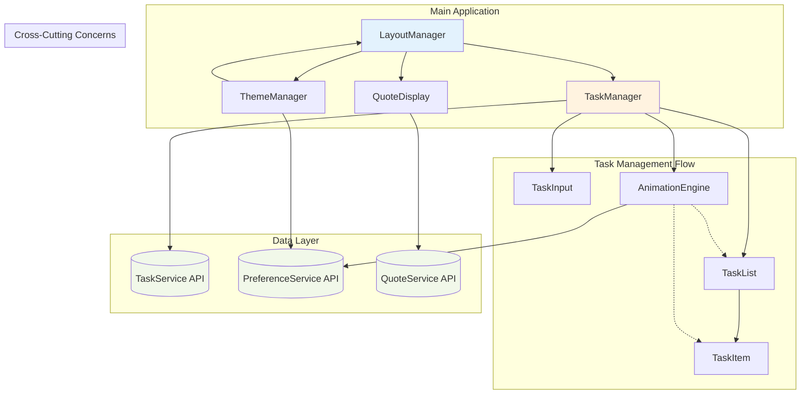

# Components

Based on the architectural patterns, tech stack, and data models defined above, I'll identify the major logical components that make up the Simple To-Do application. Each component has clear responsibilities and well-defined interfaces following BMAD principles.

### TaskManager

**Responsibility:** Core component orchestrating all task-related functionality including creation, display, completion, deletion, and undo operations. Serves as the primary interface between UI components and TaskService.

**Key Interfaces:**
- `onTaskCreate(text: string): Promise<void>` - Handles new task creation with validation
- `onTaskToggle(id: string): Promise<void>` - Manages task completion state changes
- `onTaskDelete(id: string): Promise<void>` - Processes task deletion with undo support
- `onTaskRestore(id: string): Promise<void>` - Handles undo functionality within session
- `getActiveTasks(): Task[]` - Provides filtered list of non-deleted tasks
- `getRecentlyDeleted(): Task[]` - Supports undo functionality with time limits

**Dependencies:** TaskService, TaskInput, TaskList, TaskItem components

**Technology Stack:** Astro component (.astro) with TypeScript, vanilla JavaScript for interactivity, Tailwind CSS for styling

### TaskInput

**Responsibility:** Handles task creation interface with validation, character counting, and accessibility features. Provides immediate feedback and maintains focus for rapid task entry.

**Key Interfaces:**
- `onSubmit(text: string): void` - Emits task creation events with validated input
- `onInputChange(text: string): void` - Provides real-time character count and validation
- `reset(): void` - Clears input after successful submission
- `focus(): void` - Programmatic focus management for UX flow

**Dependencies:** TaskManager (parent component)

**Technology Stack:** Astro component with vanilla JavaScript event handling, Tailwind CSS for responsive form styling

### TaskList

**Responsibility:** Renders collection of tasks with proper ordering (newest first), empty states, and efficient DOM updates. Manages bulk operations and list-level interactions.

**Key Interfaces:**
- `renderTasks(tasks: Task[]): void` - Displays task collection with proper ordering
- `showEmptyState(): void` - Renders helpful onboarding when no tasks exist
- `onBulkClearCompleted(): void` - Batch operation for clearing completed tasks
- `updateTaskOrder(tasks: Task[]): void` - Handles reordering without full re-render

**Dependencies:** TaskItem components, TaskManager (parent)

**Technology Stack:** Astro component with vanilla JavaScript for DOM manipulation, CSS animations for smooth transitions

### TaskItem

**Responsibility:** Individual task rendering with completion toggle, delete confirmation, and accessibility support. Handles task-level interactions and state visualization.

**Key Interfaces:**
- `render(task: Task): HTMLElement` - Renders individual task with current state
- `onToggleComplete(): void` - Handles completion state changes with animation
- `onDeleteClick(): void` - Shows confirmation dialog before deletion
- `updateVisualState(task: Task): void` - Updates appearance based on completion status

**Dependencies:** TaskManager (for event propagation)

**Technology Stack:** Astro component with CSS-only animations for completion states, ARIA labels for accessibility

### ThemeManager

**Responsibility:** Manages light/dark theme switching with system preference detection, smooth transitions, and persistence. Coordinates theme changes across all components.

**Key Interfaces:**
- `initializeTheme(): Promise<void>` - Sets initial theme based on preferences
- `toggleTheme(): Promise<void>` - Cycles through light/dark/system options
- `onSystemThemeChange(): void` - Responds to OS theme changes
- `applyTheme(theme: 'light' | 'dark'): void` - Updates CSS custom properties

**Dependencies:** PreferenceService, all styled components

**Technology Stack:** Vanilla JavaScript module with CSS custom properties, prefers-color-scheme media queries

### QuoteDisplay

**Responsibility:** Shows daily motivational quotes with refresh capability, favoriting, and responsive typography. Manages quote rotation and user interaction.

**Key Interfaces:**
- `showDailyQuote(): Promise<void>` - Displays current daily quote with caching
- `refreshQuote(): Promise<void>` - Fetches new random quote on demand
- `toggleFavorite(quoteId: string): Promise<void>` - Manages quote favoriting
- `formatQuoteText(quote: Quote): string` - Handles text wrapping and attribution

**Dependencies:** QuoteService, PreferenceService

**Technology Stack:** Astro component with vanilla JavaScript for quote fetching, Tailwind CSS for responsive typography

### AnimationEngine

**Responsibility:** Provides satisfying micro-interactions for task completion, theme transitions, and UI feedback while respecting motion preferences. Centralized animation management.

**Key Interfaces:**
- `celebrateTaskCompletion(element: HTMLElement): Promise<void>` - Confetti or equivalent celebration
- `animateTaskAddition(element: HTMLElement): Promise<void>` - Smooth task appearance
- `animateTaskRemoval(element: HTMLElement): Promise<void>` - Graceful task disappearance
- `animateThemeTransition(): Promise<void>` - Smooth color scheme changes

**Dependencies:** PreferenceService (for motion preferences), DOM elements

**Technology Stack:** Vanilla JavaScript with CSS animations, Web Animations API, CSS custom properties for theme transitions

### LayoutManager

**Responsibility:** Coordinates responsive layout, navigation, and overall page structure. Manages viewport changes and mobile/desktop layout differences.

**Key Interfaces:**
- `initializeLayout(): void` - Sets up responsive breakpoints and layout
- `onViewportChange(): void` - Handles mobile/desktop layout adjustments
- `showErrorState(error: Error): void` - Displays user-friendly error messages
- `showLoadingState(): void` - Manages global loading indicators

**Dependencies:** All other components (coordination layer)

**Technology Stack:** Astro layout component with Tailwind CSS responsive utilities, vanilla JavaScript for viewport detection

### Component Relationships Diagram

This component architecture provides clear separation of concerns while maintaining loose coupling and high cohesion, perfectly supporting the PRD requirements and BMAD methodology principles.

---

