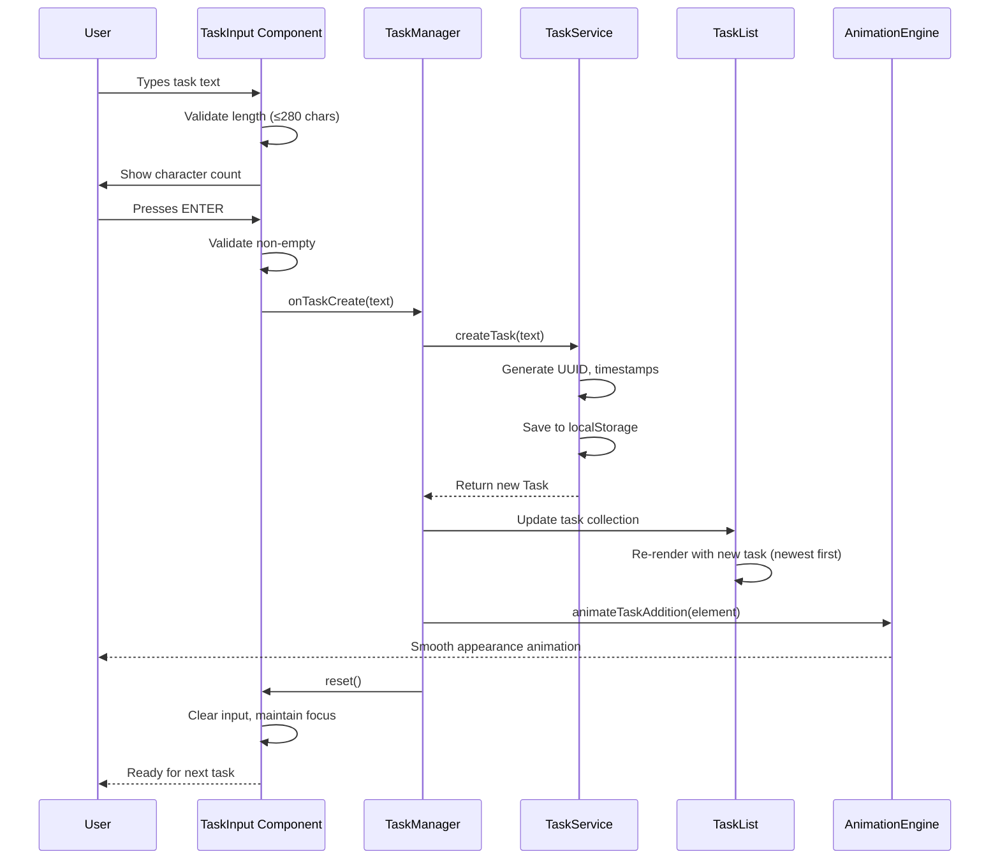
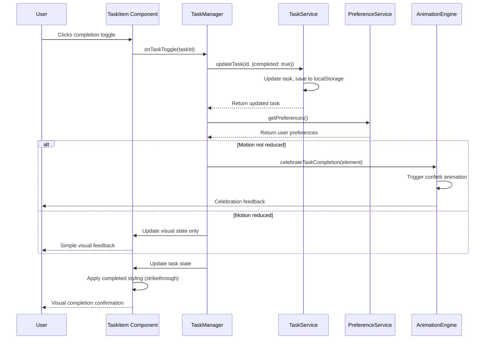
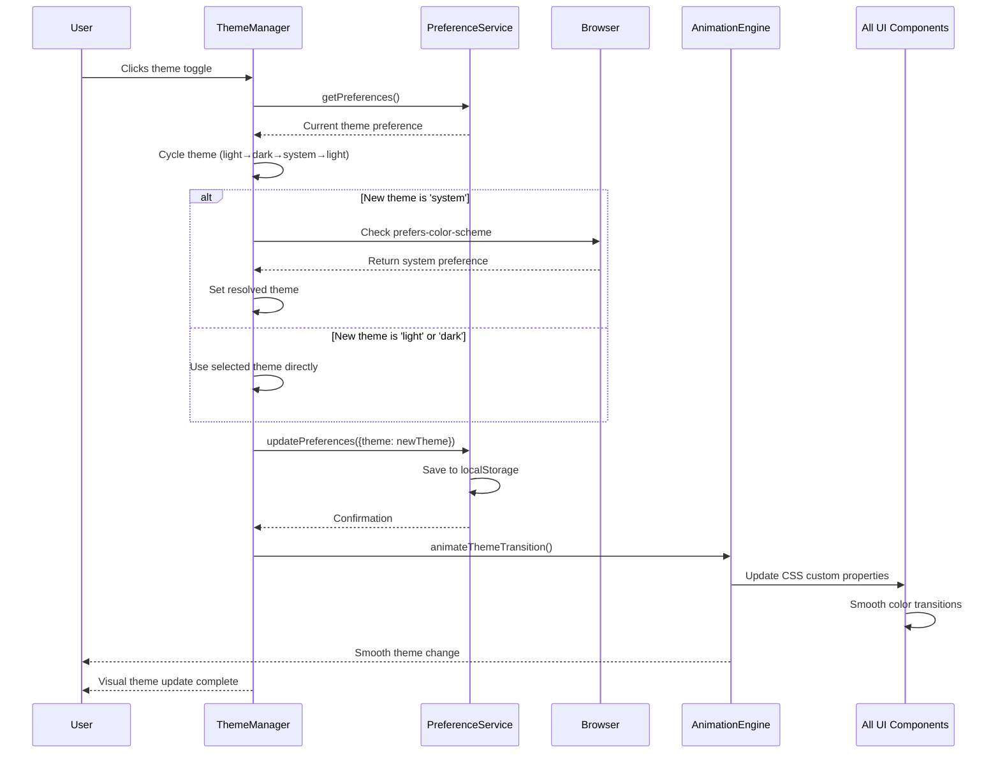
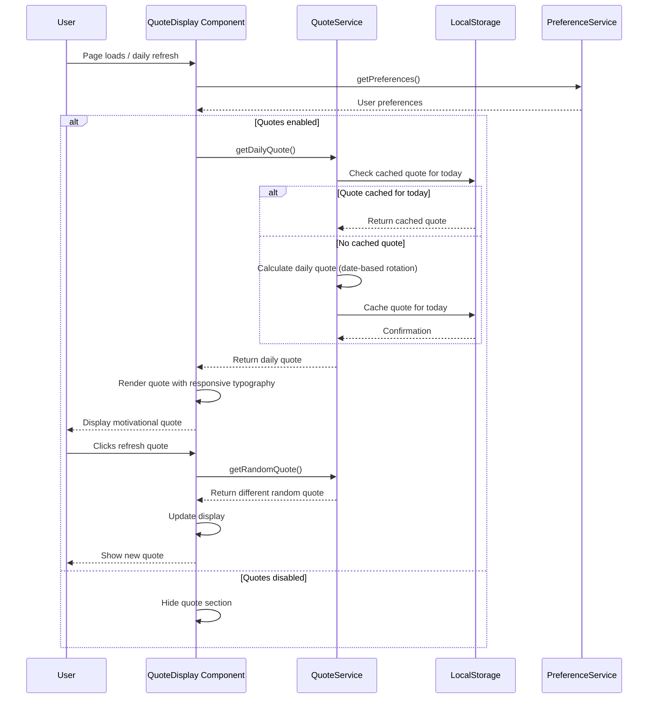
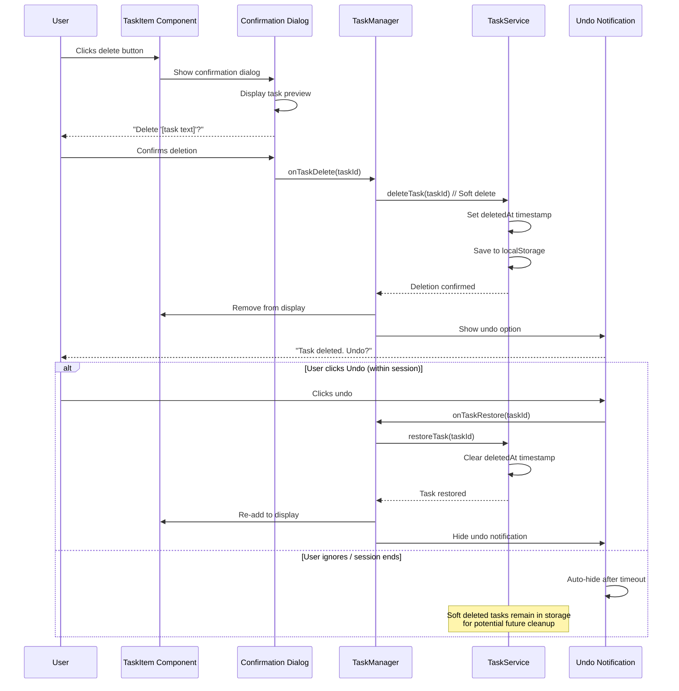
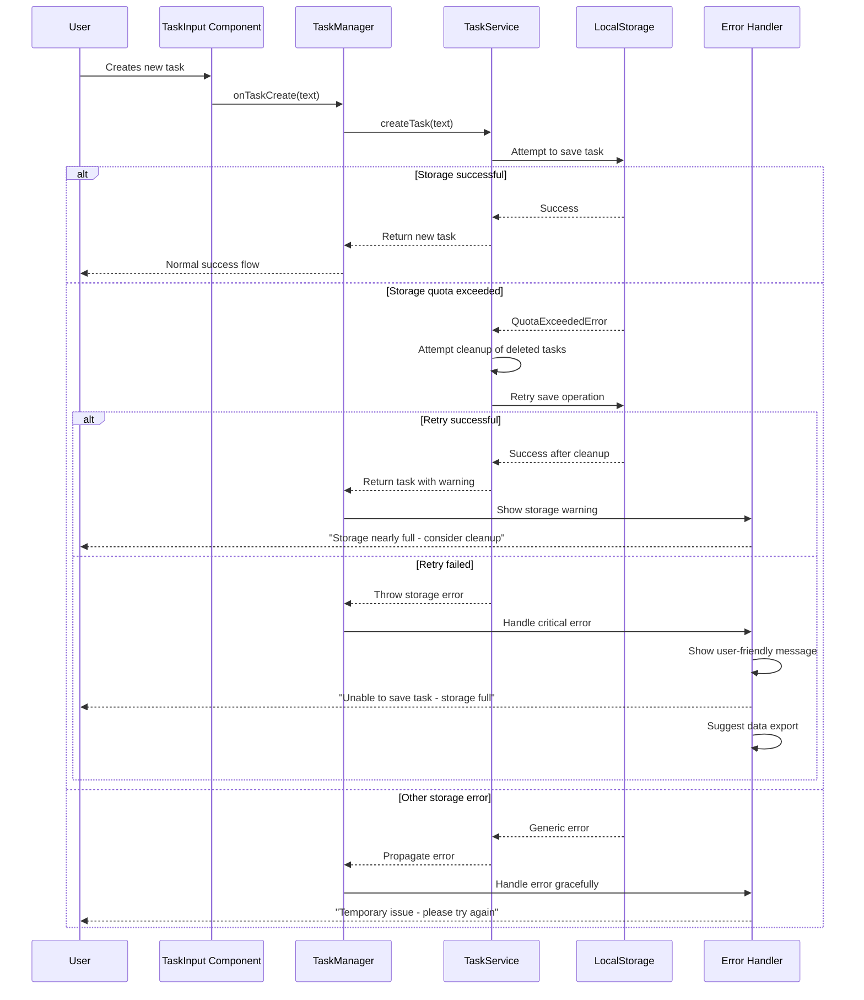

# Core Workflows

The following sequence diagrams illustrate critical user journeys from the PRD, showing component interactions and data flow. These workflows demonstrate how the architecture supports key functional requirements while maintaining performance and user experience goals.

### Workflow 1: Task Creation with Validation

This workflow demonstrates FR1 (task creation with immediate feedback) and shows how validation, persistence, and UI updates work together.

### Workflow 2: Task Completion with Celebration

This workflow demonstrates FR3 (single-click completion) and FR4 (satisfying animations) while respecting accessibility preferences.

### Workflow 3: Theme Switching with System Detection

This workflow demonstrates FR8 (theme toggle with system preference detection) and shows how preferences persist across sessions.

### Workflow 4: Daily Quote Display with Caching

This workflow demonstrates FR7 (daily motivational quotes with refresh) and shows efficient caching to avoid repetitive selections.

### Workflow 5: Task Deletion with Undo Support

This workflow demonstrates FR5 (delete confirmation) and FR6 (undo functionality) showing how soft deletion enables recovery.

### Workflow 6: Error Handling and Recovery

This workflow demonstrates NFR5 (localStorage limitations handling) and shows graceful error recovery patterns.

These workflows demonstrate how the architecture supports all PRD requirements while maintaining excellent user experience through proper error handling, accessibility considerations, and performance optimization.

---

