# High Level Architecture

### Technical Summary

Simple To-Do employs a **Pure Static Architecture** using Astro v5 with TypeScript strict mode and vanilla JavaScript for interactivity. This approach eliminates all framework overhead while maintaining type safety and modern development practices. Tailwind CSS provides utility-first styling with zero runtime JavaScript, supporting responsive design and theme switching through CSS custom properties.

The architecture prioritizes radical simplicity - no React, no complex state management, no build-time dependencies beyond Astro's core functionality. Interactive features use vanilla JavaScript with strict TypeScript interfaces, localStorage for persistence, and CSS-only animations where possible. This approach directly demonstrates BMAD principles of choosing appropriate technology complexity for the problem domain.

### Platform and Infrastructure Choice (Following Elio Struyf's Best Practices)

**Platform:** Azure Static Web Apps (Free Tier) with GitHub Actions  
**Key Services:** Static hosting with global CDN, automated deployment, future Azure Functions expansion capability  
**Deployment Host and Regions:** Azure global edge network with automatic region selection  
**Node Version:** Node 20+ (required for latest Astro v5 compatibility)

**Azure Static Web Apps Benefits:**
- **Free Tier:** Perfect for MVP with generous limits (100GB bandwidth, 0.5GB storage)
- **Global CDN:** Automatic content distribution with low latency worldwide
- **Native GitHub Integration:** Clean workflow automation following Elio Struyf patterns
- **Future Expandability:** Can add Azure Functions for API endpoints without migration
- **Pull Request Previews:** Automatic staging deployments for testing

**Following Elio Struyf's SWA CLI Methodology:**
```json
// swa-cli.config.json (Clean configuration over verbose boilerplate)
{
  "$schema": "https://aka.ms/azure/static-web-apps-cli/schema",
  "configurations": {
    "simple-todo": {
      "appLocation": "/app",
      "outputLocation": "dist",
      "appDevserverUrl": "http://localhost:4321",
      "apiLocation": "/api",
      "apiLanguage": "node", 
      "apiVersion": "20",
      "apiDevserverUrl": "http://localhost:7071"
    }
  }
}
```

**GitHub Actions Configuration (Optimized for Node 20+):**
```yaml
# .github/workflows/azure-static-web-apps-ci-cd.yml
name: Azure Static Web Apps CI/CD

on:
  push:
    branches: [main]
  pull_request:
    types: [opened, synchronize, reopened, closed]
    branches: [main]

jobs:
  build_and_deploy_job:
    if: github.event_name == 'push' || (github.event_name == 'pull_request' && github.event.action != 'closed')
    runs-on: ubuntu-latest
    name: Build and Deploy Job
    steps:
      - uses: actions/checkout@v4
        with:
          submodules: true
      - name: Setup Node.js 20+
        uses: actions/setup-node@v4
        with:
          node-version: '20'
          cache: 'npm'
      - name: Install dependencies
        run: |
          npm ci
          cd app && npm ci
      - name: Build And Deploy
        id: builddeploy
        uses: Azure/static-web-apps-deploy@v1
        with:
          azure_static_web_apps_api_token: ${{ secrets.AZURE_STATIC_WEB_APPS_API_TOKEN }}
          repo_token: ${{ secrets.GITHUB_TOKEN }}
          action: "upload"
          app_location: "/app"
          api_location: ""
          output_location: "dist"
        env:
          NODE_VERSION: "20"

  close_pull_request_job:
    if: github.event_name == 'pull_request' && github.event.action == 'closed'
    runs-on: ubuntu-latest
    name: Close Pull Request Job
    steps:
      - name: Close Pull Request
        id: closepullrequest
        uses: Azure/static-web-apps-deploy@v1
        with:
          azure_static_web_apps_api_token: ${{ secrets.AZURE_STATIC_WEB_APPS_API_TOKEN }}
          action: "close"
```

### Repository Structure (Following Elio Struyf's Clean Patterns)

**Structure:** Monorepo with logical separation following Elio's proven methodology  
**Monorepo Tool:** Native npm workspaces (lightweight, no additional tooling complexity)  
**Package Organization:** Clean separation between frontend and API

```
simple-todo/
├── .bmad-core/              # BMAD methodology files
├── docs/                    # Architecture and documentation
├── app/                     # Astro frontend application
│   ├── src/
│   │   ├── components/      # Astro components (.astro files)
│   │   ├── pages/           # Astro pages (routing)
│   │   ├── scripts/         # Vanilla JavaScript modules
│   │   ├── types/           # TypeScript type definitions
│   │   └── styles/          # Tailwind config and custom CSS
│   ├── public/              # Static assets
│   ├── package.json
│   └── astro.config.mjs
├── api/                     # Azure Functions (future expansion)
│   ├── package.json
│   └── [future API functions]
├── swa-cli.config.json      # Clean SWA configuration
├── package.json             # Root orchestration
└── .github/workflows/       # GitHub Actions deployment
```

**npm Scripts Architecture (Elio Struyf Pattern):**
```json
{
  "scripts": {
    "dev": "npm run dev:swa",
    "dev:app": "cd app && npm run dev",
    "dev:api": "echo 'No API yet - localStorage only'",
    "dev:swa": "swa start",
    "build": "npm run build:app",
    "build:app": "cd app && npm run build",
    "deploy": "swa deploy --print-config",
    "install:all": "npm ci && cd app && npm ci"
  }
}
```

### High Level Architecture Diagram (Following Elio Struyf's SWA CLI Proxy Pattern)

```mermaid
graph TB
    subgraph "Development Environment"
        Developer[👨‍💻 Developer] --> SWA_CLI[🔧 SWA CLI :4280]
        SWA_CLI --> Astro[📄 Astro App :4321]
        SWA_CLI --> Future_API[⚡ Future API :7071]
    end
    
    subgraph "User Experience"
        User[👤 User] --> Browser[🌐 Browser]
        Browser --> AzureCDN[🌍 Azure Global CDN]
    end
    
    subgraph "Production (Azure Static Web Apps)"
        AzureCDN --> StaticApp[📱 Simple Todo App]
        StaticApp --> AstroComponents[🧩 Astro Components]
        StaticApp --> VanillaJS[⚡ Vanilla JS Modules]
        StaticApp --> TailwindCSS[🎨 Tailwind CSS]
        
        VanillaJS --> TaskLogic[📝 Task Logic]
        VanillaJS --> LocalStorage[💾 localStorage API]
        VanillaJS --> DOMManipulation[🔄 DOM Updates]
        
        TailwindCSS --> ThemeCSS[🌗 CSS Theme Variables]
        TailwindCSS --> ResponsiveCSS[📱 Responsive Design]
        
        StaticApp --> Future_Functions[🔮 Future: Azure Functions]
    end
    
    subgraph "Development Workflow"
        GitHub[📚 GitHub Repository] --> GitHubActions[⚡ GitHub Actions]
        GitHubActions --> AzureSWA[☁️ Azure Static Web Apps]
    end
    
    style StaticApp fill:#e1f5fe
    style AzureSWA fill:#0078d4,color:#ffffff
    style SWA_CLI fill:#f0f8ff
    style Future_Functions fill:#f0f0f0,stroke-dasharray: 5 5
    style Future_API fill:#f0f0f0,stroke-dasharray: 5 5
```



### Architectural Patterns (Aligned with BMAD and Elio Struyf Methodologies)

- **Pure Static Generation with SWA CLI Development Proxy:** Astro-only rendering with zero client-side frameworks in production, SWA CLI proxy for unified development experience - _Rationale:_ Maximum simplicity and performance for a basic todo app, following Elio's proven development workflow patterns

- **Vanilla JavaScript Modules with Strict TypeScript:** ES6+ modules with strict TypeScript interfaces, no framework dependencies - _Rationale:_ Modern JavaScript without framework overhead, full type safety, educational clarity for BMAD demonstration

- **CSS-First Theming with System Preference Detection:** Tailwind utilities with CSS custom properties and prefers-color-scheme - _Rationale:_ No JavaScript needed for theme switching, pure CSS performance, accessibility through system integration

- **Progressive Enhancement with localStorage Persistence:** HTML-first with JavaScript enhancement, client-side data persistence - _Rationale:_ Works without JavaScript, enhanced with vanilla JS interactivity, privacy-first local storage approach

- **Component-Based Astro Architecture:** .astro components with zero client-side hydration unless specifically needed - _Rationale:_ Component organization benefits without React complexity, selective hydration for performance

- **Elio Struyf's Clean Configuration Pattern:** Minimal SWA configuration focusing on essentials, avoiding boilerplate - _Rationale:_ Readable, maintainable configuration that developers can understand and modify, following proven industry patterns

---

