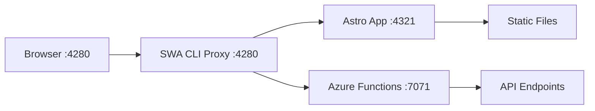

# Elio Struyf's Astro + Azure Functions Methodology

> **Core Implementation Guide**: This document outlines Elio Struyf's proven methodology for integrating Astro with Azure Functions, as implemented in this project.

## 📚 **Core Articles by Elio Struyf**

### 1. **Deploy Astro to Azure Static Web Apps with GitHub CLI**
**URL**: https://www.eliostruyf.com/deploy-astro-azure-static-web-apps-github-cli/

**Key Insights**:
- Clean, minimal SWA CLI configuration over verbose `swa init`
- Focus on essential settings only
- Readable JSON configuration that developers can understand and modify
- Basic Astro deployment patterns

**Our Implementation**: Script `4-swa-init.ps1` (Option 1 - Basic Astro)

### 2. **Integrating Azure Functions with Your Astro Site**
**URL**: https://www.eliostruyf.com/integrating-azure-functions-astro-site/

**Key Insights**:
- SWA CLI as the development proxy (eliminates CORS issues)
- Clean separation of frontend (`./app`) and API (`./api`)
- Unified development workflow with `swa start`
- Build-time API access for static generation
- Production deployment maintains same architecture

**Our Implementation**: Script `4-swa-init.ps1` (Option 2 - Full-stack)

## 🏗️ **Architecture Philosophy**

### **Clean Configuration Over Boilerplate**
```json
// ✅ Elio's Approach (Our Implementation)
{
  "$schema": "https://aka.ms/azure/static-web-apps-cli/schema",
  "configurations": {
    "astro-func-swa": {
      "appLocation": "./app",
      "outputLocation": "dist",
      "appDevserverUrl": "http://localhost:4321",
      "apiLocation": "./api",
      "apiLanguage": "python",
      "apiVersion": "3.12",
      "apiDevserverUrl": "http://localhost:7071"
    }
  }
}
```

vs.

```json
// ❌ swa init Generated (Verbose & Complex)
{
  "configurations": {
    "app": {
      "appName": "my-app",
      "appLocation": "./",
      "appArtifactLocation": "dist",
      "appBuildCommand": "npm run build",
      "appDevserverUrl": "http://localhost:4321",
      "appDevserverCommand": "npm run dev",
      "appDevserverTimeout": 120000,
      "outputLocation": "",
      "apiLocation": "api",
      "apiLanguage": "python",
      "apiVersion": "3.9",
      "apiDevserverUrl": "http://localhost:7071",
      "apiDevserverCommand": "func start",
      "apiDevserverTimeout": 120000,
      // ... many more unnecessary options
    }
  }
}
```

### **Unified Development Workflow**
```bash
# Single command starts everything
npm run dev          # Starts SWA CLI + Astro + Functions
# vs.
npm run dev:app      # Start only Astro
npm run dev:api      # Start only Functions  
npm run dev:swa      # Start only SWA CLI
```

### **Logical Project Structure**
```
project/
├── app/                    # Astro frontend
│   ├── src/
│   ├── package.json
│   └── astro.config.mjs
├── api/                    # Azure Functions backend
│   ├── function_app.py     # Python v2 model
│   ├── requirements.txt
│   └── host.json
├── swa-cli.config.json     # Clean SWA configuration
└── package.json            # Root orchestration
```

## 🚀 **Development Workflow**

### **Phase 1: Project Setup** (Scripts 0-series)
1. **Environment Check** (`0-check.ps1`) - Validate TypeScript and content
2. **Project Setup** (`0-setup-astro-project.ps1`) - Orchestrate setup process
3. **SSL/NPM Fix** (`0a-fix-npm-ssl.ps1`) - Resolve common npm issues
4. **CLI Install** (`0b-fix-astro-cli.ps1`) - Ensure Astro CLI is available
5. **Verification** (`0c-verify-setup.ps1`) - Validate environment
6. **Project Creation** (`0d-create-astro.ps1`) - Create clean Astro project

### **Phase 2: Core Development** (Scripts 1-6)
1. **Build** (`1-build.ps1`) - `npm run build`
2. **Start** (`2-start.ps1`) - `npm run dev`
3. **Dependencies** (`3-update-deps.ps1`) - Update packages safely
4. **SWA Init** (`4-swa-init.ps1`) - **Interactive setup following Elio's patterns**
5. **SWA Build** (`5-swa-build.ps1`) - `npm run build:swa`
6. **SWA Start** (`6-swa-start.ps1`) - `npm run dev:swa`

### **Phase 3: Deployment** (Scripts 7-9)
7. **Azure Login** (`7-swa-login.ps1`) - Authenticate with Azure
8. **Azure Resources** (`8-swa-azure.ps1`) - Create SWA resource
9. **Deploy** (`9-swa-deploy.ps1`) - `npm run deploy`

## 🎯 **Key Benefits of Elio's Methodology**

### **1. Simplified Development Experience**
- **Single Port**: Everything accessible through SWA CLI proxy
- **No CORS**: API and frontend share same origin
- **Hot Reload**: Works for both Astro and Azure Functions
- **Unified Commands**: Consistent npm script interface

### **2. Build-Time API Access**
```typescript
// This works in development with SWA CLI!
export async function getStaticPaths() {
  const response = await fetch('http://localhost:7071/api/courses');
  const courses = await response.json();
  return courses.map(course => ({ params: { id: course.id } }));
}
```

### **3. Production Deployment Simplicity**
- **Single Deploy Command**: `swa deploy`
- **Automatic Routing**: Azure handles API routing
- **Same Architecture**: Development mirrors production

### **4. Clean Configuration Management**
- **Readable JSON**: Developers can understand and modify
- **Essential Settings Only**: No unnecessary boilerplate
- **Version Controlled**: Configuration is part of the codebase

## 🔧 **Technical Implementation**

### **SWA CLI as Development Proxy**


### **API Host Detection Pattern**
```typescript
// Following Elio's pattern for environment detection
const apiHost = import.meta.env.DEV 
  ? "http://localhost:4280"  // SWA CLI proxy in development
  : window.location.origin;   // Production SWA domain
```

### **npm Scripts Architecture**
```json
{
  "scripts": {
    "dev": "npm run dev:all",
    "dev:all": "concurrently \"npm run dev:storage\" \"npm run dev:backend\" \"npm run dev:frontend\" \"npm run dev:swa\"",
    "dev:frontend": "cd app && npm run dev",
    "dev:backend": "cd api && func start --build",
    "dev:swa": "swa start",
    "dev:storage": "azurite --silent --location .azurite",
    "build": "npm run build:frontend && npm run build:backend",
    "build:frontend": "cd app && npm run build",
    "build:backend": "cd api && pip install -r requirements.txt",
    "deploy": "swa deploy --print-config"
  }
}
```

## 📋 **Implementation Checklist**

### **✅ Completed in Our Project**
- [x] Clean SWA configuration without boilerplate
- [x] Interactive script for language/version selection
- [x] Unified npm script workflow
- [x] Generic configuration name (`astro-func-swa`)
- [x] Python v2 Azure Functions support
- [x] Latest Python versions (3.10, 3.11, 3.12)
- [x] Proper project structure (`./app`, `./api`)

### **🔧 Enhanced Beyond Elio's Articles**
- [x] Multi-language support (Python, Node.js, Other)
- [x] Interactive version selection with recommendations
- [x] Flex Consumption Plan compatibility
- [x] PowerShell script automation
- [x] npm script standardization
- [x] Azure Storage integration (Azurite)

## 🎓 **Learning Resources**

### **Must-Read Articles**
1. [Deploy Astro to Azure Static Web Apps with GitHub CLI](https://www.eliostruyf.com/deploy-astro-azure-static-web-apps-github-cli/)
2. [Integrating Azure Functions with Your Astro Site](https://www.eliostruyf.com/integrating-azure-functions-astro-site/)

### **Related Elio Struyf Content**
- [Azure Static Web Apps CLI Best Practices](https://www.eliostruyf.com/tag/azure-static-web-apps/)
- [Frontend Build Pipeline Optimization](https://www.eliostruyf.com/tag/azure-devops/)

## 💡 **Why This Methodology Works**

### **Developer Experience First**
- **Predictable**: Same commands work across all environments
- **Fast**: Unified development server with hot reload
- **Simple**: Minimal configuration, maximum functionality
- **Debuggable**: Clear separation of concerns

### **Production Ready**
- **Scalable**: Azure Static Web Apps handle global distribution
- **Secure**: Built-in authentication and authorization
- **Fast**: CDN distribution with edge computing
- **Cost Effective**: Pay-per-use model with free tier

### **Maintainable**
- **Clean Code**: Readable configurations and scripts
- **Version Controlled**: Everything in source control
- **Documented**: Clear patterns and examples
- **Extensible**: Easy to add new features and services

---

> **Credit**: This implementation is based on and inspired by [Elio Struyf's](https://www.eliostruyf.com/) excellent work on Astro and Azure Static Web Apps integration. The methodology has been enhanced for multi-language support and modern Azure Functions capabilities.
